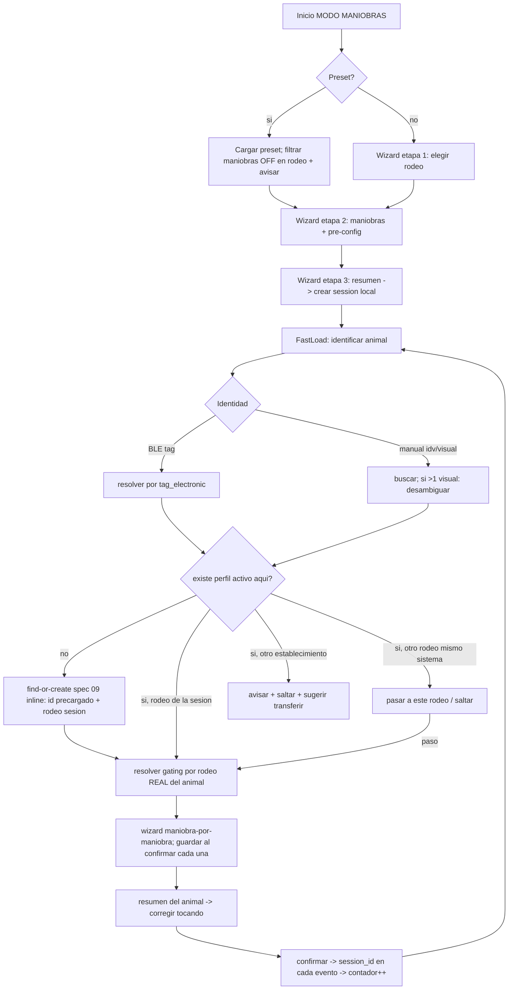
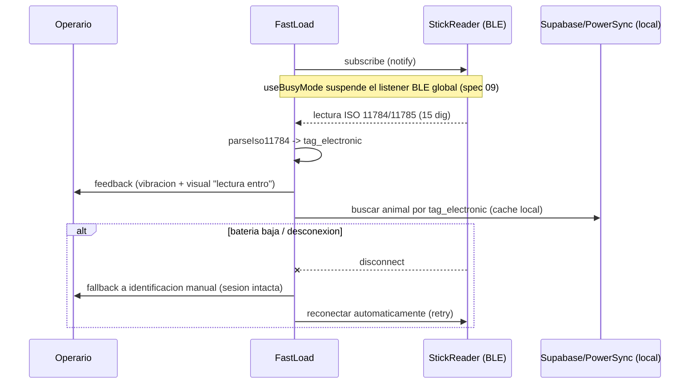
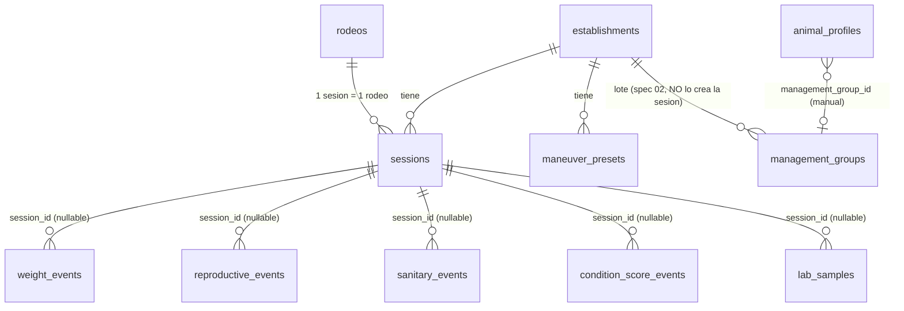

# Spec 03 — MODO MANIOBRAS — Design

**Status**: `spec_ready` — **APROBADA por Raf (Puerta 1, 2026-05-30)**. Gate 1 PASS. **Backend DONE** (migrations `0050-0057` aplicadas). Cliente (Fase 3/4) **reconciliado contra as-built 2026-06-13** (ver §1.1 y el Historial). **+ Fold sesión 26 (2026-06-13/14): Antiparasitario (R6.13/R6.14) + Antibiótico (R6.15) → mapeo §3, delta de gating §4.bis (REABRE Gate 1) y decisión abierta D10 (interno/externo del antiparasitario).**
**Fecha**: 2026-05-30 (sesión 18) · **reconciliación JIT del cliente 2026-06-13** · **fold antiparasitario/antibiótico sesión 26 (2026-06-13/14)**.
**Fuente de verdad**: `context.md` (Gate 0 aprobado + decisiones nuevas de Raf 2026-06-13). Sustrato: spec 02 (eventos tipados, `rodeo_data_config`, `field_definitions`, `management_groups`, triggers, `animal_timeline`, RLS, helper `establishment_of_profile`). **Nota Gate 1 (SEC-SPEC-03-02)**: las funciones `current_animal_rodeo` / `get_rodeo_data_keys` **NO existen as-built** — spec 03 NO depende de ellas; el rodeo del animal se resuelve **inline** vía `animal_profiles.rodeo_id` del perfil activo (ver §4).

> **Numeración de migrations — RESUELTO (backend done).** El backend de spec 03 está **implementado y done**: `0050_sessions.sql`, `0051_maneuver_presets.sql`, `0052_event_session_fk.sql`, `0053_tacto_vaquillona.sql`, `0054_gating_db_layer.sql`, `0055_check_grants.sql`, `0056_event_session_tenant_check_split.sql`, `0057_soft_delete_maneuver_preset.sql`. **El cliente NO requiere migraciones nuevas** (enum `tacto_vaquillona`, FK `session_id`, triggers de gating capa 2 INSERT + UPDATE dientes/CUT, tenant-check cross+intra, fail-closed — TODO ya existe). Si durante la implementación del cliente apareciera la necesidad de una migración (no debería), se marca como **hallazgo para Gate 1 puntual** antes de aplicarla — no se aplica DDL sin pasar por el clasificador (memoria: Supabase MCP en modo escritura gatea deploys a la DB compartida).

> **HALLAZGO clave del as-built (corrige C2)**: las 5 tablas de evento de spec 02 **ya tienen la columna `session_id uuid`** (migrations 0025-0029), pero **SIN FK**, con el comentario "session_id se vincula al MODO MANIOBRAS (feature 03), sin FK por ahora (la tabla sessions no existe aún)". O sea, spec 02 dejó el hueco preparado. Spec 03 **no crea la columna** — solo **agrega la FK + el trigger tenant-check** (§2.3).

---

## 1. Arquitectura

### 1.1 Componentes nuevos (cliente) — RECONCILIADO AL LAYOUT REAL (2026-06-13)

> **El árbol `app/src/features/maneuvers/` del design original NO EXISTE en el repo y NO se va a crear.** El repo as-built organiza: **pantallas** en `app/app/**` (Expo Router, file-based), **lógica** en `app/src/{services,hooks,utils,contexts}`. Se reconcilió el árbol propuesto a ese layout. Stubs ya presentes a reemplazar/expandir: `app/app/maniobra.tsx` (modal MODO MANIOBRAS, destino del FAB central — ADR-018), `app/app/(tabs)/maniobra-fab.tsx` (placeholder de ruta del FAB), `app/app/baston-test.tsx` (harness de dev del bastón, NO producción).

```
app/
├─ app/                                      # PANTALLAS (Expo Router)
│  ├─ maniobra.tsx                           # MODO MANIOBRAS — entrypoint/modal (HOY stub; expandir)
│  │                                         #   inicio: presets al tope + "nueva jornada"  (M1)
│  ├─ maniobra/                              # (nuevas rutas hijas del flujo; nombres a confirmar por el implementer)
│  │  ├─ jornada.tsx                         # wizard 3 etapas (rodeo / maniobras+preconfig / resumen)  (M1)
│  │  ├─ carga.tsx                           # PANTALLA CRÍTICA: FRAME de carga rápida (secuencia + resumen-modo)  (M2.2 ✅)
│  │  ├─ paso.tsx                            # una maniobra por pantalla (botones GIGANTES, R5.2/R12.5)  (M3)
│  │  └─ _components/{TactoStep,PesajeStep,  # pasos cableados + resumen como COMPONENTE (no ruta separada)  (M2.2 ✅)
│  │     PlaceholderStep,AnimalSummary}.tsx   #   (NO se creó resumen.tsx — el resumen es un modo del frame)
│  └─ (tabs)/maniobra-fab.tsx                # placeholder del FAB central (ya existe)
└─ src/
   ├─ contexts/
   │  └─ ManeuverSessionContext.tsx          # estado de la sesión activa (1 por dispositivo, persistida local)  (M2/M4)
   ├─ hooks/
   │  ├─ useManeuverSession.ts               # (M1)
   │  └─ useManeuverGating.ts                # (M1)
   ├─ utils/
   │  └─ maneuver-gating.ts                  # mapeo maniobra→data_keys + resolución por rodeo real (PURO, testeable)  (M1)
   └─ services/
      ├─ sessions.ts                         # CRUD de sessions (offline-first, IDs cliente; CRUD-plano de feature 15)  (M1)
      ├─ maneuver-presets.ts                 # CRUD de presets (CRUD-plano; soft-delete vía 0057)  (M1)
      └─ maneuver-events.ts                  # ESQUELETO del orquestador (session_id) — iniciado en M2.2; M3.1 lo generaliza
                                             #   lógica pura en utils/{maneuver-sequence,maneuver-step-kind,maneuver-event-query}.ts  (M2.2 ✅)
```

> **BLE: NO se crea una capa nueva.** El bastón ya está implementado as-built (spec 04) en `app/src/services/ble/`. El cliente de 03 **consume** esa API pública, no la reimplementa:
> - `useBleStickListener({ enabled, onTagRead })` — escucha del listener global; `onTagRead(eid)` entrega el EID **ya validado + des-duplicado** por `contract.ts`/`parser-rs420.ts` (parseo ISO 11784/11785, dedup por-TAG). **NO** hay que escribir un parser nuevo (`parseIso11784.ts` del design viejo no existe ni hace falta).
> - `useStickListenerControls()` → `{ enableListener, disableListener }` — handle explícito (apaga el transporte). **AS-BUILT (M2.1-core)**: el handle NO se usa para R3.2 — la suspensión del listener global se hace por **supresión de RUTA del overlay** + listener manga-owned (ver §5, "Suspensión del listener global"), porque `disableListener()` apagaría el transporte y la manga no recibiría la lectura. El handle queda disponible para usos que quieran apagar el transporte físicamente.
> - `useBusyMode()` / `useBusyWhileMounted()` — suspende la escucha mientras un form CREATE/EDIT (alta inline) está activo.
> - `useBleConnectionStatus()` + `BleStickListenerProvider` (ya montado en el root layout). El feedback sensorial de la lectura (vibración/beep) ya lo dispara el provider (`playFeedback`).
> - **Interfaz agnóstica al modelo (R3.8)**: el contrato real es `StickAdapter` (`stick-adapter.ts`) con adaptadores por transporte (`adapter-web-serial`, `adapter-spp-android`, `adapter-manual`, `adapter-mock`, …) — sustituye al `StickReader` propuesto. El punto de extensión para una **balanza** futura cuelga de ahí (un `WeightCapableStickAdapter`), ver §6.

**Reusa de spec 02 (nombres reales as-built):**
- `app/src/services/events.ts`: `addWeight` (R6.9/R6.10), `addConditionScore` (R6.6), `addTacto` (R6.2), `addService` (R6.5 inseminación), `registerBirth`/`addAbortion` (NO maniobra de manga — viven en la ficha), `addObservation`, `fetchMother` (vínculo ternero→madre, R6.10), `deleteTypedEvent` (corrección).
- `app/src/services/animals.ts`: `createAnimal` (alta), `fetchAnimals`/`searchAnimals` (búsqueda manual), `lookupByTag` (resolución por TAG, vía spec 09), `setCastrated`/`previewCastrationCategory`/`revertCategoryOverride`/`previewRevertCategory` (categoría/CUT-adyacente). **NO** existe un `updateAnimalCategory`/`markCut` con esos nombres — el path **dientes/CUT** (R6.7/R6.8) es un `UPDATE animal_profiles` (`teeth_state`/`is_cut`/`category_id`/`category_override`) que el cliente de 03 debe agregar como nuevo write-path CRUD-plano (no hay builder as-built para CUT desde manga todavía; ver §4 / T3.6).
- `app/src/services/management-groups.ts`: `assignAnimalToGroup(profileId, groupId | null)` (lote manual, R9.2).
- `app/src/services/rodeo-config.ts`: `fetchRodeoConfig`/`fetchFieldCatalog`/`fetchSystemDefaults` (read-only, leen el `rodeo_data_config`/catálogo del SQLite local) — base del gating capa 1. **NO** existe `isManeuverAvailable`; esa resolución la arma `maneuver-gating.ts` (nuevo, §3) sobre `fetchRodeoConfig`.
- `app/src/utils/animal-category.ts`: `computeCategoryCode`/`resolveCastrationTargetCategory` — **espejo cliente de `compute_category`** para el **preview de transición offline** (R8.4). **NO** existe `services/category/transitions.ts` (era un nombre del design viejo).

**Reusa de spec 09**: `FindOrCreateOverlay.tsx` + `lookupByTag` + `resolveTagLookup`/`resolveCreateOrAssign` (find-or-create) + `useBusyMode` (suspende listener BLE global durante el alta inline).

**Balanza (spec 05): DIFERIDA — FUERA del MVP.** El pesaje del MVP es **a mano** (R6.9/R6.10, decisión de Raf 2026-06-13). No se consume ninguna balanza BLE en este spec; el punto de extensión queda limpio (ver §6 / D6).

### 1.2 Componentes nuevos (backend / Supabase)

- Tabla `sessions` (NUEVA) — jornada de maniobra.
- Tabla `maneuver_presets` (NUEVA) — presets por establishment.
- `ALTER` de las 5 tablas de evento de spec 02: agregar `session_id` (FK nullable a `sessions`) — ver C2 / D1. (Conflicto: spec 02 *requirements* lo listan pero las migraciones del árbol local no lo crearon.)
- Extensión del enum reproductivo de spec 02 para `tacto_vaquillona` + campo de resultado — ver R5.13 / D-enum.
- Triggers `BEFORE INSERT` de gating DB (capa 2) en cada tabla de evento gateada — ver §4.
- Trigger `BEFORE UPDATE` de gating DB sobre `animal_profiles` para el destino dientes/CUT (`teeth_state`/`is_cut`) — ver §4 (SEC-SPEC-03-01).
- RLS en `sessions` y `maneuver_presets` (patrón canónico tenant).

### 1.3 Diagrama de flujo — carga rápida



### 1.4 Diagrama de secuencia — BLE manual-first



### 1.5 ER — sessions / eventos / lote



Nota: el lote (`management_groups`) **NO** está vinculado a `sessions` por FK. La sesión solo agrupa eventos vía `session_id`. (Ver C1.)

---

## 2. Modelo de datos (SQL nuevo)

> Patrón de la casa: `enable RLS` + `GRANT` explícito a `authenticated` + policies por establishment con helpers `has_role_in` / `is_owner_of` de spec 01. IDs `uuid` con default cliente (PowerSync). `created_by` forzado server-side donde es load-bearing (ADR-019, patrón `tg_force_created_by_auth_uid` de spec 02 `0043`). Los bloques SQL son **especificación de diseño**; el implementer escribe los `.sql` y los tests.

### 2.1 `sessions` (migration `0050_sessions.sql`)

```sql
-- 0050_sessions.sql — jornada de maniobra (NO es "lote"; ver ADR-020 / management_groups)
create type public.session_status as enum ('active', 'closed');

create table public.sessions (
  id                uuid primary key default gen_random_uuid(),
  establishment_id  uuid not null references public.establishments(id) on delete cascade,
  rodeo_id          uuid not null references public.rodeos(id),
  -- snapshot de la config de la jornada: maniobras elegidas + parametros fijos de tanda + preset_id origen
  config            jsonb not null default '{}'::jsonb,
  status            public.session_status not null default 'active',
  -- lote de trabajo informativo, NO-autoritativo (R9.4): texto libre, nunca FK asignadora a management_groups
  work_lot_label    text,
  animal_count      int not null default 0,   -- mantenido por la app al confirmar cada animal (ver nota)
  event_count       int not null default 0,   -- mantenido por la app al persistir cada evento
  notes             text,
  created_by        uuid references public.users(id),  -- forzado server-side a auth.uid()
  started_at        timestamptz not null default now(),
  ended_at          timestamptz,
  created_at        timestamptz not null default now(),
  updated_at        timestamptz not null default now(),
  deleted_at        timestamptz,
  -- SEC-SPEC-03-06: limite de tamano del jsonb libre del cliente (snapshot de config de jornada).
  -- No hay injection (no se hace EXECUTE/format dinamico sobre config), pero un CHECK acota el riesgo
  -- de encolar payloads arbitrarios via sync. 16 KiB sobra para maniobras + pre-config de una tanda.
  constraint sessions_config_size check (octet_length(config::text) < 16384)
);

create index sessions_by_est    on public.sessions (establishment_id) where deleted_at is null;
create index sessions_by_rodeo  on public.sessions (rodeo_id)         where deleted_at is null;
create index sessions_active    on public.sessions (establishment_id, status) where deleted_at is null;

-- created_by es auditoria de jornada: se FUERZA server-side (no spoofeable), reusa helper de spec 02 (0043)
create trigger sessions_force_created_by
  before insert on public.sessions
  for each row execute function public.tg_force_created_by_auth_uid();

create trigger sessions_set_updated_at
  before update on public.sessions
  for each row execute function public.tg_set_updated_at_generic();

-- rodeo debe ser del mismo establishment, activo (reusa patron de spec 02 R4.5)
create or replace function public.tg_sessions_rodeo_check ()
returns trigger language plpgsql as $$
begin
  if not exists (
    select 1 from public.rodeos r
    where r.id = new.rodeo_id and r.establishment_id = new.establishment_id
      and r.active = true and r.deleted_at is null
  ) then
    raise exception 'session rodeo does not belong to establishment or is inactive'
      using errcode = '23514';
  end if;
  return new;
end; $$;

create trigger sessions_rodeo_check
  before insert or update on public.sessions
  for each row execute function public.tg_sessions_rodeo_check();

alter table public.sessions enable row level security;

create policy sessions_select on public.sessions
  for select using (has_role_in(establishment_id) and deleted_at is null);
create policy sessions_insert on public.sessions
  for insert with check (has_role_in(establishment_id));
create policy sessions_update on public.sessions
  for update using (has_role_in(establishment_id))
  with check (has_role_in(establishment_id));
-- sin DELETE de cliente: cerrar = status='closed'; borrado = soft-delete (deleted_at) via update.

grant select, insert, update on public.sessions to authenticated;
```

**Nota sobre `animal_count` / `event_count`** (ADR-020 delegaba esto a esta spec): se mantienen **desde la app** (incremento al confirmar cada animal / persistir cada evento), NO por trigger. Razón: (a) la sesión es offline-first y los eventos se encolan localmente, así que un trigger server-side contaría desfasado respecto al estado local; (b) son contadores de conveniencia para el resumen (spec 07), no constraints de integridad. El conteo autoritativo siempre se recomputa con `count(*) … where session_id = ?`. **Default propuesto, requiere confirmación (D5).**

#### 2.1.1 Shape del `config` jsonb — orden de maniobras (R1.12/R1.13/R5.14) — refinamiento Raf 2026-06-13 #1

> **Sin schema change → Gate 1 N/A.** `sessions.config` y `maneuver_presets.config` ya son `jsonb not null default '{}'` as-built (`0050`/`0051`), con su CHECK de tamaño (`octet_length(config::text) < 16384`, SEC-SPEC-03-06). El orden de maniobras se persiste **dentro** de ese jsonb existente; no hay `ALTER`, ni migración, ni trigger nuevo. Es contrato de cliente sobre una columna libre que ya existe.

El `config` snapshot de la jornada (R1.10) tiene el siguiente shape canónico, donde **el array `maniobras` es ordenado** (el orden de presentación que el operario fijó arrastrando, R1.12):

```jsonc
// shape de sessions.config y maneuver_presets.config (mismo shape; el preset arranca ya ordenado)
{
  "maniobras": ["pesaje", "tacto", "vacunacion", "sangrado"],        // ARRAY ORDENADO (tokens = ManeuverKind as-built: tacto/raspado/etc., NO data_keys; R1.13)
  "preconfig": {                                                     // parámetros fijos de tanda por maniobra (R1.7)
    "vacunacion":  { "products": ["Aftosa", "Mancha"] },
    "inseminacion": { "default_pajuela": "Toro 123" }
    // ...
  }
}
```

- **Orden inicial** (R1.12): al elegir maniobras en la etapa 2, `maniobras` se llena en el orden en que el operario las fue tocando; si carga un **preset** (R2.1/R2.2), `maniobras` arranca con el orden guardado en `maneuver_presets.config.maniobras`.
- **Drag-reorder** (R1.12): arrastrar reordena el array `maniobras` in-place; al guardar la jornada (etapa 3 → `createSession`) o el preset (R2.1) se persiste el array en su orden actual.
- **El orden es presentación pura**: el gating capa 1 (§3) y capa 2 (§4) operan por `data_key` del rodeo real, **independientes del orden del array**. Reordenar NO cambia qué maniobras aplican por animal (R5.5) ni el enforcement.
- **Carga rápida respeta el orden** (R5.14): el wizard paso-por-maniobra de un animal itera `config.maniobras` **en orden**, salteando las que no aplican al rodeo real (R5.5) sin reordenar las que sí; el contador "Tacto · 2 de 4" cuenta sobre las maniobras-que-aplican en ese orden.
- **Validación defensiva (cliente)**: al leer un `config` viejo sin la key `maniobras` (sesión/preset previo al refinamiento) o con maniobras no reconocidas, el cliente cae a un orden por defecto (orden del catálogo) e ignora claves desconocidas — el orden nunca debe romper la carga.

### 2.2 `maneuver_presets` (migration `0051_maneuver_presets.sql`)

```sql
-- 0051_maneuver_presets.sql — presets de maniobra (scope establishment, R2.4)
create table public.maneuver_presets (
  id                uuid primary key default gen_random_uuid(),
  establishment_id  uuid not null references public.establishments(id) on delete cascade,
  name              text not null,
  config            jsonb not null default '{}'::jsonb,   -- maniobras + pre-config (mismo shape que sessions.config)
  created_by        uuid references public.users(id),
  created_at        timestamptz not null default now(),
  updated_at        timestamptz not null default now(),
  deleted_at        timestamptz,
  constraint maneuver_presets_name_not_empty check (length(trim(name)) > 0),
  -- SEC-SPEC-03-06: mismo limite de tamano que sessions.config (jsonb libre del cliente).
  constraint maneuver_presets_config_size check (octet_length(config::text) < 16384)
);

create index maneuver_presets_by_est on public.maneuver_presets (establishment_id) where deleted_at is null;

create trigger maneuver_presets_force_created_by
  before insert on public.maneuver_presets
  for each row execute function public.tg_force_created_by_auth_uid();
create trigger maneuver_presets_set_updated_at
  before update on public.maneuver_presets
  for each row execute function public.tg_set_updated_at_generic();

alter table public.maneuver_presets enable row level security;

-- scope por establishment: cualquier rol operativo activo lee/crea/edita presets del establecimiento.
create policy maneuver_presets_select on public.maneuver_presets
  for select using (has_role_in(establishment_id) and deleted_at is null);
create policy maneuver_presets_insert on public.maneuver_presets
  for insert with check (has_role_in(establishment_id));
create policy maneuver_presets_update on public.maneuver_presets
  for update using (has_role_in(establishment_id))
  with check (has_role_in(establishment_id));

grant select, insert, update on public.maneuver_presets to authenticated;
```

### 2.3 FK de `session_id` en las 5 tablas de evento (migration `0052_event_session_fk.sql`) — ver C2/D1

```sql
-- 0052_event_session_fk.sql — vincular eventos a la sesion (R5.11).
-- C2 (corregido contra as-built): la columna session_id YA EXISTE en las 5 tablas (0025-0029) como uuid SIN FK,
-- con el comentario "session_id se vincula al MODO MANIOBRAS (feature 03), sin FK por ahora (sessions no existe aun)".
-- Spec 03 NO crea la columna: agrega la FK + el trigger tenant-check.
-- ON DELETE SET NULL: borrar/archivar una sesion no borra sus eventos (append-only, ADR-017).
-- Eventos cargados desde la ficha (spec 09) quedan con session_id NULL (legitimo).

alter table public.weight_events          add constraint weight_events_session_fk          foreign key (session_id) references public.sessions(id) on delete set null;
alter table public.reproductive_events    add constraint reproductive_events_session_fk    foreign key (session_id) references public.sessions(id) on delete set null;
alter table public.sanitary_events        add constraint sanitary_events_session_fk        foreign key (session_id) references public.sessions(id) on delete set null;
alter table public.condition_score_events add constraint condition_score_events_session_fk foreign key (session_id) references public.sessions(id) on delete set null;
alter table public.lab_samples            add constraint lab_samples_session_fk            foreign key (session_id) references public.sessions(id) on delete set null;

create index weight_events_by_session          on public.weight_events (session_id)          where session_id is not null;
create index reproductive_events_by_session    on public.reproductive_events (session_id)    where session_id is not null;
create index sanitary_events_by_session        on public.sanitary_events (session_id)        where session_id is not null;
create index condition_score_events_by_session on public.condition_score_events (session_id) where session_id is not null;
create index lab_samples_by_session            on public.lab_samples (session_id)            where session_id is not null;

-- Integridad tenant: el session_id de un evento debe pertenecer al mismo establishment que el animal_profile.
-- Defensa en profundidad sobre RLS; evita que un cliente pegue un session_id ajeno via PostgREST/sync.
-- SEC-SPEC-03-04: ademas del cross-tenant (ya validado), se valida INTRA-tenant:
--   (a) la sesion debe estar status='active' al momento del insert (no colgar eventos de una sesion cerrada);
--   (b) el rodeo del animal del evento debe coincidir con sessions.rodeo_id (R1.1 "una sesion = un rodeo").
-- Ambas blindan el eje de auditoria de jornada (R5.11/R11.2) contra manipulacion intra-tenant via PostgREST/sync.
create or replace function public.tg_event_session_tenant_check ()
returns trigger language plpgsql security definer set search_path = public as $$
declare
  v_event_est    uuid;
  v_session_est  uuid;
  v_session_st   public.session_status;
  v_session_rod  uuid;
  v_event_rod    uuid;
begin
  if new.session_id is null then return new; end if;
  select public.establishment_of_profile(new.animal_profile_id) into v_event_est;  -- helper de spec 02 (0022)
  -- rodeo REAL del animal del evento, resuelto inline desde el perfil activo (mismo criterio que el gating, §4).
  select rodeo_id into v_event_rod
    from public.animal_profiles
    where id = new.animal_profile_id and deleted_at is null;
  select establishment_id, status, rodeo_id
    into v_session_est, v_session_st, v_session_rod
    from public.sessions
    where id = new.session_id and deleted_at is null;
  if v_session_est is null then
    raise exception 'session % not found or deleted', new.session_id using errcode = '23503';
  end if;
  -- (cross-tenant)
  if v_session_est <> v_event_est then
    raise exception 'event session belongs to a different establishment than the animal' using errcode = '23514';
  end if;
  -- (a) intra-tenant: la sesion debe estar activa (SEC-SPEC-03-04)
  if v_session_st <> 'active' then
    raise exception 'cannot attach event to session % with status % (must be active)', new.session_id, v_session_st
      using errcode = '23514';
  end if;
  -- (b) intra-tenant: el rodeo del animal debe ser el de la sesion (R1.1; SEC-SPEC-03-04).
  -- Nota: el flujo de manga "pasar a este rodeo" (R4.4) hace el UPDATE de rodeo_id ANTES de cargar eventos,
  -- por lo que en el camino feliz v_event_rod = v_session_rod. Un evento sobre un animal aun en otro rodeo
  -- se rechaza (es exactamente el caso que R4.4 prohibe hasta mover el animal).
  if v_event_rod is distinct from v_session_rod then
    raise exception 'event animal rodeo % does not match session rodeo % (one session = one rodeo)', v_event_rod, v_session_rod
      using errcode = '23514';
  end if;
  return new;
end; $$;
-- helper interno del trigger: revocar EXECUTE de public/authenticated (leccion SEC-HIGH-01 de spec 02).
revoke execute on function public.tg_event_session_tenant_check () from public, authenticated, anon;

-- aplicar a las 5 tablas (before insert or update of session_id). Ejemplo:
create trigger weight_events_session_tenant_check
  before insert or update of session_id on public.weight_events
  for each row execute function public.tg_event_session_tenant_check();
-- ... idem para reproductive_events, sanitary_events, condition_score_events, lab_samples.
```

**Hardening R4.7 (prevención de corrupción de rodeo)**: el check intra-tenant (b) (`v_event_rod = v_session_rod`) fuerza que todo animal de la sesión esté en `session.rodeo_id`. Eso vuelve riesgoso elegir mal el rodeo de la jornada: el operario vería cada animal como "de otro rodeo" y podría mover en masa decenas al rodeo equivocado vía [pasar a este rodeo] (R4.4) sin que el gating capa 2 lo detecte. Mitigación de cliente: detecta el patrón "casi todos los primeros animales son de otro rodeo" y sugiere corregir el **rodeo de la sesión** (R4.7), en vez de empujar al operario a mover en masa. La confirmación de [pasar a este rodeo] (R4.4) muestra el **rodeo de origen** del animal.

> **As-built M2.1-edge (2026-06-14; fix-loop 2026-06-14) — R4.2 / R4.4 / R4.7 (frontend, sin schema; reviewer + Gate 2 después).** La parte de UI de los tres edge cases se cableó en `app/app/maniobra/identificar.tsx` con 3 componentes (`CandidatePicker`, `OtherRodeoSheet`, `RodeoMismatchBanner`) + lógica PURA en `app/src/utils/maniobra-edge.ts` (unit-testeada). Dos servicios CRUD-plano offline: `moveAnimalToRodeo` (`animals.ts` + `buildMoveAnimalToRodeoUpdate` en `local-reads.ts`, UPDATE de `animal_profiles.rodeo_id` — R4.4) y `setSessionRodeo` (`sessions.ts` + `buildSetSessionRodeoUpdate`, UPDATE de `sessions.rodeo_id` de una sesión activa — R4.7). Detalle as-built en `tasks.md` M2.1-edge. Reconciliación de diseño/seguridad:
> - **R4.4 = PASAR EL ANIMAL a este rodeo (honra el EARS)**. Tras un `found` se resuelve el rodeo real del animal (`fetchAnimalDetail`, local) y se compara con `sessions.rodeo_id`; si difiere y es del **mismo sistema** (`canChangeSessionRodeo`, contra `rodeo.available` del RodeoContext) se ofrece **[Pasar el animal a este rodeo]** = `moveAnimalToRodeo(profileId, sessions.rodeo_id)` → UPDATE de `animal_profiles.rodeo_id` al rodeo de la sesión; lo valida el trigger same-system `tg_animal_profiles_rodeo_same_system_check` (0047) + `tg_animal_profiles_rodeo_check` (0021) server-side al subir (el cliente NO replica validación). Si es de otro sistema, solo **[Saltar]** (pasarlo cruzaría sistemas → dead-end R4.6, lo rechaza 0047). El rodeo de origen es visible. **NO se carga ningún evento sobre el animal hasta moverlo** (el `OtherRodeoSheet` intercepta el auto-avance) → respeta el invariante de R4.4. NOTA: una versión previa había desviado R4.4 a `setSessionRodeo` (cambiar la jornada); el fix-loop la revirtió para honrar el EARS.
> - **R4.7 = banner no-bloqueante** (`RodeoMismatchBanner`) cuando un tracker PURO de racha (`pushSeenRodeo`/`shouldWarnMisconfiguredRodeo`, umbral `MISCONFIGURED_RODEO_THRESHOLD=3` configurable) detecta ≥3 consecutivos del mismo otro-rodeo (un animal del rodeo correcto resetea la racha). Confirmar → `setSessionRodeo` al rodeo de la racha (cambia el rodeo de la SESIÓN — el caso real es "elegí mal el rodeo de la jornada", no querer mover decenas de a uno). El banner trunca el nombre de rodeo y apila los botones (robustez de nombres largos).
> - **Riesgo residual (R4.7 ↔ R10.8)**: cambiar `sessions.rodeo_id` (R4.7) y luego subir un evento offline de un animal de un rodeo VIEJO sería rechazado por el tenant-check (`v_event_rod ≠ v_session_rod` con el `sessions.rodeo_id` ACTUAL). Lo superficia R10.8 (M4.2). R4.7 (avisar al 3er animal) MITIGA el patrón "cargar muchos en el rodeo equivocado". (R4.4 ya no toca `sessions.rodeo_id` — mueve el animal, así que no genera este riesgo.) Decisión consciente.

Recomendación a futuro (backlog, no bloqueante):
- **Auditoría de movimientos de rodeo**: registrar el `rodeo_id` anterior en cada movimiento de manga haría recuperable un error puntual; toca modelado de spec 02 → fuera de alcance de esta pasada (backlog).

### 2.4 Extensión enum reproductivo para `tacto_vaquillona` (migration `0053_tacto_vaquillona.sql`) — R5.13

```sql
-- 0053_tacto_vaquillona.sql — tacto de aptitud de vaquillona (apta/no_apta/diferida).
-- Spec 02 repro_event_type no tiene 'tacto_vaquillona'; lo agregamos sin reabrir spec 02.
alter type public.repro_event_type add value if not exists 'tacto_vaquillona';

create type public.heifer_fitness_result as enum ('apta', 'no_apta', 'diferida');

alter table public.reproductive_events
  add column heifer_fitness public.heifer_fitness_result;  -- solo aplica cuando event_type='tacto_vaquillona'
-- (opcional) CHECK de coherencia: heifer_fitness no nulo SSI event_type='tacto_vaquillona'. El implementer decide.
```

> Nota: `ALTER TYPE … ADD VALUE` no corre dentro de un bloque transaccional con otro DDL en algunos contextos de Postgres; el implementer lo aísla en su propia migración si hace falta.

---

## 3. Gating capa 1 (cliente) — resolución por rodeo real

> **AS-BUILT (chunk M1-SERVICIOS, 2026-06-13) — reconciliado al layout/nombres reales.** El gating PURO vive
> en `app/src/utils/maneuver-gating.ts` (NO `gating/maneuverGating.ts`); el hook en `app/src/hooks/useManeuverGating.ts`;
> la capa de datos que arma el `RodeoDataKeyMap` es `fetchRodeoGating(rodeoId)` en `app/src/services/rodeo-config.ts`
> (NO existe `isManeuverAvailable` — esa resolución la hace el módulo puro sobre el mapa). El `ManeuverKind`
> as-built usa `tacto` (no `tacto_vaca`) y `raspado` (no `raspado_toros`) — las claves del Record son el
> ManeuverKind del cliente, NO el data_key; los **data_keys** (valores) sí matchean field_definitions/triggers.

El mapeo maniobra→`data_keys` (R5.4) vive hardcodeado en `app/src/utils/maneuver-gating.ts`.

> **AS-BUILT (M3.1, 2026-06-15) — el mapeo modela el modo de match `all`/`any`.** El shape canónico es
> `MANEUVER_DATA_KEY_REQS: Record<ManeuverKind, { dataKeys: string[]; match: 'all' | 'any' }>` (12 maniobras:
> 10 de fábrica + `antiparasitario`/`antibiotico`). El `match` resuelve la OR del antiparasitario sin un
> predicado separado: `resolveManeuverGating` evalúa `dataKeys.every(enabled)` para `match:'all'` (la mayoría)
> y `dataKeys.some(enabled)` para `match:'any'` (SOLO antiparasitario). `MANEUVER_DATA_KEYS`
> (`Record<ManeuverKind, readonly string[]>`, la lista plana sin el modo) se DERIVA de `MANEUVER_DATA_KEY_REQS`
> y se conserva para los call-sites que solo necesitan los literales (binding-test). Esto reemplaza la idea
> previa de "una regla dedicada / entrada especial" — el `match` es la forma as-built:

```ts
// app/src/utils/maneuver-gating.ts (cliente) — mapeo ADR-021 (R5.4). dataKeys = data_key de field_definitions.
export const MANEUVER_DATA_KEY_REQS: Record<ManeuverKind, { dataKeys: readonly string[]; match: 'all' | 'any' }> = {
  tacto:              { dataKeys: ['prenez', 'tamano_prenez'], match: 'all' },
  tacto_vaquillona:   { dataKeys: ['tacto_vaquillona'],        match: 'all' },
  sangrado:           { dataKeys: ['brucelosis'],              match: 'all' },
  vacunacion:         { dataKeys: ['vacunacion'],              match: 'all' },
  inseminacion:       { dataKeys: ['inseminacion'],            match: 'all' },
  condicion_corporal: { dataKeys: ['condicion_corporal'],      match: 'all' },
  dientes:            { dataKeys: ['dientes'],                 match: 'all' },
  pesaje:             { dataKeys: ['peso'],                    match: 'all' },
  pesaje_ternero:     { dataKeys: ['peso'],                    match: 'all' },
  raspado:            { dataKeys: ['raspado_toros'],           match: 'all' },
  // Antiparasitario: OR pura de interno/externo (D10, R6.14) → match:'any', basta uno enabled.
  antiparasitario:    { dataKeys: ['antiparasitario_interno', 'antiparasitario_externo'], match: 'any' },
  antibiotico:        { dataKeys: ['antibiotico'],             match: 'all' },
};
```

> **Antiparasitario — gating OR (R6.13/R6.14, D10 CERRADO Raf 2026-06-14).** El antiparasitario es **una sola maniobra SIN sub-elección estructurada de interno/externo** (D10: la vía, si se anota, es texto libre en `product_name`/notas). Su gating capa 1 es **OR** (`match:'any'`): se ofrece SSI `antiparasitario_interno` **O** `antiparasitario_externo` están enabled en el rodeo real, a diferencia del resto del mapa que es AND (`match:'all'`). La capa 2 (DB, AS-BUILT `0091`) espeja la misma OR con `assert_any_data_key_enabled` (ver §4.bis).

Resolución por animal (R5.3): `rodeo_real` = el `rodeo_id` del `animal_profile` ACTIVO del animal (leído del cache local de `animal_profiles` vía `buildActiveProfileRodeoQuery`; un perfil soft-deleted/inexistente → null → la UI NO ofrece maniobras gateadas, fail-safe paralelo al fail-closed de la capa 2; el cliente NO depende de `current_animal_rodeo` — ver SEC-SPEC-03-02 en §4). `fetchRodeoGating(rodeo_real)` arma un `RodeoDataKeyMap` (`{ [data_key]: { enabled, required } }`) joineando tres lecturas LOCALES cacheadas (R10.3): `rodeo_data_config` (enabled por field_definition_id), `field_definitions` (id→data_key), y `system_default_fields` del system del rodeo (required_for_system → el `required`). El módulo puro (`resolveManeuverGating`/`filterApplicableManeuvers`) decide: una maniobra APLICA SSI **todos** sus data_keys están enabled (R5.5); si alguno falta/está off → se omite (R5.5). Required vs opcional (R5.6): el `required` sale de `system_default_fields.required_for_system` (NO de un flag en `rodeo_data_config`, que no lo tiene — 0018 solo `enabled`/`custom_config`); en cría MVP ningún field es required → todos opcionales. No se usa `get_rodeo_data_keys` (no existe as-built).

---

## 4. Gating capa 2 (DB, trigger BEFORE INSERT) — corazón de seguridad de este spec

ADR-021 manda un trigger `BEFORE INSERT` en cada tabla de evento gateada que valide el `rodeo_data_config` del rodeo **del animal del evento** y rechace si el `data_key` requerido no está `enabled`. Defensa en profundidad sobre la UI (R7.1–R7.4).

> **Corrección Gate 1 (SEC-SPEC-03-02, HIGH).** La versión previa de este spec resolvía el rodeo del animal con `public.current_animal_rodeo(uuid)` y leía las data_keys con `public.get_rodeo_data_keys(...)`, **dándolas por existentes as-built de spec 02**. Verificado contra el árbol (migrations 0001-0049): **ninguna de las dos funciones existe** (0 hits). Premisa load-bearing rota. **Decisión firme (esta pasada): resolver el rodeo INLINE** dentro de `assert_data_keys_enabled`, leyendo directamente `animal_profiles.rodeo_id` del perfil **activo** (`deleted_at IS NULL`). Es la menor superficie de seguridad posible (una sola función SECURITY DEFINER, sin helper intermedio que blindar). `animal_profiles.rodeo_id` ES el rodeo actual del animal (spec 02 as-built, `0020` l.16, NOT NULL para un perfil vivo). NO se crean `current_animal_rodeo` / `get_rodeo_data_keys`; cualquier mención de ellas en spec 03 queda obsoleta y reemplazada por la resolución inline de abajo. (El cliente, capa 1, resuelve el rodeo real del animal del mismo modo: ver §3.)

```sql
-- 0054_gating_db_layer.sql — gating capa 2 (ADR-021).
-- Funcion generica: recibe el animal_profile_id del evento + los data_key requeridos; valida enabled.
-- SEC-SPEC-03-02: resuelve el rodeo del animal INLINE (animal_profiles.rodeo_id del perfil activo),
--   NO via current_animal_rodeo() (que NO existe as-built). Menor superficie.
-- SEC-SPEC-03-03: FAIL-CLOSED explicito. Si el rodeo no se resuelve (perfil inexistente / soft-deleted
--   => v_rodeo IS NULL) la funcion LEVANTA EXCEPCION y NO permite el insert. PROHIBIDO un early-return
--   "de cortesia" (if v_rodeo is null then return;) — eso seria fail-OPEN = bypass total del gating.
create or replace function public.assert_data_keys_enabled (p_animal_profile_id uuid, p_data_keys text[])
returns void language plpgsql security definer set search_path = public as $$
declare v_rodeo uuid; v_have int; v_need int;
begin
  v_need := array_length(p_data_keys, 1);
  if v_need is null then return; end if;   -- maniobra sin data_keys gateadas: nada que validar

  -- Rodeo REAL del animal, resuelto inline desde el perfil ACTIVO (spec 02 as-built 0020).
  select rodeo_id into v_rodeo
  from public.animal_profiles
  where id = p_animal_profile_id and deleted_at is null;

  -- FAIL-CLOSED (SEC-SPEC-03-03): rodeo no resoluble => rechazo duro, NUNCA pasar.
  if v_rodeo is null then
    raise exception 'maneuver gated: cannot resolve rodeo for gated event on profile % (profile missing or soft-deleted)', p_animal_profile_id
      using errcode = '23514';
  end if;

  select count(distinct fd.data_key) into v_have
  from public.rodeo_data_config rdc
  join public.field_definitions fd on fd.id = rdc.field_definition_id
  where rdc.rodeo_id = v_rodeo
    and rdc.enabled = true
    and fd.data_key = any (p_data_keys);

  -- FAIL-CLOSED: falta CUALQUIERA de los data_keys requeridos enabled => rechazo.
  if v_have < v_need then
    raise exception 'maneuver gated: rodeo % is missing enabled data_keys %', v_rodeo, p_data_keys
      using errcode = '23514';
  end if;
end; $$;
revoke execute on function public.assert_data_keys_enabled (uuid, text[]) from public, authenticated, anon;
-- ^ helper interno de triggers; NO RPC publico (SEC-HIGH-01 de spec 02). Los triggers SECURITY DEFINER lo invocan.

-- Trigger por tabla. Ejemplo condition_score_events (data_key: condicion_corporal):
create or replace function public.tg_condition_score_gating ()
returns trigger language plpgsql security definer set search_path = public as $$
begin
  perform public.assert_data_keys_enabled(new.animal_profile_id, array['condicion_corporal']);
  return new;
end; $$;
create trigger condition_score_gating
  before insert on public.condition_score_events
  for each row execute function public.tg_condition_score_gating();

-- weight_events (data_key: peso)            -> array['peso']
-- lab_samples (sample_type ramifica):
--   sample_type='blood'                              -> array['brucelosis']
--   sample_type in ('scrape_tricho','scrape_campylo') -> array['raspado_toros']
-- sanitary_events (event_type ramifica):
--   event_type='vaccination'                         -> array['vacunacion']
-- reproductive_events (event_type ramifica):
--   event_type='tacto'                               -> array['prenez','tamano_prenez']
--   event_type='tacto_vaquillona'                    -> array['tacto_vaquillona']
--   event_type='service' AND service_type es IA      -> array['inseminacion']
-- (parto/aborto/destete NO son maniobras de manga -> NO se gatean por este spec; ver US-8 nota)

-- ─────────────────────────────────────────────────────────────────────────────
-- SEC-SPEC-03-01 (HIGH): gating capa 2 del destino UPDATE (dientes / CUT).
-- La maniobra "dientes" (R6.7) NO es un INSERT a una tabla de evento: es un UPDATE de
-- animal_profiles.teeth_state, y CUT (R6.8) es UPDATE is_cut/category_id. Los triggers
-- BEFORE INSERT de arriba NO los cubren. Verificado contra as-built: la policy
-- animal_profiles_update (0022) solo exige has_role_in(); con grant UPDATE a authenticated
-- (0020), un UPDATE de teeth_state/is_cut por PostgREST/sync sobre un rodeo con dientes=false
-- pasaria SIN enforcement -> R7.3 (defensa en profundidad) seria falso para esa maniobra,
-- y CUT toca analytics (transicion de categoria).
-- RESUELTO (Raf, D8): ENFORCE AFINADO — gatea solo cambios aditivos; permite los sustractivos (limpieza).
-- Esto modifica una tabla de spec 02 (como la FK de §2.3 y el delta 0047) -> migration nueva.
-- Decision de producto asociada: ver D8 en §9.
create or replace function public.tg_animal_profiles_teeth_gating ()
returns trigger language plpgsql security definer set search_path = public as $$
begin
  -- ENFORCE AFINADO (D8, decisión de Raf): solo se gatean los cambios ADITIVOS
  -- (que ESCRIBEN dato de dientes/CUT). Los SUSTRACTIVOS (limpiar teeth_state -> NULL,
  -- desmarcar is_cut true->false) se PERMITEN: nunca pueden meter dato prohibido en un
  -- rodeo sin 'dientes' (solo lo quitan), así que no debilitan ADR-021 y no traban la
  -- limpieza de datos heredados (perfil que llegó de otro rodeo con teeth_state viejo).
  if (new.teeth_state is distinct from old.teeth_state and new.teeth_state is not null)
     or (new.is_cut is distinct from old.is_cut and new.is_cut = true) then
    -- Reusa assert_data_keys_enabled(NEW.id): lee animal_profiles.rodeo_id del perfil activo,
    -- fail-closed heredado (perfil soft-deleted / rodeo no resoluble -> rechaza, SEC-SPEC-03-03).
    perform public.assert_data_keys_enabled(new.id, array['dientes']);
  end if;
  return new;
end; $$;
revoke execute on function public.tg_animal_profiles_teeth_gating () from public, authenticated, anon;

-- Solo dispara cuando teeth_state o is_cut REALMENTE cambian (IS DISTINCT FROM, NULL-safe).
-- La guarda WHEN evita gatear los UPDATE de lote (R9.2: management_group_id) y de rodeo (R4.4: rodeo_id),
-- que no tocan dientes/CUT. category_id se lista en el OF porque CUT lo cambia junto con is_cut.
create trigger animal_profiles_teeth_gating
  before update of teeth_state, is_cut, category_id on public.animal_profiles
  for each row
  when (new.teeth_state is distinct from old.teeth_state
        or new.is_cut is distinct from old.is_cut)
  execute function public.tg_animal_profiles_teeth_gating();
```

> **Dientes sin historial.** Trade-off conocido y **lockeado por Gate 0**: dientes es propiedad que sobrescribe `teeth_state`, sin historial (R6.7). Se acepta la pérdida de la progresión de boca como serie temporal; revisitar post-MVP si el benchmarking lo requiere.

**Riesgo de binding `data_key`↔destino (ADR-021, R7.2)**: cada trigger ramifica por `event_type`/`sample_type` y mapea a un `data_key` literal (incluido el literal `'dientes'` del trigger `BEFORE UPDATE` de SEC-SPEC-03-01). Si un `data_key` se renombra en `field_definitions` sin actualizar el literal del trigger, el gating se rompe silenciosamente (cuenta 0 → rechaza todo, o no aplica). **Mitigación**: tests de Fase 2 que insertan un evento de cada tipo en un rodeo con/sin el `data_key` habilitado y verifican accept/reject, + el caso UPDATE dientes/CUT, + un test que verifica que cada `data_key` literal del trigger (`condicion_corporal`, `peso`, `brucelosis`, `raspado_toros`, `vacunacion`, `prenez`, `tamano_prenez`, `tacto_vaquillona`, `inseminacion`, **`dientes`**, **`antiparasitario_interno`**, **`antiparasitario_externo`**, **`antibiotico`**) **existe** en `field_definitions` (catálogo). Ver tasks T2.4/T2.5.

### 4.bis Delta de gating para Antiparasitario + Antibiótico (R7.7, sesión 26) — ⚠️ REABRE GATING → Gate 1 OBLIGATORIO

> **AS-BUILT verificado (`0054_gating_db_layer.sql`):** `tg_sanitary_events_gating` HOY ramifica **solo** `event_type='vaccination'` → `['vacunacion']`; **todo otro `event_type` (incluidos `deworming` y `treatment`) pasa SIN gatear**. Las maniobras nuevas (R6.13 antiparasitario → `deworming`; R6.15 antibiótico → `treatment`) son `silent_apply` y escriben a `sanitary_events`, igual que la vacunación → **deben gatearse igual** (defensa en profundidad, R7.3/R7.7). Esto exige **extender el trigger** → modifica una tabla de spec 02 + reabre la capa de gating → **Gate 1 (security modo `spec`) OBLIGATORIO** sobre el delta antes de la Puerta 1.

**Migración (AS-BUILT, M3.0-BACKEND 2026-06-15): `0091_sanitary_gating_deworming_treatment.sql`.** Número re-confirmado contra el árbol (último era `0090_sanitary_route_intranasal.sql` → `0091` libre). ⚠️ **PENDIENTE DEPLOY**: el implementer escribió el `.sql` + tests; el **leader** la aplica a la DB compartida tras **Gate 1 + autorización de Raf** (memoria `project_supabase_mcp_write`). Reemplaza el cuerpo de `tg_sanitary_events_gating` para ramificar también `deworming` y `treatment`, agregando un helper hermano `assert_any_data_key_enabled` para la **OR** del antiparasitario:

```sql
-- 0091_sanitary_gating_deworming_treatment.sql  (spec 03 — R7.7, sesión 26) — toca tabla de spec 02
-- Helper OR fail-closed (mismo contrato que assert_data_keys_enabled, pero acepta si AL MENOS UNO
-- de los data_keys está enabled). Para gatear maniobras con alternativas equivalentes
-- (antiparasitario interno/externo, R6.14 / D10).
create or replace function public.assert_any_data_key_enabled (p_animal_profile_id uuid, p_data_keys text[])
returns void language plpgsql security definer set search_path = public as $$
declare v_rodeo uuid; v_have int; v_need int;
begin
  -- Rodeo REAL del animal, inline desde el perfil ACTIVO (SEC-SPEC-03-02).
  select rodeo_id into v_rodeo
  from public.animal_profiles
  where id = p_animal_profile_id and deleted_at is null;
  -- FAIL-CLOSED (SEC-SPEC-03-03): rodeo no resoluble => rechazo duro.
  if v_rodeo is null then
    raise exception 'maneuver gated: cannot resolve rodeo for gated event on profile %', p_animal_profile_id
      using errcode = '23514';
  end if;
  v_need := array_length(p_data_keys, 1);
  if v_need is null then return; end if;
  select count(distinct fd.data_key) into v_have
  from public.rodeo_data_config rdc
  join public.field_definitions fd on fd.id = rdc.field_definition_id
  where rdc.rodeo_id = v_rodeo and rdc.enabled = true and fd.data_key = any (p_data_keys);
  -- FAIL-CLOSED OR: NINGUNO enabled => rechazo. Basta con uno.
  if v_have < 1 then
    raise exception 'maneuver gated: rodeo % has none of the alternative data_keys % enabled', v_rodeo, p_data_keys
      using errcode = '23514';
  end if;
end; $$;
revoke execute on function public.assert_any_data_key_enabled (uuid, text[]) from public, authenticated, anon;

-- CREATE OR REPLACE de tg_sanitary_events_gating (0054). La rama vaccination queda EXACTA
-- (no se altera el gating existente). El trigger sanitary_events_gating NO se redefine.
create or replace function public.tg_sanitary_events_gating ()
returns trigger language plpgsql security definer set search_path = public as $$
begin
  if new.event_type = 'vaccination' then
    perform public.assert_data_keys_enabled(new.animal_profile_id, array['vacunacion']);
  elsif new.event_type = 'deworming' then
    -- Antiparasitario (R6.13/R6.14): gating OR. D10 CERRADO (Raf 2026-06-14): una sola maniobra,
    -- SIN distinción estructurada interno/externo; basta con que el rodeo real tenga AL MENOS UNO
    -- de antiparasitario_interno / antiparasitario_externo enabled. NO se usa `route` para ramificar;
    -- NO se agrega data_key nueva.
    perform public.assert_any_data_key_enabled(
      new.animal_profile_id,
      array['antiparasitario_interno', 'antiparasitario_externo']
    );
  elsif new.event_type = 'treatment' then
    -- Antibiótico (R6.15): single key, igual que vaccination.
    perform public.assert_data_keys_enabled(new.animal_profile_id, array['antibiotico']);
  end if;
  -- test/other NO se gatean (no son maniobras de manga de este spec).
  return new;
end; $$;
revoke execute on function public.tg_sanitary_events_gating () from public, authenticated, anon;

notify pgrst, 'reload schema';
```

> **D10 CERRADO (Raf 2026-06-14): OR pura, sin `route` ni distinción interno/externo.** El antiparasitario es una sola maniobra; la vía (interno/externo) NO se persiste como dimensión estructurada/queryable — si el operario la quiere anotar, va como texto libre en `product_name`/notas (R6.14). El gating capa 2 del `deworming` exige **al menos uno** de `antiparasitario_interno` / `antiparasitario_externo` enabled, vía el helper `assert_any_data_key_enabled` (mismo fail-closed que `assert_data_keys_enabled` pero con `v_have >= 1`). Las opciones (a) `route` / (b) columna nueva / (c) texto quedaron **descartadas** por D10 — ver D10 en §9. El cliente (M3) ofrece la maniobra con la misma OR en capa 1 (§3).

**Tests del delta (AS-BUILT, `supabase/tests/maneuvers/run.cjs`, bloque `T2.4c`):** espejan T2.4/T2.4b. `treatment` → `antibiotico` enabled OK / disabled `23514`. `deworming` → las 4 combinaciones de la OR (ninguno enabled `23514`; solo interno OK; solo externo OK; ambos OK). No-bypass (R7.3): INSERT directo por `service_role` sobre rodeo sin el data_key → rechazado igual (el trigger corre BEFORE INSERT independiente del rol). Fail-closed (R7.6): perfil soft-deleted → `23514` para `deworming` y `treatment` (heredado del helper). Regresión: `vaccination` sigue OK; `event_type='other'` NO se gatea. El binding-test R7.2 (T2.5) cubre que `antiparasitario_interno`/`antiparasitario_externo`/`antibiotico` existen en `field_definitions`. ⚠️ **Estos tests PASAN recién POST-DEPLOY de 0091** (pre-deploy, el INSERT que esperamos rechazado se acepta porque el trigger viejo solo gatea `vaccination` → assert de `23514` falla; estado pre-deploy, no bug del test).

**Nota de coordinación**: agregar un `BEFORE INSERT` de gating a tablas de spec 02 es una **modificación a tablas de otra spec**. Va en migración nueva 0091, documentada como "extiende eventos de spec 02 per ADR-021 (enforcement que la nota de spec 02 tras R6.14 dejó explícitamente para spec 03)". Spec 02 R2.7 + esa nota ya declararon que este enforcement es scope de spec 03 — no hay conflicto, es el plan.

---

## 5. Offline-first (PowerSync) — RECONCILIADO contra feature 15 as-built (2026-06-13)

> **Mecanismo real (no inventar una cola propia).** El repo as-built (`app/src/services/powersync/`) tiene **dos caminos de escritura** y el cliente de 03 se monta sobre ELLOS:
> - **(a) CRUD-plano** (`runLocalWrite` de `local-query.ts` → INSERT/UPDATE sobre la tabla **SINCRONIZADA** → PowerSync encola **1 CrudEntry** → `connector.uploadData` la sube al reconectar; RLS+triggers+CHECK re-validan server-side). Es el camino de las 5 tablas de evento (ver `events.ts`: `addWeight`/`addConditionScore`/`addTacto`/`addService`) y de los UPDATE simples de `animal_profiles` (`assignAnimalToGroup`, `setCastrated`). **`sessions` y `maneuver_presets` van por acá** (INSERT/UPDATE local directo, IDs de cliente); los **eventos de maniobra** también (reusan los `add*` de `events.ts` + un INSERT/UPDATE nuevo para las maniobras que aún no tienen builder — vacunación/sangrado/raspado/tacto_vaquillona/dientes-CUT, ver §4).
> - **(b) outbox RPC-bound** (`op_intents` + overlay `pending_*` + UNION en lecturas, `outbox.ts`/`upload.ts`) — SOLO para ops **atómicas cross-tabla** (create_animal, register_birth, create_rodeo, set_rodeo_config, transfer, exit, assign_tag, soft_delete). El cliente de 03 lo toca **indirectamente** (el alta inline de spec 09 ya usa `enqueueCreateAnimal`; el lote/categoría usan CRUD-plano). **No se crea un op_type nuevo para `sessions`/eventos** — son CRUD-plano sobre tablas sincronizadas.

- **Buckets de sync**: agregar `sessions` y `maneuver_presets` a las sync rules de PowerSync (`sync-streams/rafaq.yaml` (raíz del repo) + el `AppSchema` de `app/src/services/powersync/schema.ts`), scoping por `establishment_id` del usuario (mismo patrón que spec 02). Las 5 tablas de evento ya están en sync; el `session_id` viaja con ellas.
- **IDs cliente**: `sessions.id`, `maneuver_presets.id` y cada evento se generan con `crypto.randomUUID()` en el cliente (R1.11, R2.5, R10.2) → sin round-trip para crear/operar offline.
- **Estrategia de conflictos**: append-only (ADR-017). Los eventos son inserts independientes; no hay edición concurrente del mismo evento (un dispositivo = una sesión, R10.6). `last-write-wins` de PowerSync alcanza para `sessions.status`/`ended_at`/contadores (no concurrentes en la práctica).
- **Cache de gating**: `rodeo_data_config` + `field_definitions` ya sincronizan; el gating capa 1 los lee del SQLite local vía `fetchRodeoConfig`/`fetchFieldCatalog` (R10.3). La capa 2 (DB, ya done en `0054`) corre al sincronizar — si un evento gateado choca con un `rodeo_data_config` que cambió mientras el dispositivo estaba offline, el trigger lo rechaza con `23514`; **ese rechazo NO debe ser un dead-letter silencioso** (R10.8).
- **Surfacing de rechazos (R10.8) — mecanismo real:** para los eventos **CRUD-plano**, un upload rechazado lo maneja `connector.uploadData` (un `23514`/`42501`/tenant-check es **permanente** → se descarta + se superficia por el canal de status/error de PowerSync, mismo patrón que el rechazo de un evento de spec 02). Para las ops (b), `classifyIntentUploadError` → `permanent_reject` (rollback del overlay + superficia). El cliente de 03 **debe enganchar ese canal** y mostrar al operario el evento rechazado + su motivo + un camino para re-resolver (no silenciar). No hay que inventar un dead-letter nuevo — el canal ya existe; 03 lo consume y le da UI de manga.
- **Orden de cierre offline (interacción con el check (a) "sesión active" del tenant-check, `0056`)**: el check (a) asume que los eventos se insertan mientras la sesión está `active`. Offline esto depende de que PowerSync re-aplique las mutaciones del cliente **en orden** (los eventos creados antes del cierre se suben antes que la mutación `status='closed'`). Se debe verificar ese orden en el cliente; una corrección tardía de un evento ya cerrado usa el edit per-evento de spec 02 (que NO re-apunta `session_id`, así que NO dispara el trigger).
- **Reanudación (R10.5)**: la sesión activa vive en SQLite local con `status='active'`; al abrir la app, `ManeuverSessionContext` busca una sesión `active` del dispositivo (lectura local) y ofrece retomar. El "último animal/maniobra" se infiere del último evento con ese `session_id` + el estado local del wizard (persistido en el context / secure-store).
- **BLE offline (R10.4)**: el bastón usa BLE/serial directo (no red) — el provider de spec 04 funciona sin señal (ver `offline-noread.test.ts` as-built).

---

## 6. BLE — CONSUME la API as-built de spec 04 (no se reimplementa) — RECONCILIADO 2026-06-13

> El bastón ya está construido (spec 04) en `app/src/services/ble/`. El cliente de 03 **consume su API pública**; NO crea `StickReader`/`parseIso11784.ts`/`useStickReader` (nombres del design viejo que nunca existieron). La interfaz transport-agnóstica real es `StickAdapter` (`stick-adapter.ts`); el parseo/validación/dedup ISO 11784/11785 ya viven en `parser-rs420.ts` + `contract.ts` (`EidIngestEngine`).

API pública real que MODO MANIOBRAS usa:

```ts
// app/src/services/ble/stick.ts (as-built spec 04)
useBleStickListener(opts: { enabled: boolean; onTagRead: (tag: string) => void }): { isConnected: boolean; isListening: boolean }
useStickListenerControls(): { enableListener(): void; disableListener(): void }   // handle de MODO MANIOBRAS (R3.2)
useBusyMode(): (busy: boolean) => void
useBusyWhileMounted(): void
// app/src/services/ble/connection-status.ts
useBleConnectionStatus(): ConnectionStatus
// app/src/services/ble/BleStickListenerProvider.tsx (ya montado en el root layout)
```

- **Parseo / validación / dedup (R3.3)**: ya lo hace el provider antes de entregar el `tag`. `onTagRead(eid)` recibe el EID **de 15 dígitos ya normalizado, validado y des-duplicado** (ventana por-TAG). El cliente de 03 NO parsea: recibe el EID limpio y lo resuelve por `tag_electronic` vía `lookupByTag` (spec 09).
- **Feedback de lectura (R3.4)**: ya lo dispara el provider (`playFeedback` → beep/vibración best-effort). La confirmación de **maniobra** (R12.3) la agrega 03 con expo-haptics.
- **Suspensión del listener global (R3.2) — AS-BUILT (M2.1-core, reconciliado 2026-06-14)**: la opción elegida es **supresión por RUTA del overlay global + listener manga-owned** (NO `disableListener()`). La pantalla `maniobra/identificar` monta su PROPIO `useBleStickListener({ enabled:true, onTagRead })` (es el único consumidor efectivo del bastón en la manga); el `FindOrCreateOverlay` global se SUPRIME por ruta — su `onTagRead` early-returns cuando `segments[0] === 'maniobra'` (generalización del anti-stacking ya existente para `asignar-caravanas`: `BLE_OWNED_ROUTES = {asignar-caravanas, maniobra}`). **Por qué NO `disableListener()`**: `disableListener()` apaga el transporte (`transport.disable()` → el `adapter-mock`/serial no propaga la lectura) → la manga TAMPOCO recibiría el bastonazo; y dos consumidores con `enabled` propio competirían por habilitar/deshabilitar. La supresión-por-ruta deja el transporte escuchando y un solo consumidor efectivo (el overlay retorna temprano por ruta). Al salir de la manga, el overlay vuelve a procesar bastoneos (cierra un sheet stale si quedó). El `useStickListenerControls().disableListener()`/`enableListener()` siguen disponibles pero NO se usan acá (quedan para usos que quieran apagar el transporte físicamente). El **alta inline** (R4.1) no abre un form CREATE encima de la manga: navega a `/crear-animal` (cambia de ruta → el overlay sigue suprimido si fuera necesario, y el `useBusyWhileMounted` de crear-animal cubre su propio anti-stacking).
- **Reconexión automática (R3.7)** y **fallback manual (R3.6)**: ya garantizados por el provider/adapters as-built (los estados de conexión son no bloqueantes; `blocksManualEntry` siempre `false`). Perder el bastón nunca bloquea la manga.
- **Interfaz agnóstica al modelo (R3.8)**: cubierto por `StickAdapter` + los adaptadores por transporte. Hardware del Allflex RS420 (UUIDs/parsing) ya resuelto en `parser-rs420.ts`/`adapter-web-serial.ts`.

**Balanza — FUERA del MVP (decisión de Raf 2026-06-13, cierra D6).** El pesaje del MVP es **a mano** (R6.9/R6.10): acción explícita "pesar" del operario sobre el animal en cepo (tipea kilos) → `addWeight`. La balanza BLE se **difiere a post-MVP / spec 05** (no existe, hardware-bloqueada). **Punto de extensión limpio**: cuando llegue, se enchufa como un `WeightCapableStickAdapter` que extiende `StickAdapter` (emite peso por el mismo canal), sin reabrir esta spec; la acción explícita "pesar" del MVP es el mismo gesto que dispara la captura cuando exista la balanza (evita adjudicar una lectura tardía al siguiente animal). El frame de "pesar" del MVP se diseña de modo que cambiar el origen del número (tipeo → lectura de balanza) sea un swap del input, no un rediseño.

---

## 6.bis Refinamientos de Raf (2026-06-13) — orden de maniobras + flujo de tacto 2-pasos

> Dos refinamientos de cliente, **sin schema change → Gate 1 N/A** (ambos viven en UI + el `config` jsonb ya existente, §2.1.1).

### 6.bis.1 Drag-reorder de maniobras en el wizard (R1.12/R1.13/R5.14)

UI del paso "elegir maniobras" (etapa 2 del wizard, `app/app/maniobra/jornada.tsx`):

- **As-built v2 (iteración de diseño M1-UI, feedback de Raf): LISTA UNIFICADA con drag "burbuja"** (`app/app/maniobra/_components/ManeuverReorderList.tsx`, reescrito). UNA sola lista (estilo Weverse "Change order"): las maniobras **seleccionadas** están **arriba** en su orden operativo, cada una con su **número de orden + grip de drag**; las **no seleccionadas** quedan **abajo** (bajo un rótulo), tappables para sumarlas (suben al tope). **Tap en una fila = selecciona/deselecciona** (verde + ✓ cuando seleccionada). Esto **reemplaza** la v1 (chunk M1-UI inicial), que tenía DOS bloques separados (una lista de toggles "Maniobras disponibles" + una lista reordenable "Orden de la jornada" debajo) — la v1 empujaba las filas seleccionadas bajo el fold y el CTA "Continuar" las tapaba (bug reportado por Raf). La lista unificada con seleccionadas-arriba lo cierra: las elegidas están siempre a la vista.
- **Drag burbuja**: arrastrar por el grip (gesto inmediato) levanta la fila en estado "burbuja" — **escala ~1.04 + sombra/elevación fuerte + esquinas más redondas + sigue el dedo 1:1**; los hermanos se **corren animados** (spring) para hacer lugar; **spring** al soltar; **háptica** al agarrar y al soltar (`@/utils/haptics`, vía `Vibration` de RN — el proyecto NO tiene `expo-haptics`; mismo idioma que `services/ble/feedback.ts`, web-safe/degrada-en-silencio). **Fluidez = prioridad #1**: gesto + animación en el **hilo de UI** (reanimated worklets + gesture-handler) — el JS thread solo recibe el commit del reorder.
- **Implementación a mano, NO `react-native-draggable-flatlist` / `-reorderable-list`**: (a) esas libs tienen soporte web pobre o nulo y el e2e del wizard corre en react-native-web (Playwright) → romperían las capturas; (b) reanimated 4.3.1 / RN 0.85 / worklets 0.8.3 no son targets soportados por ellas (peer-deps) y sumaría superficie de postinstall (onlyBuiltDependencies, ADR-011); (c) la lista es chica y acotada (≤10 filas de alto fijo) → un layout **absoluto** con un mapa `positions` worklet da control TOTAL del lift/sombra/reflow + el clamp de bounds + el auto-scroll a 60fps, y permite el **test hook** `frozenDragIndex` (param de ruta `?dragFreeze=<i>`) que congela una fila en estado burbuja para la captura del veto. Las filas reordenables son de alto fijo (`ROW_HEIGHT`); al cruzar medio-row se recoloca el mapa `positions` (reflow por springs en el UI thread) y al soltar se delega `onReorder(from, to)` al padre vía `runOnJS` → `moveManeuver` (PURO, testeado). `GestureHandlerRootView` ya está en la raíz → cross-platform.
- **As-built v3 (iteración UX 2, feedback de Raf 2026-06-14) — SCROLL + bounds + auto-scroll de la etapa 2.** La v2 metía la lista absoluta de alto fijo (`n*ROW_HEIGHT`) directa en el contenedor de la etapa, y con muchas maniobras (p. ej. 8 de 9) la lista + el pool + el "Detalle de la tanda" + el CTA "Continuar" quedaban **inalcanzables** (no scrolleaba — bug reportado por Raf). Fix: la etapa 2 (y todas) va dentro de un **`Animated.ScrollView`** (reanimated, `useAnimatedRef` + `useScrollOffset` — ambos con implementación web) → un **swipe vertical normal SCROLLEA** (todo alcanzable). El **drag de reorder NO roba ese swipe**: el `Gesture.Pan` del grip se **activa solo tras cruzar un umbral vertical** (`activeOffsetY`) y **falla ante movimiento horizontal** (`failOffsetX`) → swipe normal → ScrollView; agarrar el grip y arrastrar → reorder. **Auto-scroll**: cuando el dedo arrastrado entra en la zona de borde (`EDGE_ZONE`) del viewport (medido con `measureInWindow`, guardado contra viewport sin medir), un `useFrameCallback` desplaza el ScrollView con `scrollTo` (UI thread); el cómputo del destino compensa el desplazamiento del scroll (`scrollOffset` al iniciar vs actual) para que el ítem siga al dedo. **Bounds (clamp)**: el ítem arrastrado se clampea a la región de las seleccionadas — `dragY ∈ [-index*ROW_HEIGHT, (total-1-index)*ROW_HEIGHT]` → su top ∈ `[0, (total-1)*ROW_HEIGHT]` → nunca sube arriba del título "En la jornada" ni baja al pool. El CTA "Continuar"/"Arrancar jornada" es sibling **pinneado** (fuera del ScrollView). La etapa 3 (resumen) también vive en el ScrollView con el CTA pinneado (scrollea con muchas maniobras). El bubble (lift/sombra/spring/háptica) de la v2 se mantiene, ahora dentro de los bounds.
- **As-built v4 (iteración UX 3, feedback de Raf 2026-06-14) — preconfig de tanda INLINE + BOTTOM SHEET (R1.7/R1.8).** El preconfig de tanda dejó de vivir en la **sección huérfana del fondo** de la etapa 2 (la v1/v2/v3 tenían un bloque "Detalle de la tanda" con un `FormField` suelto + chips de autocompletar abajo de todo) y pasó a **inline en la fila de la maniobra + un bottom sheet enfocado**:
  - **Inline (2da línea en la fila seleccionada)**: solo las maniobras con preconfig de tanda de texto libre — **Vacunación** (`vacunacion`, multi) e **Inseminación** (`inseminacion`, single) — muestran una **segunda línea** en su fila de "En la jornada". Si NO está cargado → hint *"Tocá para elegir vacuna"* / *"Tocá para elegir pajuela"* (muted, `$textFaint`) + chevron `ChevronRight`; si está cargado → el valor (énfasis `$primary`; vacunación = las vacunas separadas por coma). Las maniobras SIN preconfig (pesaje, tacto, dientes, etc.) **no muestran 2da línea** ni abren sheet. `ROW_HEIGHT` subió a 80 (card 72, patrón `animalRow`) para que la 2da línea quepa sin romper la matemática del drag (todas las filas reordenables miden lo MISMO — configurables y no).
  - **Zonas de toque de la fila seleccionada** (claras y consistentes, tres `GestureDetector` espacialmente disjuntos): **BADGE ✓/número (izquierda) = QUITAR** la maniobra (deseleccionar, `onToggle`); **CUERPO (label + 2da línea) = abrir el bottom sheet de preconfig** si es configurable (si no, el cuerpo es **inerte** — el badge sigue siendo el quitar); **GRIP (derecha) = drag** (R1.12, sin cambios). El grip traga su tap (no dispara otra acción). El bubble/scroll/bounds/auto-scroll de v2/v3 se mantienen intactos.
  - **Bottom sheet enfocado** (`app/app/maniobra/_components/ManeuverConfigSheet.tsx`, nuevo): modelado sobre el patrón as-built de bottom-sheet (`BulkConfirmSheet`) — backdrop `$scrim` tappable que cierra + `YStack` anclado abajo con grip + **safe-area inferior respetada** (`max(insets.bottom, $4)`). Contiene: título = nombre de la maniobra, subtítulo, **input GRANDE manga-friendly** (`$searchBarLg`=56, el mismo del buscador de Animales), y **autocompletar (R1.8)** como chips bajo "Usadas antes" (valores históricos del campo que matchean lo tipeado, vía `filterAutocomplete`). **Vacunación = multi** (varias vacunas: cada una se agrega como chip con × para quitar, vía el botón "+" / `onSubmitEditing` / tocar una sugerencia; persiste como las vacunas **separadas por coma** — helpers puros `splitMultiPreconfig`/`joinMultiPreconfig`, round-trip testeado). **Inseminación = single** (una pajuela: el input ES el valor). Guardar → persiste en `config.preconfig[<maniobra>]` (el modelo jsonb ya lo soporta) → se ve inline en la fila + en el resumen (etapa 3, `maneuverDetail`, ya andaba). Guardar vacío = limpiar la clave.
  - **As-built v5 (bugfix, Raf 2026-06-15) — guard del "click huérfano" del backdrop (race web).** Raf reportó en testing en vivo (web) que el sheet **se abría y se cerraba al instante** (~1ms) al tocar el cuerpo de Vacunación. **Causa raíz** (confirmada con repro táctil + logging diagnóstico): el cuerpo de la fila abre el sheet con un `Gesture.Tap()` de react-native-gesture-handler (`bodyTap`, driven por `pointerup`). En web táctil, tras el `touchend` el navegador **emula** una secuencia de mouse (`mousedown→mouseup→click`) y dispara ese `click` ~20ms después, **re-hit-testeándolo** contra lo que esté bajo el dedo → para entonces el sheet ya montó y su `$scrim` (Pressable con `onPress=onClose`, full-screen) está justo ahí → el click huérfano cae sobre el scrim → `onClose` → cierra. En native el gesto consume el touch (sin click emulado suelto) → por eso solo se ve en web. **Fix**: el scrim ignora presses hasta estar "listo para descartar" (`readyToDismissRef`, false al montar, armado en el **próximo frame** vía **doble `requestAnimationFrame`** — fallback `setTimeout(0)` sin DOM). El click huérfano del open (dentro de esa ventana de ~2 frames) NO cierra; un tap **deliberado** posterior del usuario en el backdrop **sí** cierra (no rompe la salida por backdrop, R3/UX). El guard es **solo para el scrim**: Cancelar/Guardar/chips/sugerencias andan desde el 1er tick (no pasan por `onBackdropPress`). **Nota de alcance**: el race afecta SOLO a sheets abiertos por un `Gesture.Tap` de gesture-handler (driven por `pointerup` → deja el `click` libre). NO afecta al `CutPromptSheet` de `DientesStep.tsx` (R6.8): ese se abre con el `onPress` de Tamagui sobre el bloque de dientes (driven por el evento `click`, que lo consume → no queda click suelto) — verificado con la misma repro táctil (su scrim nunca recibe el click huérfano) → ese sheet NO lleva guard (solo una nota explicando por qué). **Regresión**: `app/e2e/maniobra-config-sheet-race.spec.ts` abre un context con `hasTouch: true` + `touchscreen.tap` (única forma fiel de reproducir el race en Playwright — el project default es Desktop Chrome sin touch, por eso el e2e viejo del wizard, con `locator.click()` y sin touch, daba falso verde aun CON el bug) y verifica: abrir táctil → el sheet QUEDA abierto + se puede escribir; backdrop deliberado → cierra. Con el bug presente este spec FALLA (probado revirtiendo el fix).
- **Orden inicial** = orden de selección (o el del preset cargado, R1.12). Arrastrar reordena el array `config.maniobras` (§2.1.1) in-place.
- **Etapa 1 / resumen — ícono de rodeo (as-built v3)**: el rodeo se iconifica con **`RodeoIcon`** del **registro central de iconos** (`@/theme/icons`, = lucide `Boxes`, los cubos 3D) — NO el `Group` de la v2 (que NO es el ícono de rodeo as-built; bug reportado por Raf) ni `Layers` (reservado para LOTE = `LoteIcon`). El registro `@/theme/icons` (nuevo, iteración UX 2) es la **única fuente** de los íconos de ENTIDAD (`RodeoIcon=Boxes`, `LoteIcon=Layers`, `CampoIcon=Building2`, `AnimalIcon=PawPrint`, `MiembroIcon=Users`) — antes cada pantalla importaba el glifo lucide suelto y se desincronizaban. Consumidores migrados (solo swap de iconos, visualmente idéntico): `jornada.tsx`, `app/(tabs)/index.tsx`, `app/(tabs)/mas.tsx`, `lotes.tsx`. Cambiar el ícono de una entidad en toda la app = cambiar UNA línea en el registro.
- **Etapa 3 — resumen con detalle + CTA**: cada maniobra del resumen muestra su **detalle cargado** desde `config.preconfig` (helper puro `maneuverDetail`, tolerante: string o objeto → texto; ej. "Brucelosis" bajo "Vacunación", la pajuela bajo "Inseminación") — R1.9. El CTA "Arrancar jornada" usa **emphasis confiado pero no gigante** (un toque más alto que el `Button` canónico [64 vs $touchMin=56] + ícono ▶ leading [`Play`] + verde botella) — esta pantalla es de VERIFICACIÓN, no de carga rápida, así que NO usa los botones gigantes de la manga (M2).
- **Solo presentación**: el orden no toca el gating (capa 1 §3 / capa 2 §4) ni qué maniobras aplican por animal. Reordenar es un re-set del array; no dispara ningún re-cómputo de gating.
- **Persistencia**: al confirmar la etapa 3 (`createSession`, M1.2) el array se guarda en `sessions.config.maniobras`; al "guardar como preset" (R2.1, M1.3) se guarda en `maneuver_presets.config.maniobras` con el mismo orden, así la rutina arranca ordenada al recargar el preset.
- **Carga rápida** (R5.14, `app/app/maniobra/carga.tsx` + `paso.tsx`): el wizard paso-por-maniobra itera `config.maniobras` **en orden**, salteando las que no aplican al rodeo real del animal (R5.5) sin reordenar las que sí; el contador "Tacto · 2 de 4" cuenta sobre ese orden filtrado.

> **AS-BUILT M2.2 (2026-06-14) — el FRAME de carga rápida.** El frame que secuencia las maniobras vive en `app/app/maniobra/carga.tsx` (de spike mock M2.0 a REAL). **NO se creó un `resumen.tsx` separado** (como sugería el árbol §1.1): el resumen por animal es un **MODO** del frame (`mode: 'step' | 'summary'`) renderizado por el componente `app/app/maniobra/_components/AnimalSummary.tsx`, para NO perder el estado capturado al navegar entre paso↔resumen (la corrección R5.9 vuelve a un paso preservando los valores). El frame: lee la sesión (`getSessionById`) + el animal (`fetchAnimalDetail`) + el gating por **rodeo REAL del animal** (`useManeuverGating(animal.rodeoId)`); construye la secuencia con la util pura `app/src/utils/maneuver-sequence.ts` (`buildSequence` = orden de config ∩ aplicables; `summaryRows`; `isSequenceComplete`); **dispatchea** el render por maniobra con `app/src/utils/maneuver-step-kind.ts` (`stepKindFor` → un `case` por StepKind: `tacto`/`pesaje`/`placeholder`) — el SEAM para que M3 enchufe las 10 sin tocar el frame; persiste vía el **esqueleto del orquestador** `app/src/services/maneuver-events.ts` (`persistManeuverEvent`) que delega en la util pura `app/src/utils/maneuver-event-query.ts` (`buildManeuverEventQuery`, testeable sin SDK). Pasos cableados: `_components/{TactoStep,PesajeStep,PlaceholderStep}.tsx`. La pantalla `maniobra/carga` SALIÓ de `DEV_WEB_ROUTES` (ya es autenticada real; solo `maniobra/paso` queda como spike mock de pesaje).

> **AS-BUILT bugfix tacto (2026-06-15) — 2 bugs de la pantalla de TACTO reportados por Raf en web.**
> - **(1) "otra caravana" — auto-avance manual sólo con match EXACTO.** `searchAnimals` corre (además del exacto) un substring/fuzzy `LIKE '%texto%'` sobre idv/tag/visual. La identificación manual trataba un ÚNICO resultado como `found` y **auto-avanzaba** sin confirmar — incluso si ese único resultado era un match por **substring** (la caravana sólo CONTIENE el texto, ej. tecleo "42" → idv "1428") → se cargaba la caravana EQUIVOCADA. Fix en `resolveManualIdentify` (`app/src/utils/maniobra-identify.ts`): un único candidato auto-avanza **solo si matchea EXACTO** (idv / visual_id_alt / tag_electronic === texto, case-insensitive + trim, `isExactMatch`). Un único match NO-exacto → `ambiguous` → el `CandidatePicker` lo muestra para **confirmar** (copy adaptado para 1 candidato) o **dar de alta** el que buscaba. El flash de confirmación al elegir un candidato muestra la caravana del animal ELEGIDO (no el texto tecleado) — `onPickCandidate` en `identificar.tsx`. El camino rápido del idv/visual EXACTO queda intacto. Reproducido en e2e (substring "42" → único animal "1428" → auto-avanzaba al equivocado); regresión en `e2e/maniobra-tacto-bugfix.spec.ts`.
> - **(2) "no avanza" — persistencia fail-closed (error superficiado, no tragado).** El frame (`carga.tsx`, `captureAndAdvance`) hacía `await persistManeuverEvent(...)` y avanzaba **sin chequear el ServiceResult**, y el call-site era `void captureAndAdvance(...)` **sin try/catch** → si el write LOCAL fallaba (ok:false) o **tiraba** (ej. `getPowerSync()` no booteó, que está fuera del try de `runLocalWrite`), el error se **tragaba**: el operario tapeaba PREÑADA/VACÍA y no pasaba nada, sin feedback. Fix: `captureAndAdvance` ahora **chequea el resultado** de `persistManeuverEvent`/`softDeleteManeuverEvents`/`resolveCutCategory` y se envuelve en **try/catch**; ante fallo, **NO avanza** y superficia un banner accionable es-AR (`ManeuverErrorBanner`, `testID="maneuver-capture-error"`, terracota, "No se pudo guardar la maniobra. Tocá de nuevo para reintentar…" + detalle atenuado). El `setCaptured` del mapa local pasó a correr **después** del write confirmado (antes era optimista). Guard `capturingRef` contra doble-tap. Cumple el espíritu de R5.7/R10.8 (rechazo observable). NOTA: el rechazo de SYNC server-side (gating capa 2 / tenant-check) es asíncrono y NO llega a este path (lo cubre R10.8 vía el canal de status); este fix cubre el fallo del write LOCAL. Regresión: la falla se inyecta determinísticamente con una marca SOLO-E2E (`window.__RAFAQ_MANEUVER_FAULT__`, `app/app/maniobra/_components/maneuver-e2e-fault.ts`, mismo patrón gated que `ble-e2e-flag.ts` — fuera de la superficie de prod, vetable por Gate 2).

> **AS-BUILT M2.2 — jerarquía de identidad del header (R12.4, fix design-review 2026-06-14).** El `SpikeIdentityHeader` de la carga rápida muestra como elemento DOMINANTE la **caravana VISUAL HUMANA** (`visual_id_alt || idv`) — la que el operario LEE en la oreja para verificar el animal (R12.4) —, NO el tag electrónico (RFID 15 díg). El **tag electrónico** va MUTED/secundario debajo (formateado `formatEidReadable`, `$textMuted` = 5,58:1 AA sobre `$surface`) como confirmación de la lectura BLE. **Espeja `identify-found.png`** (caravana grande + tag electrónico muted abajo) → consistencia Jakob en el mismo flujo. La prioridad es **visual > electrónico**: solo si el animal NO tiene caravana visual (`visual_id_alt`/`idv` vacíos) el tag formateado sube a dominante (fallback de `displayIdentity` en `carga.tsx`) y no se repite muted (`mutedTag` devuelve null). El `SpikeIdentityHeader` ganó una prop OPCIONAL `tagElectronic?: string | null` (slot muted); `paso.tsx` (spike mock que comparte el componente) no la pasa → backward-compatible. El as-built PREVIO había mal-mapeado la identidad dominante al RFID truncado (corregido).

> **AS-BUILT — línea de maniobra robusta a labels LARGOS (R5.14, 2026-06-16).** La LÍNEA DE MANIOBRA de la carga rápida (`carga.tsx`, "Tacto · 2 de 4") es robusta a labels largos: el label más largo es `tacto_vaquillona` = "Tacto de aptitud reproductiva" (~29 chars; ver nota de label es-AR abajo), más largo que la mayoría. El **label** lleva `flex={1}` + `minWidth={0}` + `numberOfLines={1}` (en react-native-web `numberOfLines` NO elipsa sin ancho constreñido — el default `flexShrink:0` dejaría overflowear/empujar) → elipsa con "…" si no entra; el **contador "· N de M"** lleva `flexShrink={0}` → nunca se recorta, siempre visible (qué maniobra de cuántas importa tanto como su nombre). Solo layout/robustez (cero hardcode, tokens, lineHeight matching `$5`): no toca la secuencia (R5.14) ni el gating. Auditoría de los OTROS call-sites de `maneuverLabel(...)`: las filas del wizard (etapa 2 `ManeuverReorderList`, etapa 3 resumen `jornada.tsx`) y el resumen por animal (`AnimalSummary`) **ya** rendereaban el label dentro de un contenedor `flex/minWidth:0` + `numberOfLines={1}` (no tocados); los pasos `SilentSanitaryStep`/`PlaceholderStep` nunca reciben el label de tacto_vaquillona (routea a `TactoVaquillonaStep`). Capturas web táctil 360/412 en `tests/modo-maniobra/{maniobra-line-vaquillona,wizard-vaquillona}-{360,412}.png`.

> **AS-BUILT — label es-AR de tacto_vaquillona afinado (R6.3, 2026-06-16, frontend puro, decisión de Raf).** `MANEUVER_LABELS['tacto_vaquillona']` (`maneuver-wizard.ts`) pasó de "Tacto de aptitud reproductiva (vaquillonas)" a **"Tacto de aptitud reproductiva"** (sin el sufijo "(vaquillonas)"): es redundante — el header de la carga rápida ya muestra la categoría del animal — y a 360px se recortaba al final, así que nunca se llegaba a leer completo. El de `tacto` queda en "Tacto de preñez". El `ManeuverKind` interno y los data_keys NO cambian — solo el label es-AR. A 412px el label nuevo entra completo en la línea de maniobra; a 360px puede elipsar 1-2 letras al final (aceptable, la robustez de la línea no cambia). El label del timeline de eventos (`event-timeline.ts` `REPRO_LABELS`) es otra superficie y NO se tocó.

> **AS-BUILT M2.2 — round-trip del config jsonb (fix doble-encoding).** `parseManeuverConfig` (`app/src/utils/maneuver-config.ts`) se endureció para tolerar las TRES formas en que `sessions.config`/`maneuver_presets.config` puede llegar según de dónde se lee la fila: (a) **string JSON** plano (INSERT local recién creado, `JSON.stringify`); (b) **objeto** ya parseado; (c) **string DOBLEMENTE serializado** — cuando la fila VOLVIÓ del server por la stream, PowerSync materializa el `jsonb` en la columna `text` como un string JSON que CONTIENE otro string JSON escapado (`'"{\\"maniobras\\":[...]}"'`). Sin tolerar (c), el 1er `JSON.parse` devolvía un string (no un objeto) → el config caía a `{}` → la carga rápida veía "sin maniobras" tras el primer sync de la sesión (bug cazado en M2.2). Los tipos `SessionRow.config`/`PresetRow.config` pasaron a `unknown`.

> **AS-BUILT M2.2 — `session_id` + corrección (R5.9/R5.11).** Los builders `buildAddWeightInsert`/`buildAddTactoInsert` (`local-reads.ts`) aceptan un `sessionId` opcional (default null → la ficha de spec 02 sigue sin vincular jornada). La 1ra captura de una maniobra INSERTA con session_id; la **corrección** desde el resumen (mismo `eventId` estable por animal+maniobra) hace un **UPDATE** explícito de la(s) columna(s) de dato (`buildUpdateManeuverWeight`/`buildUpdateManeuverTacto`) — NO un `INSERT ... ON CONFLICT` (PowerSync NO captura bien un upsert SQLite → el evento no subiría). El `eventId` es un **UUID válido** (`crypto.randomUUID()`, estable por animal+maniobra en un ref): un literal `"<profile>:<maniobra>"` rompía con `22P02` (invalid uuid) al subir. El frame distingue 1ra-captura vs corrección por la presencia previa en el `CaptureMap`.

> **DM1-UI-1 (reconciliación as-built, chunk M1-UI) — fuente del autocompletar de preconfig (R1.8).** El wizard (etapa 2) ofrece preconfig de texto libre para las maniobras que lo admiten (vacuna(s) → `vacunacion`, pajuela → `inseminacion`) con **autocompletar** (`filterAutocomplete`, util pura). La **fuente** del histórico de autocompletar en M1-UI son los valores de `preconfig` YA usados en los **presets** del establecimiento (`fetchPresets` → `config.preconfig`), NO una query distinct sobre los eventos tipados (`sanitary_events.product_name` / pajuela de `reproductive_events`). Razón: ese distinct-query exigiría un SQL builder + service nuevos (capa de servicios, cerrada por M1-SERVICIOS) y la pajuela no tiene columna tipada limpia. NO cambia el *qué* de R1.8 — los presets SON valores previamente cargados por el campo. El helper es source-agnóstico → M2/M3 enchufan una fuente más rica (valores cargados en la manga) sin reabrir esto. (As-built v4: el `history` se pasa al `ManeuverConfigSheet`, que filtra las sugerencias con `filterAutocomplete` contra lo tipeado — antes vivía en el `PreconfigField` del fondo de la etapa, ya removido.)

### 6.bis.2 Flujo de tacto vaca = 2 pasos condicionales (R6.2 — aclaración de implementación)

R6.2 ya define el dato (un único `reproductive_events` `event_type='tacto'` con `pregnancy_status` ∈ `empty`/`small`/`medium`/`large`). Este refinamiento **explicita el flujo de captura** del paso de tacto (`app/app/maniobra/_components/TactoStep.tsx`, renderer de la maniobra tacto vaca, as-built M2.2):

```
Paso de TACTO VACA (un solo reproductive_event al final):

  Paso 1 ─ ¿Preñada?           [ PREÑADA ]   [ VACÍA ]      (2 bloques gigantes, R5.2/R12.5)
              │                     │             │
              │                  PREÑADA        VACÍA
              │                     │             └──► pregnancy_status='empty' → CIERRA la maniobra
              ▼                     ▼
  Paso 2 ─ Tamaño (solo si PREÑADA): [ CABEZA ] [ CUERPO ] [ COLA ]   (3 bloques gigantes)
                                         │          │          │
                                       large      medium      small
                                         └──────────┴──────────┴──► pregnancy_status → CIERRA la maniobra
```

- **VACÍA** (paso 1) escribe `pregnancy_status='empty'` y **cierra** la maniobra de tacto sin pasar al paso 2 (no hay tamaño en una vaca vacía).
- **PREÑADA** (paso 1) abre el **paso 2 condicional** de tamaño: 3 bloques grandes CABEZA/CUERPO/COLA. Recién al elegir tamaño se cierra la maniobra con un **único** `reproductive_events`.
- **⚠️ Mapeo tamaño→enum (RECONCILIACIÓN as-built M2.2):** el mapeo correcto es **CABEZA→`large`, CUERPO→`medium`, COLA→`small`** (preñez más avanzada = ternero más grande/cabeza). Es el que ya usa el timeline as-built (`event-timeline.ts` `PREGNANCY_LABELS`: `small='Cola'`, `medium='Cuerpo'`, `large='Cabeza'`, dominio Facundo §4). La versión previa de este diagrama tenía el mapeo **invertido** (CABEZA→small / COLA→large) — corregido al as-built de Facundo, que es la fuente de verdad de campo. El `TactoStep` y el resumen (`describeStepValue`) siguen este mapeo.
- **Un solo evento**: el flujo de 2 pasos es de captura/UX; persiste **un** `reproductive_events` (no dos). La transición de categoría server-side (R8.1/R8.2/R8.3) se dispara con ese evento, igual que hoy.
- **DECISIÓN as-built M2.2: el paso 2 (tamaño) se construyó EN M2.2** (no se difirió a M3 como sugería el split original). Razón: el enum `pregnancy_status` no tiene un valor "preñada sin tamaño" → persistir PREÑADA sin el tamaño sería un dato incompleto/inventado. Al cablear el tamaño en M2.2, el tacto produce un dato COMPLETO y correcto (un único `reproductive_events` con el `pregnancy_status` real), coherente con la demo end-to-end. M3 solo agrega las maniobras restantes, no re-toca el tacto.
- **Gating**: tacto vaca requiere `prenez` **Y** `tamano_prenez` enabled en el rodeo real (R5.4); si solo `prenez` está enabled el gating capa 2 rechaza (multi-key, §4) — el flujo de 2 pasos no cambia eso (sigue siendo una sola maniobra gateada por ambos `data_key`).
- **Botones gigantes**: el paso 1 (binario) ya lo validó el design spike M2.0 (aprobado por Raf); el paso 2 (3 bloques) reusa **el mismo patrón** de bloques full-width que se reparten el alto del viewport (R5.2/R12.2/R12.5) — no es un diseño nuevo, es el mismo lenguaje visual ya lockeado, con 3 bloques en vez de 2.

### 6.bis.3 Pantallas de "elegir un valor" (as-built M3.2a, 2026-06-15) — tacto vaquillona / condición corporal / dientes+CUT

Las 3 pantallas de paso de las maniobras de "elegir un valor" se enchufaron al `switch` del dispatcher `ManeuverStep` de `app/app/maniobra/carga.tsx` (el SEAM de M3.1 — el frame NO cambió, se agregaron 3 `case`). Reusan el lenguaje visual ya lockeado (bloques full-width que se reparten el alto, header de identidad del frame, tokens, es-AR). Ninguna requiere migración (M3.1 dejó write-paths + StepValue; el backend valida server-side).

- **Tacto vaquillona** (`_components/TactoVaquillonaStep.tsx`, R6.3/R5.13): **3 bloques GIGANTES** que se reparten el alto, mismo patrón que el tacto vaca pero con 3 resultados y COLOR INEQUÍVOCO en manga: **APTA** (verde botella `$primary`, ✓) / **NO APTA** (terracota `$terracota`, ✗) / **DIFERIDA** (ámbar `$amber`, ⏲ reloj). Un toque = `onConfirm(fitness)` → el frame persiste `reproductive_events` (`event_type='tacto_vaquillona'`, `heifer_fitness`, 0053). DECISIÓN visual: el 3er color es **ámbar** (no neutro/gris) — sobre 2 bloques vivos, el gris se leería como "deshabilitado" (ambigüedad fatal en manga); el ámbar tiene la semántica universal de "espera/pausa" = diferir. Token `$amber`/`$amberPress` JIT (provisional, a canonizar), texto blanco encima ≈ 5,0:1 (AA).
- **Condición corporal** (`_components/CondicionCorporalStep.tsx`, R6.6): **STEPPER gigante** — valor hero `$11`/64px **en su propia línea full-width arriba** (centrado, coma es-AR "3,00") y botones − / + GIGANTES (`$stepperBtn`=88px ≥80, dirección del leader) **DEBAJO, lado a lado** (centrados); step **0,25**, rango **1,00–5,00**, **default 3,00**; − / + se deshabilitan en los límites. Una **pista de escala VISUAL** (las 5 marcas 1…5 con la actual resaltada en verde) comunica dónde cae el animal en el rango y, junto con la card de superficie que contiene el stepper, llena el alto útil para cumplir la densidad de R12.5 (sin región vacía grande). CTA "Confirmar" full-width → `condition_score_events`. La aritmética (clamp/snap a la grilla de 0,25 sin drift de coma flotante, ±, formato es-AR de 2 decimales) vive en la util PURA `app/src/utils/condition-stepper.ts` (testeada sin UI). **(Reconciliación bugfix 2026-06-15 — `impl_03-bugfix-cc-truncado`):** el layout original era `− [valor] +` (valor ENTRE los botones en `flex={1}` con `numberOfLines={1}` + `adjustsFontSizeToFit`). En web el valor se truncaba a "4…" porque `adjustsFontSizeToFit` es **NO-OP en react-native-web** y el ancho remanente entre los botones a 64px no alcanzaba para "4,00". El fix movió el valor a una **línea propia full-width** (sin `numberOfLines`/ellipsize/`adjustsFontSizeToFit`) → nunca se trunca, en web y native (verificado por captura a 412×915 y 360×800 con 1,00/4,00/5,00 completos). Layout más prominente; lógica del stepper sin cambios. **(Reconciliación tweak cosmético 2026-06-15 — `impl_03-cc-hint-removal`):** el hint de texto descriptivo *"1 = flaca · 5 = gorda"* que iba debajo de las marcas **se removió por pedido de Raf** ("en el campo ya se sabe eso"). Solo se sacó ese `<Text>` (frontend puro, NO backend); el indicador de escala VISUAL (marcas 1…5 + activa en verde) y la lógica del stepper quedan intactos. La card sigue centrada (`justifyContent="center"`, `flex={1}`) → sin espacio muerto. Re-capturado `design/maniobra-elegir/condicion-corporal.png` (412×915) sin el hint.
- **Dientes** (`_components/DientesStep.tsx`, R6.7/R6.8): **bloques GIGANTES verticales** con los 8 valores del enum `teeth_state_enum` (0020) en orden de boca joven→gastada (`app/src/utils/teeth-options.ts`, labels es-AR). Tocar uno = elige → UPDATE `animal_profiles.teeth_state` (PROPIEDAD, no evento, R6.7). **Prompt CUT (R6.8)**: si el valor ∈ {`1/2`, `1/4`, `sin_dientes`} (set `CUT_PROMPT_TEETH`, ÚNICA fuente de verdad en `maneuver-applicability.ts`, reusado — NO 3/4) **Y** el animal NO es ternero (`shouldOfferCutPrompt` con la categoría real), se abre un **SHEET** de confirmación (patrón as-built `ManeuverConfigSheet`/`BulkConfirmSheet`: scrim tappable que descarta + sheet anclado abajo con grip + safe-area) con **[Marcar CUT]** (terracota, destructivo) / **[No, solo registrar dientes]**. Confirmar → el frame persiste teeth_state + la transición CUT (is_cut/category_id(CUT)/override). El `category_id` de CUT (y la categoría derivada para el desmarcado) los resuelve **`resolveCutCategory(profileId)`** (NUEVO en `animals.ts`) del catálogo LOCAL: code='cut' del sistema del rodeo para el SET (`buildCategoryIdByCodeQuery`) + `resolveRevertCategory` para la derivada del revert. El frame pasa el id correcto (CUT al marcar / derivada al desmarcar) a `persistManeuverEvent` (parámetro `cutCategoryId` que M3.1 ya soportaba). Fail-safe: sin id resoluble → solo teeth_state (no fija una categoría inválida que 0021 rechazaría). El gate "no ternero" usa la categoría que el frame lee del `AnimalDetail` (espejo C6) — una ternera REAL (con birth_date < 1 año) deriva `ternera` y NO dispara el prompt; sin birth_date el espejo deriva el default conservador (vaquillona) y el prompt sí aplicaría (caso de dato incompleto, no de campo real).

**Tokens nuevos (JIT, provisionales a canonizar, mismo patrón que heroScan/StickIcon de M2.1):** `$amber`/`$amberPress` (DIFERIDA del tacto vaquillona), `$stepperBtn`=88 (botón − / + del stepper, ≥80 manga). En `app/tamagui.config.ts`.

**Diferido a M3.2b/M3.2c** (el seam sigue listo): sanitarias silent_apply (vacunación multi / antiparasitario / antibiótico) + tubos (sangrado / raspado) + pesaje ternero **(M3.2b, hecho)** + inseminación **(M3.2b fix-loop, hecho — §6.bis.5)**; frame (preview transición offline R8.4, lote opcional R9.x, label timeline) **(M3.2c → M4)**.

### 6.bis.4 Pantallas de paso restantes (as-built M3.2b, 2026-06-15) — sanitarias silent_apply / tubos / pesaje ternero

Las pantallas de paso que faltaban se enchufaron al `switch` del dispatcher `ManeuverStep` de `app/app/maniobra/carga.tsx` (el SEAM de M3.1 — el frame NO se reescribió, se agregaron `case`). Con esto quedan renderizables **las 12 maniobras**. Reusan el lenguaje visual ya lockeado (CTA full-width botella, header de identidad del frame, tokens, es-AR). Ninguna requiere migración (M3.1 dejó write-paths + StepValue; el backend valida server-side, 0091).

- **Sanitarias silent_apply de UN producto** (`_components/SilentSanitaryStep.tsx`, Antiparasitario R6.13 → `deworming`, Antibiótico R6.15 → `treatment`): pantalla de **confirmación de un toque**. Si hay producto preconfigurado de la tanda (`config.preconfig[<maniobra>]`, R1.7, leído con el helper PURO `preconfigStringFor`) → se muestra el **producto GRANDE/hero** + CTA gigante **"Aplicar y seguir"** + "Cambiar producto" (editable). Si NO hay preconfig → un **input grande + autocompletar "Usadas antes"** (R1.8, `filterAutocomplete` sobre `preconfigHistory`) es lo primero a la vista; recién con un producto se aplica. El CTA está **SIEMPRE habilitado** (silent: la maniobra "se aplicó" persiste un `sanitary_event` aunque el `product_name` quede vacío — el dato útil es la aplicación, el nombre es libre). El `event_type` lo fija la maniobra (`deworming`/`treatment`), NO el usuario. **D10**: SIN route/interno-externo (la vía, si se anota, va como texto libre en el product_name).
- **Vacunación silent_apply MULTI** (`_components/SilentVaccinationStep.tsx`, R6.1): N vacunas → N `sanitary_events vaccination`. Chips con × (reusa el patrón multi de `ManeuverConfigSheet`) + input + "Agregar" + autocompletar. Vacunas de la tanda (preconfig) pre-cargadas como chips. A diferencia del silent de un producto, el CTA se **deshabilita con CERO vacunas** (R6.1 escribe una fila POR vacuna → no se "aplica cero"; evita un resumen "Aplicada" que no persistió ninguna fila).
- **Sangrado** (`_components/LabSampleStep.tsx`, R6.4): 1 número de tubo → `lab_samples` (`sample_type='blood'`). **El tube_number es un INPUT DE TEXTO grande, NO un keypad**: `lab_samples.tube_number` es `text not null` (0029) y los códigos de tubo de laboratorio son **alfanuméricos** en la práctica (ej. "A-104", "CEDIVE-23") — un keypad numérico excluiría los códigos con letras/guiones. Se muestra grande (`$tubeText`=24) para leerlo al rotular el tubo. **Código de máquina → SIN formato es-AR** (memoria `reference_es_ar_number_format`). El tubo es **REQUERIDO** (columna NOT NULL + R5.7 → CTA bloqueado si vacío; una muestra sin rótulo no se vincula al resultado de spec 06). `maxLength=64` (cap server-side `0070`). El `result` queda pendiente (llega por import, spec 06).
- **Raspado de toros** (`_components/LabDoubleStep.tsx`, R6.11; solo machos R6.12): 2 números de tubo (Tricomoniasis + Campylobacteriosis, **ambos visibles a la vez, claramente etiquetados** — se rotulan los 2 tubos del mismo raspado en una pasada) → 2 `lab_samples` (`scrape_tricho` + `scrape_campylo`). Mismo input de texto que el sangrado. **Ambos tubos REQUERIDOS** (CTA bloqueado hasta los 2).
- **Pesaje de ternero** (R6.10): **reusa `PesajeStep`** (ya cae en `case 'pesaje'` del dispatcher) → `weight_events`. La **categoría ternero/ternera la autocompleta el espejo C6** (se muestra en el header de identidad, ej. "Cría · Ternera") — NO se re-captura; el vínculo con la madre viene de `birth_calves` (`fetchMother`). Mismo keypad/coma es-AR que el pesaje de R6.9.

**Aplicabilidad per-animal en el frame (R6.12 — fix de M3.2b).** El M3.1 dejó `filterByAnimalApplicability` (raspado solo machos) PERO el frame (`carga.tsx`) construía la secuencia aplicando SOLO el gating por rodeo (R5.5), **no** la aplicabilidad por atributos → el raspado NO se saltaba para hembras (bug cazado en la autorrevisión de M3.2b). Cerrado: la `sequence` del frame es ahora **orden de `config.maniobras` ∩ gating del rodeo real (R5.5) ∩ aplicabilidad por atributos del animal (R6.12)** — el `buildSequence` recibe el set ya filtrado por `filterByAnimalApplicability(applicable, {sex, categoryCode})`. La secuencia pasó a depender de `animal` (sexo). Una hembra con raspado en la jornada ve la secuencia SIN el raspado (no entra a sus pasos); el e2e lo verifica server-side (0 `scrape_*`).

**Aplicabilidad per-animal — as-built v2 (bugfix 2026-06-16): tactos = hembras + pesaje/pesaje_ternero excluyentes por categoría.** Raf reportó en `pnpm web` dos celdas más de la matriz que faltaban en `appliesToAnimal` (el resto seguía `return true`): (a) **DOBLE PESAJE** — `pesaje` y `pesaje_ternero` mapean ambos al data_key `peso` (§3, `MANEUVER_DATA_KEY_REQS`), así que con `appliesToAnimal → true` para ambos, un animal pasaba por los DOS pasos de peso; (b) **tacto a machos** — `tacto` (preñez) y `tacto_vaquillona` (aptitud) se le ofrecían a un toro. Cerrado en `maneuver-applicability.ts` (lógica pura, sin tocar el frame ni el backend; el `buildSequence ∘ filterByAnimalApplicability` ya estaba cableado por el fix de M3.2b):
- **`tacto` / `tacto_vaquillona` → solo HEMBRAS** (R6.2/R6.3): `sex === 'female'`. Un macho los SALTA (un toro no se tacta). Sexo `null` (desconocido) → se SALTA (fail-safe — no se tacta sin sexo confirmado; mismo criterio que el raspado).
- **`pesaje` vs `pesaje_ternero` → MUTUAMENTE EXCLUYENTES por categoría** (R6.9/R6.10): `pesaje_ternero` aplica SSI `categoryCode ∈ {ternero, ternera}` (`CALF_CATEGORY_CODES`); `pesaje` aplica en caso contrario, **incluyendo `categoryCode == null`** (categoría desconocida → se pesa como adulto/genérico, NO como ternero — fail-safe: no se pesa-como-ternero un animal cuya categoría no se pudo resolver). Garantía: nunca aplican los dos a la vez → la secuencia tiene **un solo paso de peso** → muere el doble pesaje. La categoría sale del header de identidad (espejo C6) que ya alimenta `toApplicabilityInfo(animal)`.
- **El resto de la matriz NO cambió** (sigue `return true`): las demás exclusiones por categoría (raspado toros-vs-novillos, dientes, sangrado, condición corporal, inseminación, split fino de hembras) quedan PENDIENTES de validar con Facundo — decisión del leader/Raf, no se inventaron acá.
- e2e: `maniobra-sanitaria` test 3 (TERNERA) ahora elige `pesaje_ternero` en el wizard (el `pesaje` genérico ya no aplica a una cría → si se hubiera elegido, la secuencia de la ternera quedaría vacía). Los flujos de macho (test 1, sin tacto/pesaje) y de adulto/vaquillona (carga `tacto + pesaje`) siguen verdes.

**Multi-write: ids estables + soft-delete de huérfanos (R5.9).** El orquestador (M3.1) usa `eventId` para el 1er write y `eventIds[i-1]` para los siguientes (raspado: 2 writes; vacunación: N writes); su fallback (`${eventId}-${i}`) NO es un UUID → rompería al subir (`22P02`). El frame genera **UUIDs estables adicionales** (`extraIdsFor`, ref por maniobra) para los writes extra. Al **corregir** una vacunación con MENOS vacunas (de 2→1, R5.9), la fila extra ya escrita no se pisa por el re-INSERT (que solo toca las nuevas N) → el frame **soft-deletea los huérfanos** (`softDeleteManeuverEvents` → `buildSoftDeleteEventUpdate('sanitary_events', id)`; la RLS UPDATE owner|autor es la barrera real). El raspado (conteo FIJO = 2) no puede dejar huérfanos. Los silents de 1 write y los lab single corrigen por UPDATE in-place (M3.1).

**Helpers PUROS nuevos** (`app/src/utils/maneuver-config.ts`): `preconfigStringFor(config, maniobra)` (producto de tanda por maniobra, tolerante a string u objeto `{products|product|default_pajuela|…}`) + `preconfigHistory(config)` (histórico aplanado de los valores de preconfig de la jornada para el autocompletar, source-agnostic — espeja la fuente de DM1-UI-1; M4 puede enriquecerlo con un distinct de `product_name` sin reabrir esto). **Servicio nuevo** (`maneuver-events.ts`): `softDeleteManeuverEvents`.

**Tokens nuevos (JIT, provisionales a canonizar):** `$tubeText`=24 (número de tubo grande, input de texto). En `app/tamagui.config.ts`.

**Diferido a M3.2c → M4** (el seam sigue listo): **preview de transición offline** (R8.4), **lote opcional** (R9.1/R9.2/R9.3), **label del timeline** de deworming/treatment (no-bloqueante: ya aparecen con su label actual). *(La inseminación R6.5 y el fix de espacio muerto se hicieron en el fix-loop M3.2b — ver §6.bis.5.)*

### 6.bis.5 Fix-loop M3.2b (as-built, 2026-06-15) — cero espacio muerto + inseminación (R6.5)

El leader veteó las capturas de §6.bis.4 con 2 cambios (frontend puro, NO toca backend):

**(1) ESPACIO MUERTO → CARD DOMINANTE (cero espacio muerto, Gate 0).** Las pantallas no-keypad de §6.bis.4 (silent sanitario / vacunación / sangrado / raspado) dejaban ~50-60% de pantalla vacía (el contenido flotaba arriba/medio y el CTA quedaba abajo con un hueco grande), violando la decisión lockeada de Gate 0 ("bloques full-width que se reparten el alto, **cero espacio muerto**") e inconsistente con las pantallas densas (tacto/keypad). Fix (patrón de **CondicionCorporalStep**, figura-fondo): el contenido pasó a una **CARD DOMINANTE de superficie** (`backgroundColor="$surface"` + borde `$divider`, `flex={1}`) que ocupa el **alto disponible** → la card ES el bloque dominante (no un contenido flotando). El CTA gigante queda abajo en la zona del pulgar, **DISJUNTO** del contenido.
- **SilentSanitaryStep**: el producto/hero + "Cambiar producto" viven **dentro** de la card (centrados); "Cambiar producto" queda espacialmente disjunto del CTA "Aplicar y seguir" → **sin riesgo de mis-tap** entre aplicar y cambiar. *(El tamaño del hero pasó de `$11` fijo a length-aware web-safe en el bugfix de §6.bis.6 — ver allí.)*
- **SilentVaccinationStep**: título + chips + input + autocompletar viven dentro de la card que ocupa el alto (scrollea adentro si entran muchas vacunas); CTA abajo. Top-aligned (los chips agregados empujan hacia abajo, UX natural de form multi-add).
- **LabSampleStep / LabDoubleStep**: los inputs (etiquetados Número de tubo / Tricomoniasis+Campylobacteriosis) **centrados verticalmente** dentro de la card dominante → pantalla balanceada sin el gran vacío de arriba. Inputs grandes (`$tubeText`=24).
- Los chips/sugerencias/botón-agregar deshabilitado que antes usaban `$surface` se pasaron a `$white` (la card ahora es `$surface` → necesitan contraste). Todo el comportamiento funcional (autocompletar, multi-chips, required→CTA bloqueado, persistencia M3.1) se mantiene.

**(2) INSEMINACIÓN (R6.5)** (`_components/InseminacionStep.tsx`): la inseminación faltaba renderizada (el StepKind `inseminacion` caía al PlaceholderStep). Se agregó su `case` al dispatcher. El **write-path ya existía en M3.1** (`buildAddManeuverInseminationInsert`/`buildUpdateManeuverInsemination` → `reproductive_events` `event_type='service'`, `service_type='ai'`, la **pajuela en `notes`**; el data_key `inseminacion` mapeado en `MANEUVER_DATA_KEY_REQS`; el StepKind + StepValue `{kind:'inseminacion', semenName}`) → solo faltaba la **UI + el case**. R6.5:
  - **1 pajuela** preconfigurada (de la tanda, M1) → **confirmar de un toque**: reusa `SilentSanitaryStep` con copia de inseminación ("pajuela" en vez de "producto": `noun`/`questionLabel`/`changeLabel`/`emptyHero`/`inputPlaceholder` parametrizados — el componente quedó reusable). Pajuela hero + "Cambiar pajuela" + "Aplicar y seguir".
  - **>1 pajuela** disponible → **SELECTOR**: bloques grandes `$primary` con cada pajuela (un toque = elige y aplica) + "Otra pajuela" (`$surface`) que abre el modo single (input + autocompletar) para una pajuela libre.
  - Pajuela por **texto libre + autocompletar** (R1.8, `preconfigHistory`, sin catálogo de stock).
  - **Helper PURO nuevo** `pajuelasFor(config)` (`maneuver-config.ts`): lista de pajuelas disponibles de la tanda — tolerante al shape (`string` simple / coma-separado / objeto `{pajuelas:[]}` / `{default_pajuela|pajuela}`), dedup + sin vacíos. Es la fuente del "1 vs >1" de R6.5 (`InseminacionStep` decide single vs selector por el length). `preconfigHistory` también se enriquece con las pajuelas multi (shape `{pajuelas:[]}`).
  - **Inseminación nace DESHABILITADA en la plantilla de cría** (0018 l.96: `case when fd.data_key in ('inseminacion',...) then false`) → en producción el wizard solo la ofrece si el owner la prendió en la config del rodeo (gating capa 1); el server la re-valida (capa 2, `assert_data_keys_enabled(['inseminacion'])`, 0054). El e2e prende el data_key (`setRodeoDataKey`) para testearla.
  - Corrección (R5.9): tras elegir una pajuela, una corrección desde el resumen entra en modo single con la pajuela ya cargada (no re-muestra el selector) → UPDATE de `notes` (M3.1), no 2do INSERT.

**Capturas re-hechas (412×915, alto LLENO)** en `design/maniobra-sanitaria/`: `sanitaria-silent.png` (sin vacío), `vacunacion.png` (sin vacío), `sangrado.png`, `raspado.png`, `inseminacion.png` (nueva).

### 6.bis.6 Bugfix M3.2b (as-built, 2026-06-16) — hero del producto LENGTH-AWARE web-safe (overflow)

**Bug (Raf, testing en vivo `pnpm web`)**: el hero del producto de `SilentSanitaryStep` (Antiparasitario / Antibiótico / Inseminación-single) se renderizaba a un tamaño FIJO (`$11`=64px) con `adjustsFontSizeToFit` + `minimumFontScale={0.5}` para encoger nombres largos. Pero `adjustsFontSizeToFit` es **NO-OP en react-native-web** (gotcha del repo, memoria `reference_rn_web_pitfalls`) → el nombre largo NO se encogía y **overfloweaba horizontal saliéndose de la pantalla** por ambos lados (`tests/modo-maniobra/antibiotico-cortado.png`: "Ivermectinaaaa…" gigante, cortado). `$11` sirve para 1 carácter (condición corporal), no para un NOMBRE de longitud variable y texto LIBRE.

**Fix (web-safe, NO depende de `adjustsFontSizeToFit` — fit por layout/longitud, frontend puro, NO toca backend)**:
- **Helper PURO nuevo** `app/src/utils/hero-text-size.ts` → `heroFontTokenForName(name)`: step-down **length-aware** por buckets de longitud del string → token de `fontSize` con su `lineHeight` matching (escala Inter de `tamagui.config.ts`, cero hardcode ADR-023 §4). Buckets: `$11`(64px) ≤10 ch · `$10`(38px) ≤16 ch · `$9`(30px) ≤24 ch · `$8`(23px) ≤40 ch · `$7`(20px) piso. Calibrados para que un nombre TÍPICO de vet ("Ivermectina"/11, "Oxitetraciclina"/15, "Closantel + Ivermectina"/23) entre **completo y GRANDE** en ≤2 líneas dentro del ancho útil de la card a **360 Y 412 px**, y un nombre largo entre completo más chico (emula lo que `adjustsFontSizeToFit` debía hacer, pero determinístico y sin measuring). Mide sobre el nombre `trim()`-eado; vacío/placeholder → token grande.
- **`SilentSanitaryStep`** (hero): se quitó `adjustsFontSizeToFit` + `minimumFontScale`; `fontSize`/`lineHeight` del helper; `width="100%"` + `numberOfLines={2}` + `ellipsizeMode="tail"` + (web-only) `style={{ overflowWrap:'anywhere', wordBreak:'break-word' }}` → el **caso patológico** (string larguísimo SIN espacios, lo que tipeó Raf) **parte en líneas** dentro del ancho en vez de overflowear horizontal; si excede 2 líneas, **elipsa** con "…" (no corta a mitad de letra) sin empujar "Cambiar producto" fuera de la card. `lineHeight` matching en el hero (regla de descenders).
- **Inseminación (pajuela)** usa el mismo hero parametrizado → el fix la cubre igual ("GANADOR 1234 RA", "Toro 123" entran grandes; un código larguísimo no overflowea).

**Verificación (por LAYOUT, no por texto — el truncado es CSS, el `textContent` ve el string completo)**: unit `app/src/utils/hero-text-size.test.ts` (9 casos: buckets, bordes, trim, vacío, patológico→piso, lineHeight matching). e2e `app/e2e/maniobra-sanitaria.spec.ts` (test 6, R6.15): corto/medio/típico/patológico/**extremo (200 ch)** a 360 Y 412 → boundingBox del hero DENTRO del viewport (fit horizontal) + "Cambiar producto" dentro del alto (fit vertical, el extremo elipsa sin rebalsar). Capturas entregables en `tests/modo-maniobra/`: `antibiotico-fix-{360,412}.png` (Oxitetraciclina completo+grande) + `antibiotico-largo-{360,412}.png` (patológico partido en líneas, sin overflow).

**Reconciliación**: cambia el *cómo* del hero (tamaño length-aware web-safe), NO el *qué* (R6.13/R6.14/R6.15 antiparasitario/antibiótico + R6.5 inseminación intactos: mismo producto/pajuela hero + "Cambiar" + "Aplicar/confirmar"). No se tocó `requirements.md` (sin cambio de comportamiento) ni `tasks.md` (bugfix sobre M3.2b ya `[x]`).

### 6.bis.7 Bugfix M2.2 (as-built, 2026-06-16) — gating stale-while-revalidate (recarga que blanqueaba la carga rápida y perdía datos)

**Bug (Raf, testing en vivo `pnpm web`)**: tecleando el peso en el pesaje de ternero, ~1 s después la pantalla "se ponía en blanco y volvía a cargar" y los números tecleados **se perdían**. Feo y, peor, pérdida de datos en curso.

**Causa raíz**: `useManeuverGating.load()` hacía `setLoading(true)` en **cada** invocación, y `load()` se dispara al **enfocar** (`useFocusEffect`) y en **cada avance de sync de PowerSync** (`useEffect` sobre `lastSyncedMs`). `carga.tsx` gateaba **todo** el frame con `gating.loading` (`if (!animal || !session || gating.loading || gatingPending)` → spinner full-screen "Abriendo el animal…"). Secuencia: un sync de fondo (p. ej. la subida de los eventos del animal anterior) completa → `lastSyncedAt` cambia → `load()` → `loading=true` → el frame se reemplaza por el spinner → `PesajeStep` se **desmonta** → su estado local (`peso` en `useState`, `PesajeStep.tsx:66`) se pierde → al volver `loading=false`, remonta vacío. Aplica a cualquier paso con estado local (pesaje, sangrado, raspado, inputs en curso).

**Fix (stale-while-revalidate, frontend puro, NO toca backend)**:
- **Helper PURO nuevo** `app/src/utils/maneuver-gating-load.ts` (`shouldShowLoadingForLoad(target, loaded)` + `initialLoadingFor(rodeoId)`): decide si flipear `loading` antes de cada fetch — `true` solo si es la **carga inicial** de ese rodeo; `false` en una **revalidación del mismo rodeo**. Testeable con `node:test` sin React.
- **`app/src/hooks/useManeuverGating.ts`**: ref nuevo `loadedRodeoRef` (ref, NO state → no re-render). `load()` hace `setLoading(true)` **solo en la carga inicial del rodeo**; al éxito fija `loadedRodeoRef.current=rodeoId`; con `rodeoId=null` lo resetea. El guard `reqIdRef` (last-request-wins) se conserva; `load` **no** lee `config` → deps `[rodeoId]`, sin loop. `useState(() => initialLoadingFor(rodeoId))` da el mismo valor inicial que antes. Al **cambiar de rodeo** (rodeoId distinto) sí vuelve a `loading=true` (el config viejo no sirve).
- **`app/app/maniobra/carga.tsx`** (defensa en profundidad): ref `hasRenderedContentRef` — el spinner full-screen sale solo si animal/sesión no resolvieron o el gating no está usable **y aún no renderizamos contenido**; una vez mostrado un paso, un flip transitorio del gating ya no vuelve al spinner (no desmonta `PesajeStep`).

**Por qué cierra el bug**: un sync del **mismo** rodeo ya no flipea `gating.loading` → el frame no cae al spinner → el paso no se desmonta → el peso tecleado se conserva. **Consumidores verificados (mejora estricta para ambos)**: `carga.tsx` (rodeo del animal estable durante la carga → revalidación silenciosa) y el wizard `app/app/maniobra/jornada.tsx` etapa 2 (R1.4/R1.5: el rodeo cambia al elegirlo → loading correcto; antes parpadeaba en cada sync — ahora no).

**Verificación**: unit `app/src/utils/maneuver-gating-load.test.ts` (12 casos, incluye la regresión: revalidación background del mismo rodeo NO vuelve a loading + config se actualiza; cambio de rodeo SÍ muestra loading) + unit de maniobras 152/152 + e2e `app/e2e/maniobra-carga.spec.ts` 3/3 (flujo completo + resumen corregible + offline). *(El e2e directo "sync mientras tipeo no borra el peso" no es factible sin un hook de test que fuerce un avance discreto de `lastSyncedAt` en PowerSync — cambio mayor y más riesgoso que el bug; la regresión queda cubierta determinísticamente por el unit del ciclo de vida del hook, que es la capa exacta donde vivía el defecto.)*

**Reconciliación**: cambia el *cómo* del ciclo de vida del `loading` del gating (stale-while-revalidate) + una defensa de render en el frame, NO el *qué* (R5.3/R5.5 gating por rodeo real + R5.14 secuencia intactos; el resultado del gating es idéntico, solo no parpadea). No se tocó `requirements.md` (sin cambio de comportamiento) ni `tasks.md` (bugfix sobre M2.2 ya `[x]`).

### 6.bis.8 Salida de la jornada + hero adaptativo por conexión (as-built M2.1-exit-hero, 2026-06-16)

Dos piezas de la pantalla de IDENTIFICACIÓN (`app/app/maniobra/identificar.tsx`) que la spec original dejaba abiertas: cómo se SALE de una jornada en curso, y cómo se ve el estado "escuchando" cuando el bastón NO está conectado. Frontend puro (no toca backend ni schema).

**A) Botón ‹ → ExitJornadaSheet (surfacing de R10.7 + salida reanudable R10.5/R10.6).**
- **Antes**: el `‹` del `SpikeSessionHeader` recibía `onBack` opcional y la pantalla NO se lo pasaba → no-op. R10.7 (cerrar la sesión) no tenía superficie en el cliente.
- **As-built**: el `‹` abre un **bottom sheet de SALIDA** (`app/app/maniobra/_components/ExitJornadaSheet.tsx`, patrón `ManeuverConfigSheet`/`OtherRodeoSheet`: backdrop `$scrim` tappable + sheet anclado abajo + grip + safe-area + **guard tap-through** `readyToDismissRef` doble-rAF). NO navega atrás directo: la decisión de producto (Raf) es que no se "va atrás", se **cierra una jornada que siempre hay que cerrar** — el sheet es el lugar del cierre. Contexto arriba "Llevás **N** animales hoy" (N=`sessions.animal_count`, decisión informada Nielsen #1). 3 acciones, **NADA rojo** (no hay destructivo — los eventos ya están persistidos; terminar solo marca `status='closed'`; salir deja la sesión reanudable):
  1. **Terminar jornada** (primaria `$primary`) → `closeSession(sessionId)` (R10.7, UPDATE local offline → upload queue). Al OK → paso de CONFIRMACIÓN dentro del sheet "Jornada terminada · Procesaste N animales" + un único "Listo" → navega FUERA del flujo (`router.dismissAll()`, fallback `router.replace('/(tabs)')` si no hay stack). Si `closeSession` devuelve `ok:false` (write local falla) → **fail-closed**: NO navega, superficia error accionable es-AR + reintenta (mismo espíritu que `ManeuverErrorBanner` de `carga.tsx`). En la fase de confirmación, el scrim también navega fuera (la jornada ya está cerrada → quedarse no tiene sentido).
  2. **Salir sin terminar** (outline) → navega FUERA SIN llamar `closeSession` → la sesión queda `status='active'` + reanudable (R10.5/R10.6, vía `getActiveSession`).
  3. **Seguir en la jornada** (terciario texto) / tap en el scrim → cierra el sheet.
- **Routing**: el flujo de maniobra es un Stack `(tabs)` → `maniobra` (modal) → `maniobra/jornada` (push) → `maniobra/identificar` (replace) ↔ `maniobra/carga` (replace). `router.dismissAll()` pop-ea todo y vuelve a `(tabs)` (la superficie principal de donde se lanzó el FAB).

**B) Hero ADAPTATIVO por estado de conexión (R3.6/R3.7), solo en "escuchando" (`outcome===null`).**
- **Antes**: en "escuchando" siempre se mostraba `ScanHero` ("Acercá el bastón al animal") aunque NO hubiera bastón conectado → engañoso (no hay nada que escanear).
- **As-built**: el estado "escuchando" se ramifica en 3 sub-estados según `isConnected` (de `useBleStickListener`) + `conectable` (`useBleProviderApi()?.transport != null`). La decisión es PURA y testeable: `app/src/utils/maniobra-listen-state.ts` (`resolveListenConnState` → `'connected'|'connectable'|'manual'`):
  1. **`connected`** (CONECTADO) → `ScanHero` actual (sin cambios). El escaneo es la tarea; el manual es banda secundaria abajo.
  2. **`connectable`** (DESCONECTADO + `transport!=null`: web-serial antes de elegir puerto / bastón caído) → **`ConnectHero`** (nuevo): mismo tamaño/posición de disco que `ScanHero` (Jakob, sin salto de layout) pero el disco es un **BOTÓN ACTIVO** (pressStyle + a11y de botón, `testID="connect-stick-disc"`) con `StickIcon` + badge **Bluetooth** sobreimpreso; tap → `api.transport.connect()` (el tap ES el gesto de usuario que web-serial exige, espejando `BleConnectionChip`). El manual sigue como banda secundaria.
  3. **`manual`** (DESCONECTADO + `transport==null`: native manual-first hoy, hasta que aterrice el BLE native) → **MANUAL PROMOVIDO**: `ManualPromptHero` (nuevo, sin disco, prompt "Ingresá la caravana del animal" + línea muted "El bastón no está disponible en este dispositivo", tono NEUTRO — no es un error) + el `ManualEntry` reusado con prop nueva `promoted` = expandido por default + sin "Cancelar → volver al escaneo" (no hay scan al cual volver).
- La lógica adaptativa aplica SOLO a `outcome===null`; las ramas de outcome (found/unknown/other/ambiguous) quedan IGUAL. Reactivo a `isConnected`/`transport` (conecta/cae en vivo → el hero reacciona sin recargar).
- **E2E del sub-estado `manual`**: `transport==null` NO es reproducible con el adapter-mock en web (siempre tiene transporte) → se fuerza con un flag SECUNDARIO de E2E `__RAFAQ_BLE_E2E_MANUAL__` (doble-gateado por `__RAFAQ_BLE_E2E__` → `ProviderMode='manual'` → `instantiateTransport` devuelve null). Sin superficie de producción (prod siempre `'auto'`; ninguna marca seteable desde la UI).

**Reconciliación**: surfacing de R10.7 (cerrar) + R10.5/R10.6 (reanudable) + R3.6/R3.7 (manual-first / reconexión) en el cliente, sin cambiar el *qué* de esos EARS (el backend de cierre/reanudación ya existía: `closeSession`/`getActiveSession`, M1). No se reescribieron los EARS; se agregó esta subsección as-built + el bloque de tasks `M2.1-exit-hero`. Nota en `requirements.md` bajo R10.7 (superficie de cierre) y R3.6/R3.7 (hero adaptativo).

### 6.bis.9 Alta desde la manga → CONTINÚA la carga de la maniobra (as-built M2.2-continue-maniobra, 2026-06-16)

Cierra el **TODO de R4.1** que la nota de reconciliación de M2.1-core había dejado abierto explícitamente: *"El encadenamiento directo alta→carga (sin re-identificar) queda como mejora de M2.2."* Frontend puro (navegación/flujo; no toca backend, schema, ni el alta en sí). Raf lo cazó en vivo (`pnpm web`): el alta desde MODO MANIOBRAS aterrizaba en la FICHA del animal (`/animal/[id]`) = **dead-end de la jornada** — el operario quedaba en la ficha sin forma de volver a cargar la maniobra; al ir para atrás caía en la pantalla stale "Animal nuevo" del stack ("no me dejaba continuar"). Diagnóstico: NO es un bug de conexión (`createAnimal` es offline-first, el animal se crea optimista por la outbox), es puramente un gap de navegación.

**As-built**:
- **`app/app/maniobra/identificar.tsx`** — el contexto de la jornada (`sessionId`, ya disponible en el componente) viaja al alta. Los DOS handlers que dan de alta lo pasan a `/crear-animal` (guard: solo si `sessionId` existe):
  1. `onDarDeAlta` (outcome `unknown` → alta): `router.push({ pathname: '/crear-animal', params: sessionId ? { ...prefilled, sessionId } : prefilled })`. Aplica a **ambas fuentes** (manual y BLE: el `unknown` por bastón también continúa la maniobra).
  2. `onCreateFromPicker` (outcome `ambiguous` → "ninguno es, dar de alta"): idéntico (mismo guard).
- **`app/app/crear-animal.tsx`** — lee `maneuverSessionId = params.sessionId` (presente = "alta desde modo maniobras"). El **alta cross-tenant-safe NO cambia** (establishment del contexto, UNIQUE, `created_by` forzado, RPC `create_animal` 0083); solo cambia el **DESTINO post-create**:
  - **Happy-path**: con `maneuverSessionId` → `router.replace({ pathname: '/maniobra/carga', params: { sessionId: maneuverSessionId, profileId } })` (arranca la carga de la maniobra del animal nuevo). Sin él → `/animal/[id]` (la ficha), como hoy.
  - **Soft-fail** (el animal se creó pero falló un evento post-create tipo condición/preñez): se mantiene el aviso suave ("El animal se creó, pero no pudimos guardar X…"), pero el CTA pasa a **"Continuar con la maniobra"** y rutea a `/maniobra/carga` en contexto manga (el animal ya existe → hay que poder continuar la jornada; el dato faltante se agrega después desde la ficha). La rama de early-return de `onSubmit` cuando `createdProfileId` ya está seteado también rutea a `/maniobra/carga` en contexto maniobra.
  - **Label del CTA**: `createdProfileId ? (maneuverSessionId ? 'Continuar con la maniobra' : 'Ver la ficha del animal') : (submitting ? 'Creando…' : 'Crear animal')`.
- **Loop limpio (verificado, no sobre-ingenierado)**: tras crear en contexto maniobra y navegar a `/maniobra/carga`, la pantalla `identificar(unknown)` queda montada abajo en el stack pero es **inalcanzable en la práctica** (el back ya NO popea — abre el `ExitJornadaSheet`, §6.bis.8). `carga.tsx` `onConfirmAnimal` hace `router.replace('/maniobra/identificar', { sessionId })` → un identify FRESCO para el siguiente animal. El loop completo (alta → carga del nuevo animal → confirmar → identify fresco para el próximo) funciona. NO se fuerza gimnasia de stack para limpiar el screen stale (sería riesgosa y la pantalla es inalcanzable con el back→sheet).

**Reconciliación**: cierra el TODO de R4.1 (encadenado alta→carga) sin cambiar el *qué* del EARS (find-or-create inline con id precargado + rodeo de sesión sigue igual; solo se cablea el "y al confirmar deberá continuar el wizard de maniobras para ese animal" que el EARS YA pedía y que M2.1-core había diferido). Nota de reconciliación actualizada en `requirements.md` bajo R4.1. El alta NORMAL (sin sessionId, desde la lista de animales) → ficha, sin regresión (verificado por e2e de regresión).

### 6.bis.10 "Guardar como rutina" cableado en la etapa 3 del wizard (as-built guardar-rutina, 2026-06-16) — R2.1

Cierra el **gap de R2.1**: el servicio `createPreset` (`app/src/services/maneuver-presets.ts`, CRUD-plano offline, `ServiceResult<ManeuverPreset>`) y el listado de presets del landing (`app/app/maniobra.tsx` "Tus rutinas" → `fetchPresets`/`loadPreset`) ya existían desde M1, pero **NO había forma de CREAR un preset desde la UI** → "Tus rutinas" quedaba siempre vacío y el empty-state del landing PROMETÍA *"Arrancá una jornada nueva y, cuando quieras, guardala como rutina"* sin que esa acción existiera. Frontend puro (no toca backend/schema: `maneuver_presets` `0051` + `createPreset` ya estaban). Raf lo reportó.

**As-built**:
- **`app/app/maniobra/jornada.tsx`** (etapa 3 / resumen):
  - Acción **SECUNDARIA "Guardar como rutina"** (`Button variant="secondary"`, outline) **debajo** del CTA primario "Arrancar jornada" (que NO se degrada — sigue siendo el filled-green dominante con ▶). **Decisión de diseño**: guardar es una acción **INDEPENDIENTE** de arrancar — podés guardar sin arrancar (quedás en etapa 3), o arrancar sin guardar; NO se acoplan (no un checkbox "guardar al arrancar"). La secundaria se deshabilita mientras `submitting` (no abrir el sheet en medio del `createSession`).
  - **`buildCurrentConfig()`** extraído (memo): el snapshot de config de la jornada (maniobras EN SU ORDEN + preconfig de las maniobras aún elegidas, R1.13 shape §2.1.1) ahora se arma **en un solo lugar** y se reusa **idéntico** en `onArrancar` (`createSession`) y en `onSavePreset` (`createPreset`) — NO se re-deriva un shape distinto entre las dos acciones.
  - **`onSavePreset(name)`**: `createPreset({ establishmentId, name, config: buildCurrentConfig() })`. `establishmentId` del contexto activo (`useEstablishment`, NUNCA hardcodeado, R2.4). OK → cierra el sheet + muestra el toast breve "Rutina guardada" (`preset-saved-toast`, verde, se desvanece a 2,5s); fail (`ok:false`) → devuelve el mensaje es-AR al sheet (fail-closed: NO cierra, NO pierde lo tipeado). La rutina aparece en el landing la próxima vez (`fetchPresets` en focus, ya cableado).
- **`app/app/maniobra/_components/SavePresetSheet.tsx`** (NUEVO) — sheet de nombre con el idiom LOCKEADO (`ManeuverConfigSheet`/`ExitJornadaSheet`): backdrop `$scrim` tappable + anclado abajo + grip + safe-area. Input grande (`$searchBarLg` ≥56) "Nombre de la rutina" + "Guardar" (deshabilitado si el nombre es vacío/whitespace — el CHECK `maneuver_presets_name_not_empty` de `0051` lo exige; `createPreset` lo re-trimea) + "Cancelar"/scrim. `maxLength` = `MAX_PRESET_NAME_LEN` (60, cliente/UX) — el DB YA capea `name` a 120 (`maneuver_presets_name_len_chk`, migración `0070`, feature 13, validado en prod), así que el 60 del cliente entra holgado dentro del límite autoritativo. **GUARD ANTI TAP-THROUGH** (web táctil, `reference_rn_web_pitfalls`): el scrim lleva el `readyToDismissRef` (doble-rAF + fallback `setTimeout(0)`), igual que los otros sheets — el `click` huérfano del open NO auto-cierra; un tap deliberado posterior SÍ. Error es-AR accionable terracota dentro del sheet (fail-closed).
- **Tests**: e2e `maniobra-wizard.spec.ts` (etapa 3 → "Guardar como rutina" → nombre vacío/whitespace = "Guardar" deshabilitado → nombre válido → Guardar → toast + **oráculo server `waitForServerPreset`** confirma la fila REAL en `maneuver_presets` con `config.maniobras === ['pesaje','tacto','vacunacion']` en el orden de la jornada); regresión tap-through `maniobra-config-sheet-race.spec.ts` (context `hasTouch` + `touchscreen.tap` sobre el scrim del `SavePresetSheet`). Capturas web táctil 360/412 en `tests/modo-maniobra/guardar-rutina-{etapa3,sheet}-{360,412}.png`.

**Reconciliación**: cabla el *qué* que R2.1/R2.2/R1.13 ya describían (guardar una combinación de maniobras + pre-config como preset con nombre, mismo shape de config que la sesión). Nota de reconciliación bajo R2.1 en `requirements.md`. **Seguridad — cap server-side YA EXISTE (no hay hardening pendiente)**: `maneuver_presets.name` está capeado autoritativamente por `maneuver_presets_name_len_chk CHECK (char_length(name) <= 120)` (migración `0070`, feature 13, desplegada y validada en prod). El `maxLength`=60 del cliente es UX dentro de ese límite. El ítem del backlog 2026-06-14 que anticipaba este cap quedó CUBIERTO por `0070` (eligió 120). RLS (`has_role_in`) es la barrera de tenant; no aplica un Gate 1 nuevo. (En el review de guardar-rutina se cazó que el hallazgo inicial de "sin cap" era obsoleto.)

### 6.bis.11 Reanudación de la jornada en el landing (as-built M4-reanudación, 2026-06-16) — R10.5/R10.6

Cierra el gap de la **reanudación** en el cliente. El landing de MODO MANIOBRAS (`app/app/maniobra.tsx`) ofrecía "Nueva jornada" + arrancar desde preset, pero NO chequeaba si había una jornada ABIERTA → "Salir sin terminar" del `ExitJornadaSheet` (§6.bis.8) dejaba la sesión `active` y reanudable, pero el landing no tenía a dónde volver. Frontend puro (backend de sesiones DONE `0050-0057`; `getActiveSession`/`closeSession` ya existían desde M1). Gate 1 N/A.

**As-built**:
- **`app/app/maniobra.tsx`** — en el `useFocusEffect`, junto a `fetchPresets`, chequea `getActiveSession(establishmentId)` (lectura LOCAL offline; `Promise.all` con presets). Estado `openSession: Session | null`. El nombre del rodeo se resuelve via `useRodeo()` (`rodeoState.available.find(r.id === openSession.rodeoId)?.name`, mismo patrón que `identificar.tsx`); '' si no resuelve (rodeo soft-deleted / context loading → la UI cae a un copy sin-rodeo).
  - **TARJETA "Retomar la jornada de hoy" (R10.5)** — `ResumeJornadaCard`, ARRIBA de "Tus rutinas" cuando hay `openSession`. Card de acento (borde `$primary` 2px + fondo `$greenLight`, ícono `History`) para destacar sobre las filas de presets. Subtítulo: rodeo + maniobras (`resumeManeuversSummary` = `extractManeuvers(config).map(maneuverLabel).join(' · ')`); línea de detalle: "N animales" (`resumeAnimalCountLabel`, plural es-AR) + "· desde el dd/mm" SOLO si no empezó hoy (`resumeStartedDateLabel`). Tap → `router.push('/maniobra/identificar', { sessionId })` (retomar; NO cierra). Título `$6`/`numberOfLines={2}` (en 360px envuelve a 2 líneas para no truncar "…de hoy"; en 412 entra en una).
  - **CTA "Nueva jornada" con una abierta (R10.6)** → abre el **`NuevaJornadaConfirmSheet`** (en vez de ir directo al wizard). SIN abierta → wizard directo (`/maniobra/jornada`). **Guard de carrera**: `if (loading) return` en el handler + `disabled={loading}` en el CTA → no arranca antes de saber si hay una abierta (si no, una toque en la ventana de `getActiveSession` en vuelo dejaría dos sesiones activas — cazado en la autorrevisión / e2e (d)).
  - **`onConfirmStartNew`** (acción "Empezar una nueva"): navega al wizard (`router.push('/maniobra/jornada')`). **Actualizado por el enforcement ≤1 activa (§6.bis.12)**: ya NO hace `closeSession(open.id)` explícito — el cierre de TODAS las activas del establishment lo hace `createSession` al ARRANCAR (un solo camino de cierre). Se quitó el import de `closeSession` del landing.
- **`app/app/maniobra/_components/NuevaJornadaConfirmSheet.tsx`** (NUEVO) — idiom LOCKEADO de `ExitJornadaSheet`/`SavePresetSheet`: backdrop `$scrim` tappable + sheet anclado abajo + grip + safe-area + **guard tap-through `readyToDismissRef` (doble-rAF + fallback `setTimeout(0)`)**. Contexto arriba ("Tenés la jornada de [rodeo] abierta con N animales. Si empezás una nueva, esa queda cerrada"). 3 acciones, NADA rojo: "Empezar una nueva" (primaria, `onStartNew`→ navega al wizard; el cierre de las activas lo hace `createSession` al arrancar, §6.bis.12) / "Retomar la abierta" (secundaria, `onResume`→identificar) / "Cancelar" (terciario) + scrim.
- **`app/src/utils/maniobra-resume.ts`** (NUEVO, lógica PURA + test): `resumeManeuversSummary` / `resumeAnimalCountLabel` / `resumeStartedDateLabel` (fecha dd/mm con zero-padding manual determinístico — NO `toLocaleDateString`, cuyo ICU es-AR no zero-padea el mes consistente entre runtimes; comparación por día calendario local).
- **Tests**: e2e `maniobra-reanudar.spec.ts` (4: abierta→retomar→identificar; "Nueva jornada"+abierta→sheet→"Empezar una nueva"→closeSession [oráculo SERVER `waitForServerSessionClosed`]+wizard; sin abierta→directo; sheet→"Retomar la abierta"→identificar) + regresión tap-through en `maniobra-config-sheet-race.spec.ts` (3er test, hasTouch+touchscreen.tap sobre el scrim del `NuevaJornadaConfirmSheet`). Capturas web táctil 360/412 en `tests/modo-maniobra/retomar-jornada-landing-*.png` + `nueva-jornada-confirm-*.png`.

**Reconciliación**: surfacing de R10.5 (ofrecer retomar) + R10.6 (una sola activa: retomar o cerrar) en el cliente, sin cambiar el *qué* de esos EARS (el backend ya existía: `getActiveSession`/`closeSession`, M1). No se reescribieron los EARS; nota as-built bajo R10.5/R10.6 en `requirements.md`. **Fuera de scope (NO en este chunk)**: R10.8 (surfacing de rechazos de sync, M4.2) sigue pendiente aparte.

### 6.bis.12 Enforcement del invariante ≤1 sesión activa por establishment (as-built bugfix, 2026-06-16) — R10.6

**Bug (reportado por Raf, confirmado en la DB).** R10.6 ("una sola sesión activa por dispositivo a la vez") estaba documentado y con superficie de UI (§6.bis.11: `NuevaJornadaConfirmSheet` + guard de carrera), pero **el invariante no se enforzaba a nivel de datos**. Dos fugas: (1) `createSession` insertaba una `session` `active` SIN cerrar las anteriores; (2) "Salir sin terminar" del `ExitJornadaSheet` (§6.bis.8) navega fuera SIN cerrar → deja la sesión `active`. Resultado: se ACUMULABAN sesiones `active` huérfanas (en la DB de prueba: 4 activas + 2 cerradas). Síntoma de Raf: tras "Terminar jornada" (que cierra la actual — `closeSession` funciona), `getActiveSession` (`buildActiveSessionQuery`: `ORDER BY started_at DESC LIMIT 1`) devolvía la SIGUIENTE activa huérfana → la tarjeta "Retomar la jornada de hoy" seguía apareciendo → parecía "que no terminó". El `NuevaJornadaConfirmSheet` "Empezar una nueva" cerraba SOLO UNA (`closeSession(open.id)`, la más reciente) → no limpiaba las huérfanas previas. Frontend + service/builder; SIN schema (Gate 1 N/A).

**As-built (fix).** Cuando se ARRANCA una jornada nueva se cierran TODAS las activas del establishment ANTES de insertar la nueva → tras cualquier `createSession` queda EXACTAMENTE 1 activa (la nueva).
- **`app/src/services/powersync/local-reads.ts`** — builder nuevo **`buildCloseActiveSessionsUpdate(establishmentId, endedAt)`**: `UPDATE sessions SET status='closed', ended_at=? WHERE establishment_id=? AND status='active' AND deleted_at IS NULL` (espeja `buildCloseSessionUpdate` pero scopeado por `establishment_id`+`status='active'` en vez de por `id` → cierra el set entero de huérfanas).
- **`app/src/services/sessions.ts`** — service nuevo **`closeActiveSessions(establishmentId): Promise<ServiceResult<true>>`** (CRUD-plano local offline, igual que `closeSession`; `db.execute` → 1 CrudEntry por fila tocada → upload queue; idempotente: sin activas = no-op). **PUNTO DE ENFORCEMENT (decisión documentada): dentro de `createSession`**, que llama `closeActiveSessions(input.establishmentId)` ANTES del INSERT. Razón: es el ÚNICO call-site de creación del flujo de maniobra (verificado por grep en `app/app`+`app/src`; el único call-site de prod es `jornada.tsx` `onArrancar`) → el invariante "después de cualquier `createSession` queda a lo sumo 1 activa" vale **sin importar por dónde se llegó** (robusto ante futuros call-sites). **Fail-closed**: si el close-all falla, `createSession` devuelve el error y NO inserta (no deja la nueva conviviendo con activas viejas). Orden offline: el close-all (UPDATE) se encola ANTES del INSERT (FIFO de la upload queue) → al subir cierran las viejas, después aparece la nueva.
- **`app/app/maniobra.tsx`** (§6.bis.11) — `onConfirmStartNew` ("Empezar una nueva" del `NuevaJornadaConfirmSheet`) ya NO hace `closeSession(open.id)` explícito (quedó REDUNDANTE con el close-all de `createSession`): **un solo camino de cierre**, sin doble-close. "Empezar una nueva" solo navega al wizard; la abierta queda `active` mientras el operario configura, y se cierra al ARRANCAR la nueva (createSession). Si el operario abandona el wizard sin arrancar, la abierta sigue siendo la única activa → el landing la vuelve a ofrecer retomar (coherente). El copy del sheet ("…esa queda cerrada") vale: al crear la nueva, la vieja queda cerrada. Se quitó el import de `closeSession` (ya no usado en el landing).
- **Tests**: unit `maneuver-reads.test.ts` (buildCloseActiveSessionsUpdate cierra todas las activas del est; NO toca otros establishments / sesiones cerradas / soft-deleted — multi-tenant + idempotencia) + e2e `maniobra-single-active.spec.ts` (siembra 2 activas server-side → espera el sync local [proxy: la tarjeta de retomar] → arranca una nueva → oráculo SERVER `waitForServerActiveSessionCount`=1 + `readServerActiveSessionIds`[0] ≠ ninguna sembrada → "Terminar jornada" → 0 activas → el landing ya NO ofrece retomar) + `maniobra-reanudar.spec.ts` (b) actualizado (la abierta se cierra vía `createSession` al ARRANCAR, no por un `closeSession` explícito del sheet). Helpers admin nuevos: `seedActiveSession`, `waitForServerActiveSessionCount`, `readServerActiveSessionIds`.

**Reconciliación**: el *qué* de R10.6 ("una sola sesión activa por dispositivo a la vez") no cambia — se cierra la brecha entre el EARS y el as-built (antes el invariante no se enforzaba a nivel de datos). No se reescribió el EARS; nota as-built bajo R10.6 en `requirements.md` + task `M4.1.1` en `tasks.md`. Backend de sesiones intacto (`0050-0057`; la RLS `sessions_update`=has_role_in re-valida el close-all al subir). **Fuera de scope**: R10.8 (surfacing de rechazos de sync) sigue en M4.2.

---

## 7. Seguridad (ADR-019) — explícito para Gate 1

| Vector | Mitigación |
|---|---|
| Tenant isolation `sessions` / `maneuver_presets` | RLS `has_role_in(establishment_id)` en SELECT/INSERT/UPDATE; sin DELETE de cliente. (R11.1, R11.3) |
| `created_by` spoofing | `tg_force_created_by_auth_uid` (reusa helper de spec 02 `0043`): ignora el valor del cliente, fuerza `auth.uid()`. (R11.2) |
| `session_id` cross-tenant en un evento | `tg_event_session_tenant_check` (SECURITY DEFINER, EXECUTE revocado de public): la sesión del evento debe ser del mismo establishment que el animal. (§2.3, R7.4) |
| Gating bypass (escribir evento gateado por PostgREST/sync) | Trigger capa 2 `BEFORE INSERT` por tabla + `assert_data_keys_enabled` (SECURITY DEFINER, EXECUTE revocado, **fail-closed** ante rodeo NULL — SEC-SPEC-03-03). (§4, R7.1, R7.3, R7.6) |
| Gating bypass del destino **UPDATE** (dientes/CUT) | Trigger `BEFORE UPDATE OF teeth_state, is_cut, category_id` sobre `animal_profiles` con guarda `IS DISTINCT FROM` → `assert_data_keys_enabled(NEW.id, ['dientes'])`. Cierra el hueco verificado de la policy `animal_profiles_update`. (§4, SEC-SPEC-03-01, R7.5; ver D8) |
| **(sesión 26) Gating bypass de Antiparasitario / Antibiótico** (escribir `deworming`/`treatment` por PostgREST/sync sobre un rodeo sin el `data_key`) | **Delta de gating (§4.bis, reabre Gate 1):** `tg_sanitary_events_gating` (`0054`) HOY solo gatea `vaccination` → `deworming`/`treatment` pasan sin enforcement. Extender el trigger para ramificar `deworming` → [antiparasitario_*] (OR interno/externo, D10) y `treatment` → [`antibiotico`], reusando `assert_data_keys_enabled` (fail-closed heredado). **Gate 1 OBLIGATORIO** sobre el delta; migración nueva (número a confirmar). (§4.bis, R7.7; ver D10) |
| Helper interno expuesto como RPC | `revoke execute … from public, authenticated, anon` en `assert_data_keys_enabled` y `tg_event_session_tenant_check` (lección SEC-HIGH-01 de spec 02). (R11.4) |
| find-or-create cross-tenant | El alta respeta `establishment_id` activo + UNIQUE de identificador (spec 02 R3.2/R4.3); `created_by` forzado. **SEC-SPEC-03-05**: el *enforcement* del alta vive en spec 09 (no implementada aún) → spec 03 no puede certificarlo acá; el contrato de seguridad del alta inline se **re-verifica en Gate 2 (code)** cuando spec 09 esté integrada (ver D9 / task de verificación cross-spec). (R4.6) |
| Append-only / corrección | Eventos solo INSERT; corrección por edición/soft-delete per-evento de spec 02 (owner o `created_by`). Sin escritura cross-tenant. (R11.5, ADR-017) |
| Edge Function / SECURITY DEFINER | **Ninguna Edge Function nueva** en este spec. Toda función `SECURITY DEFINER` (`assert_data_keys_enabled`, `tg_event_session_tenant_check`, `tg_animal_profiles_teeth_gating`) deriva el tenant/rodeo de la fila real (`establishment_of_profile` + lectura inline de `animal_profiles.rodeo_id`, NO de `current_animal_rodeo` que no existe) y tiene EXECUTE revocado de public/authenticated/anon. (R11.4) |
| **(M5) Validación de `value` fail-open por `ui_component` desconocido** | `assert_custom_value_valid` (§11.4b) cierra el `if/elsif` con una rama `else raise ... 23514` → un `ui_component` no reconocido **rechaza** (fail-closed), nunca acepta cualquier `value`. + CHECK de dominio (§11.1d.1) que impide crear una fila custom con `ui_component` fuera de los 7 de R13.8. Doble barrera. (M5-SEC-01, R13.16/R13.25) |
| **(M5) Apropiación cross-tenant de una fila custom vía UPDATE de `establishment_id` (fuga WAL)** | `tg_field_definitions_custom_guard` (§11.1e) bloquea en UPDATE el cambio de `establishment_id`/`data_type`/`data_key`/`ui_component` (`IS DISTINCT FROM` → `42501`), espejando `tg_animals_block_tag_change` (0036). Mover una custom A→B fugaría su definición a los coworkers de B por `est_field_definitions_custom`. Inmutables post-creación; corrección = soft-delete + recrear. (M5-SEC-02, R13.26) |
| **(M5) Regresión INPUT-1: columnas custom escribibles sin cap/set-cerrado** | `field_definitions` reabierta a escritura del cliente (§11.1f) → CHECKs de §11.1d.2: `data_key` (≤64 + slug), `description` (≤500), `data_type` (set cerrado), `category` custom (≤32); el guard estrecha `data_type` de cliente a (`maniobra`,`propiedad`). (M5-SEC-03, R13.27) |
| **(M5) Cardinalidad/largo de `options` de un enum sin tope** | El guard (§11.1e) valida en creación: `config_schema.options` array con cardinalidad ≤50 y cada opción string ≤60; `assert_custom_value_valid` (§11.4b) acota el array de un `enum_multi` a ≤50 elementos seleccionados. Cumple R13.17. (M5-SEC-04) |
| **(M5) `custom_measurements.notes` sin cap autoritativo** | `constraint custom_measurements_notes_len check (notes is null or char_length(notes) <= 500)` (§11.2), paridad `0070`. (M5-SEC-05) |
| **(M5) Helper interno custom expuesto como RPC** | `revoke execute … from public, authenticated, anon` en `tg_field_definitions_custom_guard`, `assert_custom_field_enabled`, `assert_custom_value_valid`, `tg_custom_*_force_audit`, `tg_custom_*_gating` (lección SEC-HIGH-01). (R13.24) |

**Multi-tenancy**: este spec toca multi-tenancy en todas las tablas nuevas y en el gating → RLS canónico en todas (mandato CLAUDE.md). **Offline-first en campo**: este spec carga datos en campo → offline-first total (§5, mandato CLAUDE.md). Ambos cubiertos explícitamente.

---

## 8. Alternativas descartadas

**A1 — Tabla `batches` con reversión por eventos compensatorios (el modelo de la decomposición original).**
Descartada porque contradice el context.md aprobado (Gate 0) y la spec 02 as-built: ADR-020 se materializó como `management_groups` (lote per-animal, manual, **no** auto-asignado por la jornada). El context (decisión de Raf) es explícito en que una jornada puede tocar 2 lotes, así que auto-asignar un "batch de sesión" pisaría el `management_group_id`. Modelar `batches` además duplicaría el rol de `sessions` (agrupar eventos de una jornada). Se eligió `sessions` (agrupa eventos vía `session_id`) + `management_groups` (lote ortogonal). La reversión de jornada queda como decisión abierta D2, no como tabla. **Trade-off**: se pierde la reversión "deshacer todo el lote" de fábrica; se gana a futuro (si Raf la pide) como operación a nivel `session_id`, sin un modelo redundante.

**A2 — Gating solo en UI (capa 1), sin trigger DB.**
Descartada por ADR-019 (defensa en profundidad) y porque PowerSync sincroniza inserts directos que nunca pasaron por la UI. Un cliente comprometido o un bug de sync podría escribir un evento gateado. El trigger capa 2 es el único punto donde el enforcement es real. **Trade-off**: costo de un `count` por insert de evento — mitigado por el index parcial `rodeo_data_config (field_definition_id) where enabled` (O(log n), spec 02 design).

**A3 — `session_id` también en `animal_events` (observaciones) además de las 5 tipadas.**
Descartada: las maniobras escriben en las 5 tablas tipadas (analytics, spec 02). `animal_events` es para observaciones libres y no es parte del wizard. Agregar `session_id` ahí sería scope creep sin caso de uso. (Si una observación libre se carga durante la sesión, puede llevar `session_id` en una iteración futura; no en MVP.)

---

## 9. Decisiones abiertas / coordinación (para Raf — NO resueltas por el spec_author)

> Cada una con un default razonable y la marca **requiere confirmación de Raf**. Varias tocan tablas de otra spec → coordinación con la terminal de backend.

**D1 — Agregar la FK de `session_id` a las 5 tablas de evento de spec 02 (migración 0052).** Necesario para R5.11. La **columna ya existe** (spec 02 la dejó como `uuid` sin FK, anticipando feature 03 — ver C2). Spec 03 solo **agrega la FK** (`ON DELETE SET NULL`) + index parcial + trigger tenant-check. Modifica constraints de tablas de spec 02 → coordinación liviana con backend. **RESUELTO (Raf)**: spec 03 cierra la FK `session_id` (migración 0052), con coordinación liviana de migraciones con la terminal de backend.

**D2 — Profundidad de la reversión en MVP (ADR-020 lo delegaba a esta spec).** Dado C1 (el lote no se auto-asigna desde la sesión, así que no hay "lote de maniobra" que revertir), el default es: **NO hay reversión a nivel sesión en MVP**; la corrección de un dato cargado mal se hace per-evento por edición/soft-delete de spec 02 (R6.8.1, sin ventana de tiempo para los 5 tipados). **RESUELTO (Raf)**: NO hay reversión a nivel sesión en MVP; la corrección es per-evento (spec 02). Se reevaluará si aparece el caso real.

**D3 — `sessions.work_lot_label` (lote de trabajo informativo).** El context dice que la sesión "puede registrar un lote de trabajo como metadata informativa no-autoritativa, o se omite (detalle menor para spec_author)". Default: incluir `work_lot_label text` (texto libre, NUNCA FK asignadora a `management_groups`) por si el operario quiere anotar el lote de la jornada; la asignación real de lote sigue siendo el UPDATE per-animal de R9.2. **Confirmar**: ¿se incluye `work_lot_label` o se omite?

**D4 — `corrects_event_id` / `correction_reason` en `animal_events` (ADR-017).** ADR-017 contempla correcciones; spec 02 modeló `animal_events` con edit-window + soft-delete (sin esas columnas). Dado C1+D2 (no hay reversión de lote en este spec) y que la corrección de los 5 tipados ya es por edición/soft-delete sin ventana, **default: NO agregar esas columnas en spec 03** (no hay caso de uso en este alcance). **Confirmar**: ¿se difiere el modelo de compensación explícito de ADR-017 a la feature de reversión/timeline avanzado, o Raf lo quiere ya? (Si lo quiere para los tipados, es otra modificación a tablas de spec 02.)

**D5 — Mantenimiento de `animal_count` / `event_count` (ADR-020 lo dejó "trigger o app").** Default: **mantenerlos desde la app** (offline-first; un trigger contaría desfasado). El conteo autoritativo se recomputa con `count(*)`. **Confirmar**: ¿OK app-maintained, o se prefiere trigger asumiendo el desfase offline?

**D6 — Balanza BLE — RESUELTO (Raf, 2026-06-13): FUERA del MVP.** El pesaje del MVP es **manual** (acción explícita "pesar" → `addWeight`, R6.9/R6.10). La balanza BLE se **difiere a post-MVP / spec 05** (no existe, hardware-bloqueada). El contrato del bastón (`StickAdapter`, spec 04) queda **extensible** para enchufar la balanza después (`WeightCapableStickAdapter` futuro) sin reabrir esta spec — la acción "pesar" del MVP es el mismo gesto que disparará la captura cuando exista la balanza. No bloquea nada del cliente del MVP.

**D7 — Scope del preset (R2.4): por establishment vs por usuario.** El context dejó "default sugerido por establishment (lo confirma spec_author)". **Confirmado por defecto: por establishment** (RLS `has_role_in`). Si Raf prefiere por-usuario, se agrega un filtro por `created_by` en la policy SELECT. **Confirmar.**

**D8 — Gating capa 2 del path dientes/CUT (`UPDATE animal_profiles`) — SEC-SPEC-03-01.** La maniobra "dientes" (R6.7) y el prompt CUT (R6.8) NO son INSERT a tablas de evento: son `UPDATE` de `animal_profiles` (`teeth_state` / `is_cut` / `category_id`). Los triggers `BEFORE INSERT` del gating capa 2 NO los cubren, y la policy `animal_profiles_update` (as-built `0022`) solo exige `has_role_in` → sin enforcement, un UPDATE de `teeth_state`/`is_cut` por PostgREST/sync sobre un rodeo con `dientes=false` pasaría (R7.3 falso para esa maniobra; CUT contamina analytics). **RESUELTO (Raf)**: ENFORCE AFINADO. El trigger gatea solo los cambios que ESCRIBEN dato de dientes/CUT (teeth_state -> valor no-NULL; is_cut false->true); PERMITE los que limpian (teeth_state -> NULL; is_cut true->false), que no pueden ensuciar analytics. Mismo blindaje que el enforce bruto, sin trabar la limpieza de datos heredados. Nota: la consistencia de `category_id` al desmarcar is_cut es responsabilidad de la app (fuera del alcance del gate, que solo previene contaminación).

**D9 — Verificación cross-spec del find-or-create inline en Gate 2 — SEC-SPEC-03-05.** El contrato de seguridad del alta inline en la manga (R4.1/R4.6: respeta `establishment_id` activo, UNIQUE `tag_electronic` global y `(establishment_id, idv)`, `created_by` forzado server-side) **depende del motor find-or-create de spec 09**, que aún no está implementada. Spec 03 no puede certificar lo que no controla. **No es fixeable en esta spec**: se deja como dependencia de orden. El UNIQUE existe as-built (`0020` l.51-53). **RESUELTO (Raf)**: se mantiene como dependencia de orden — el contrato del find-or-create inline se re-verifica en el Gate 2 (code) cuando spec 09 esté integrada (ver T2.12). El Gate 2 (`code`) de spec 03 — cuando spec 09 esté integrada — debe re-verificar que el alta inline fuerza el `establishment_id` activo (no el del payload) y respeta los UNIQUE; y el Gate 1/2 de spec 09 debe certificar el alta cross-tenant-safe. (Ver task T2.12 de verificación cross-spec en `tasks.md`.)

**D10 — Almacenamiento de "interno vs externo" del Antiparasitario (R6.13/R6.14, sesión 26) — RESUELTO (Raf, 2026-06-14): NO se distingue interno/externo de forma estructurada.** El antiparasitario es **una sola maniobra**, sin sub-elección estructurada/queryable de interno/externo. Si el operario necesita anotar la vía, lo hace como **texto libre** en `product_name`/notas del evento — **no** como dimensión persistida ni columna `route`. Las opciones evaluadas en el fold quedaron **descartadas**: (a) ramificar por la columna `route` existente, (b) subtipo/columna nueva `antiparasitic_kind`, (c) texto libre como dimensión. Consecuencia para el gating capa 2 (§4.bis, AS-BUILT `0091`): el `deworming` se gatea con **OR pura** — el rodeo real debe tener `antiparasitario_interno` **O** `antiparasitario_externo` enabled (helper `assert_any_data_key_enabled`, fail-closed `v_have >= 1`); **no** se ramifica por `route` ni se agrega data_key nueva. El gating capa 1 (§3) ofrece la maniobra con la misma OR. Reconciliado en `requirements.md` R6.14 + R7.7 + tabla de mapeo R5.4.

> Si aparece otro edge case real no cubierto por el context.md durante la implementación, NO se resuelve solo: se agrega acá como pregunta para Raf (no se cierra por cuenta del implementer — eso es trabajo del Gate 0).

---

## 11. Delta backend de M5 — datos/maniobras CUSTOM (⚠️ REABRE SCHEMA → Gate 1 OBLIGATORIO)

> **Fuente de verdad: `context-m5-custom-maniobras.md` (Gate 0 aprobado por Raf 2026-06-13).** Cubre US-13 (R13.1–R13.24). A diferencia del cliente M1-M4 (frontend puro, Gate 1 N/A), **este delta reabre RLS/schema de una tabla de spec 02 (`field_definitions`) y crea 2 tablas nuevas + triggers de gating + sync rules → Gate 1 (security modo `spec`) OBLIGATORIO antes de la Puerta 1**. El deploy a la DB compartida lo gatea el leader (memoria: Supabase MCP en modo escritura). Los bloques SQL de abajo son **especificación de diseño**; el implementer escribe los `.sql` + tests. **No se aplica DDL en esta pasada.**

> **Numeración de migraciones — CONFIRMAR antes de fijar números.** As-built verificado: el último archivo es `0089_assign_tag_to_animal_rpc.sql` → el próximo libre es **0090**. **PERO**: hay otra terminal trabajando el repo (spec 08 SIGSA, `app/src/services/sigsa/` + edits a `specs/active/08-export-sigsa/*`); a la fecha del fold **no agregó migraciones** (es feature de capa pura/export), pero el implementer **debe re-confirmar el rango libre contra el árbol Y contra lo que la otra terminal tenga en vuelo** justo antes de crear los archivos (no hardcodear `0090..` sin re-chequear). Propuesta de orden (sujeta a re-confirmación): `0090_field_definitions_custom.sql` (ALTER de `field_definitions`) → `0091_custom_measurements.sql` → `0092_custom_attributes.sql` → `0093_custom_gating.sql` (gating genérico + validación de `value`) → `0094_check_grants.sql` (housekeeping de grants/revokes). El `ALTER TYPE`/constraint-drop que no sea transaccionable se aísla en su propia migración si el motor lo exige.

### 11.1 `field_definitions` — reabrir para custom (ALTER, migración `0090`)

Hoy (as-built `0018`): `data_key text not null unique`; RLS `SELECT to authenticated using (true)`; **sin policy INSERT/UPDATE de cliente** (solo `grant all to service_role`); FK-eada por `id` desde `rodeo_data_config` y `system_default_fields`. El delta:

```sql
-- 0090_field_definitions_custom.sql — habilita datos custom por establecimiento (US-13).
-- ⚠️ toca una tabla de spec 02 (0018). Gate 1 OBLIGATORIO (reabre RLS de un catálogo global).

-- (a) establishment_id: NULL = global de fábrica (las 26 quedan intactas); no-NULL = custom de un campo.
alter table public.field_definitions
  add column establishment_id uuid references public.establishments(id) on delete cascade;

-- (b) soft-delete para R13.19 (preserva custom_measurements ya cargadas).
alter table public.field_definitions
  add column deleted_at timestamptz;

-- (c) relajar la unicidad GLOBAL de data_key a unicidad POR establecimiento.
--   rodeo_data_config / system_default_fields FK-ean por `id` (NO por data_key) → no se rompe nada.
--   Las 26 globales conservan data_key único entre sí (establishment_id IS NULL). Un campo puede
--   crear un data_key que colisione con el de otro campo o con uno global SIN romper (claves por (est,key)).
--   Patrón: un UNIQUE parcial para las globales + un UNIQUE compuesto para las custom (NULLs distintos en
--   un UNIQUE plano romperían el "una sola global por data_key").
alter table public.field_definitions drop constraint field_definitions_data_key_key;  -- el UNIQUE global viejo
create unique index field_definitions_data_key_global
  on public.field_definitions (data_key) where establishment_id is null;
create unique index field_definitions_data_key_per_est
  on public.field_definitions (establishment_id, data_key) where establishment_id is not null;

-- (d) caps de creación server-side (R13.17): label acotado + config_schema acotado (anti storage-exhaustion,
--   patrón 0070 INPUT-1; el cliente Expo escribe a PostgREST directo → el CHECK es la capa autoritativa).
alter table public.field_definitions
  add constraint field_definitions_label_len      check (label is null or length(label) <= 80),
  add constraint field_definitions_config_size    check (config_schema is null or octet_length(config_schema::text) < 4096);
-- (la cantidad/largo de opciones de un enum se valida en la función de validación de value/config, §11.4,
--  porque vive en config_schema jsonb; el cap de tamaño total acota el abuso bruto).

-- (d.1) CHECK de dominio de ui_component para las filas CUSTOM (M5-SEC-01b / Gate 1 fix-loop 2026-06-13).
--   field_definitions pasó a ser escribible por el cliente (grant insert/update a authenticated, §11.1f) →
--   el dominio de ui_component dejó de estar acotado y un INSERT por PostgREST podía crear un dato custom
--   con un ui_component arbitrario ('composite', 'whatever', NULL). assert_custom_value_valid (§11.4b) ramifica
--   por los 7 esperados y un ui_component no reconocido caería sin validar el value (fail-open). Este CHECK
--   cierra el vector en la RAÍZ: una fila custom (establishment_id is not null) solo puede tener uno de los 7
--   ui_component de R13.8. Las globales de fábrica (establishment_id is null) quedan LIBRES — usan
--   'composite'/'silent_apply'/etc. as-built (0018) y la migración no debe abortar al validar esas filas.
alter table public.field_definitions
  add constraint field_definitions_custom_ui_component_valid
    check (establishment_id is null
           or ui_component in ('numeric','numeric_stepped','enum_single','enum_multi','text','boolean','date'));

-- (d.2) caps/sets-cerrados INPUT-1 de las columnas que recién ahora son escribibles por el cliente
--   (M5-SEC-03 / regresión de la exclusión de field_definitions en 0070). data_key/description/category/data_type
--   eran read-only (catálogo global) → 0070 las excluyó. §11.1f reabre la escritura → hay que topar/cerrar:
--     - data_key: cap de largo + formato slug (identificador estable; patrón identificadores de 0070).
--     - description: cap de largo (texto libre, paridad con los *.notes capeados por 0070).
--     - category: set cerrado SOLO para custom (las globales conservan su valor as-built).
--     - data_type: set cerrado SOLO para custom (refuerza R13.6/R13.7 server-side; el guard de (e) lo
--       restringe AÚN MÁS a ('maniobra','propiedad') para el alta de cliente — este CHECK es el set válido
--       de la columna a nivel tabla, que también cubre el seed de fábrica con sus 4 tipos).
alter table public.field_definitions
  add constraint field_definitions_data_key_len     check (data_key is null or char_length(data_key) <= 64),
  add constraint field_definitions_data_key_slug    check (data_key is null or data_key ~ '^[a-z0-9_]+$'),
  add constraint field_definitions_description_len   check (description is null or char_length(description) <= 500),
  add constraint field_definitions_data_type_valid
    check (data_type in ('maniobra','evento_individual','evento_grupal','propiedad')),
  add constraint field_definitions_custom_category_len
    check (establishment_id is null or char_length(category) <= 32);
-- Nota: el set cerrado de data_type aplica a TODAS las filas (las 4 categorías que conforman las globales
--   as-built); el guard (e) lo estrecha a ('maniobra','propiedad') para el alta de CLIENTE (R13.6/R13.7).

-- (e) created_by/auditoría de la fila custom: forzado server-side (R13.3, anti-spoof del establishment_id).
--   tg_field_definitions_custom_guard fuerza establishment_id al del usuario y rechaza el alta global de cliente.
create or replace function public.tg_field_definitions_custom_guard ()
returns trigger language plpgsql security definer set search_path = public as $$
declare v_est uuid; v_opts jsonb; v_opt_count int;
begin
  -- service_role / seed de fábrica: establishment_id NULL permitido SOLO sin auth (no hay auth.uid()).
  if auth.uid() is null then
    return new;  -- backend/seed: deja pasar (las 26 globales se insertan por migración, no por cliente).
  end if;
  -- cliente authenticated: NUNCA puede crear/editar una fila global (R13.4).
  if new.establishment_id is null then
    raise exception 'authenticated clients cannot create global field_definitions (establishment_id null)'
      using errcode = '42501';
  end if;
  -- forzar el establishment al del usuario owner (R13.3): debe ser owner del establishment de la fila.
  if not public.is_owner_of(new.establishment_id) then
    raise exception 'only the owner of establishment % can create/edit a custom field', new.establishment_id
      using errcode = '42501';
  end if;

  -- ── INMUTABILIDAD del eje identidad/tenant (M5-SEC-02 / Gate 1 fix-loop 2026-06-13). ─────────────
  -- Decisión del leader: establishment_id, data_type, data_key y ui_component son INMUTABLES post-creación.
  -- Rationale: un dato custom pertenece a su campo y a su tipo PARA SIEMPRE — las custom_measurements/
  -- custom_attributes lo referencian por field_definition_id; mover el establishment_id (apropiación A→B)
  -- fugaría la definición a los coworkers del otro tenant vía la stream est_field_definitions_custom (WAL),
  -- y cambiar data_type/data_key/ui_component orfanaría o re-tiparía datos ya capturados. La corrección de
  -- un dato mal clasificado es SOFT-DELETE + RECREAR (backstop del context-m5, R13.19), no mutar la fila.
  -- Espeja el patrón de inmutabilidad de tg_animals_block_tag_change (0036, R4.13 spec 02).
  -- Editable post-creación queda SOLO: label, config_schema, active, deleted_at.
  if tg_op = 'UPDATE' and (
        old.establishment_id is distinct from new.establishment_id
     or old.data_type        is distinct from new.data_type
     or old.data_key         is distinct from new.data_key
     or old.ui_component      is distinct from new.ui_component
  ) then
    raise exception 'field_definitions.{establishment_id,data_type,data_key,ui_component} are immutable once created (row %); use soft-delete + recreate to reclassify a custom field', old.id
      using errcode = '42501';
  end if;

  -- ── data_type del alta de CLIENTE restringido a ('maniobra','propiedad') (M5-SEC-03 / R13.6/R13.7). ──
  -- El CHECK de tabla (§11.1d.2) permite los 4 tipos (incl. los de fábrica); desde el cliente solo se crean
  -- los dos clasificables (R13.6 propiedad/maniobra, R13.7 solo maniobra). Un INSERT por PostgREST con
  -- data_type='evento_individual'/'evento_grupal' sobre una fila custom se rechaza acá.
  if new.data_type not in ('maniobra','propiedad') then
    raise exception 'custom field_definitions.data_type must be maniobra or propiedad (got %)', new.data_type
      using errcode = '42501';
  end if;

  -- ── cardinalidad/largo de options de un enum (M5-SEC-04 / R13.17). ────────────────────────────────
  -- Vive acá (no en un CHECK plano) porque options está en config_schema jsonb. Para enum_single/enum_multi:
  --   - el array options existe y tiene cardinalidad acotada (≤50);
  --   - cada opción es un string de largo acotado (≤60).
  -- Acota el garbage/costo (un enum_multi sin tope de opciones amplifica el @> por elemento en §11.4b).
  if new.ui_component in ('enum_single','enum_multi') then
    v_opts := new.config_schema -> 'options';
    if v_opts is null or jsonb_typeof(v_opts) <> 'array' then
      raise exception 'custom enum field % requires a config_schema.options array', new.id
        using errcode = '23514';
    end if;
    v_opt_count := jsonb_array_length(v_opts);
    if v_opt_count < 1 or v_opt_count > 50 then
      raise exception 'custom enum field % options cardinality % out of range (1..50)', new.id, v_opt_count
        using errcode = '23514';
    end if;
    if exists (
      select 1 from jsonb_array_elements(v_opts) e
      where jsonb_typeof(e.value) <> 'string' or char_length(e.value #>> '{}') > 60
    ) then
      raise exception 'custom enum field % has a non-string or too-long (>60) option', new.id
        using errcode = '23514';
    end if;
  end if;

  return new;
end; $$;
revoke execute on function public.tg_field_definitions_custom_guard () from public, authenticated, anon;
create trigger field_definitions_custom_guard
  before insert or update on public.field_definitions
  for each row execute function public.tg_field_definitions_custom_guard();

-- (f) reabrir RLS: SELECT globales a todos + custom solo a quien tiene rol; INSERT/UPDATE owner-only no-global.
drop policy field_definitions_select on public.field_definitions;
create policy field_definitions_select on public.field_definitions
  for select to authenticated using (
    (establishment_id is null)                         -- catálogo global de fábrica: a todos (R13.4/R13.20)
    or (establishment_id is not null and has_role_in(establishment_id))  -- custom: solo con rol (R13.22)
  );
create policy field_definitions_insert on public.field_definitions
  for insert to authenticated with check (
    establishment_id is not null and is_owner_of(establishment_id)       -- R13.2, R13.3, R13.4
  );
create policy field_definitions_update on public.field_definitions
  for update to authenticated using (
    establishment_id is not null and is_owner_of(establishment_id)
  ) with check (
    establishment_id is not null and is_owner_of(establishment_id)       -- soft-delete (deleted_at) es UPDATE
  );
-- sin DELETE de cliente: borrar = soft-delete (deleted_at) vía update (R13.19).

grant select, insert, update on public.field_definitions to authenticated;  -- el grant viejo era solo select
```

> **El seed `tg_rodeos_seed_data_config` (0018) NO se rompe.** Ese trigger pre-pobla `rodeo_data_config` de un rodeo nuevo con los `system_default_fields` de su sistema (solo filas de fábrica, `establishment_id IS NULL`). No referencia `establishment_id` de `field_definitions` ni las custom → sigue intacto. **Las custom NO se auto-seedean por rodeo**: el owner las habilita explícitamente por rodeo (R13.10) — coherente con "no aparecen hasta que las prendés".

### 11.2 `custom_measurements` (genérica, append-only — migración `0091`) — R13.11

```sql
-- 0091_custom_measurements.sql — captura de maniobra/evento custom (append-only, time-series).
create table public.custom_measurements (
  id                  uuid primary key default gen_random_uuid(),
  animal_profile_id   uuid not null references public.animal_profiles(id) on delete cascade,
  field_definition_id uuid not null references public.field_definitions(id),
  establishment_id    uuid not null references public.establishments(id) on delete cascade,  -- denorm (ADR-026) para sync JOIN-free
  value               jsonb not null,           -- validado por ui_component server-side (§11.4)
  session_id          uuid references public.sessions(id) on delete set null,  -- maniobra custom en una jornada
  recorded_by         uuid references public.users(id),                         -- forzado a auth.uid()
  recorded_at         timestamptz not null default now(),
  notes               text,
  created_at          timestamptz not null default now(),
  deleted_at          timestamptz,
  constraint custom_measurements_value_size check (octet_length(value::text) < 4096),  -- cap (R13.16/R13.17)
  -- M5-SEC-05 / Gate 1 fix-loop 2026-06-13: notes es texto libre del operario (cualquier rol con
  -- has_role_in, R13.13) escrito por PostgREST directo → cap autoritativo (paridad con los *.notes de 0070).
  constraint custom_measurements_notes_len check (notes is null or char_length(notes) <= 500)
);
create index custom_measurements_by_field_animal
  on public.custom_measurements (field_definition_id, animal_profile_id, recorded_at) where deleted_at is null;
create index custom_measurements_by_session
  on public.custom_measurements (session_id) where session_id is not null;
create index custom_measurements_by_est
  on public.custom_measurements (establishment_id) where deleted_at is null;

-- recorded_by forzado server-side (R13.23): reusa el patrón de spec 02 (un trigger análogo a
-- tg_force_created_by_auth_uid pero seteando recorded_by). establishment_id se fuerza desde el perfil
-- (denorm anti-spoof, mismo patrón 0077 de los eventos de spec 02).
create or replace function public.tg_custom_measurements_force_audit ()
returns trigger language plpgsql security definer set search_path = public as $$
begin
  new.recorded_by := auth.uid();
  new.establishment_id := public.establishment_of_profile(new.animal_profile_id);  -- helper 0023
  return new;
end; $$;
revoke execute on function public.tg_custom_measurements_force_audit () from public, authenticated, anon;
create trigger custom_measurements_force_audit
  before insert on public.custom_measurements
  for each row execute function public.tg_custom_measurements_force_audit();

alter table public.custom_measurements enable row level security;
create policy custom_measurements_select on public.custom_measurements
  for select using (has_role_in(establishment_id) and deleted_at is null);
create policy custom_measurements_insert on public.custom_measurements
  for insert with check (has_role_in(establishment_id));   -- cualquier rol operativo (R13.13)
create policy custom_measurements_update on public.custom_measurements   -- soft-delete/corrección owner o recorded_by
  for update using (has_role_in(establishment_id)) with check (has_role_in(establishment_id));
grant select, insert, update on public.custom_measurements to authenticated;
```

### 11.3 `custom_attributes` (genérica, current-value — migración `0092`) — R13.12

```sql
-- 0092_custom_attributes.sql — valor actual de una propiedad custom (upsert, sin historial; patrón teeth_state).
create table public.custom_attributes (
  animal_profile_id   uuid not null references public.animal_profiles(id) on delete cascade,
  field_definition_id uuid not null references public.field_definitions(id),
  establishment_id    uuid not null references public.establishments(id) on delete cascade,  -- denorm para sync
  value               jsonb not null,           -- validado por ui_component server-side (§11.4)
  updated_by          uuid references public.users(id),                         -- forzado a auth.uid()
  updated_at          timestamptz not null default now(),
  created_at          timestamptz not null default now(),
  primary key (animal_profile_id, field_definition_id),
  constraint custom_attributes_value_size check (octet_length(value::text) < 4096)
);
create index custom_attributes_by_field on public.custom_attributes (field_definition_id);
create index custom_attributes_by_est   on public.custom_attributes (establishment_id);

create or replace function public.tg_custom_attributes_force_audit ()
returns trigger language plpgsql security definer set search_path = public as $$
begin
  new.updated_by := auth.uid();
  new.establishment_id := public.establishment_of_profile(new.animal_profile_id);
  new.updated_at := now();
  return new;
end; $$;
revoke execute on function public.tg_custom_attributes_force_audit () from public, authenticated, anon;
create trigger custom_attributes_force_audit
  before insert or update on public.custom_attributes
  for each row execute function public.tg_custom_attributes_force_audit();

alter table public.custom_attributes enable row level security;
create policy custom_attributes_select on public.custom_attributes
  for select using (has_role_in(establishment_id));
create policy custom_attributes_insert on public.custom_attributes
  for insert with check (has_role_in(establishment_id));   -- cualquier rol operativo (R13.13); editable anytime (R13.12)
create policy custom_attributes_update on public.custom_attributes
  for update using (has_role_in(establishment_id)) with check (has_role_in(establishment_id));
grant select, insert, update on public.custom_attributes to authenticated;
```

> **Nota** (R13.12 "editable por owner/creador"): la RLS de arriba abre el UPDATE a **cualquier rol operativo activo** (`has_role_in`), no solo owner/creador. Es coherente con R13.13 (captura = cualquier rol) y con el patrón de propiedad as-built `teeth_state` (la UI orienta quién edita; la barrera real es tenant). Si Raf prefiere restringir el EDIT de propiedad a owner+creador (más estricto que la captura), es un afinado de policy → ver pregunta abierta DM5-2 en §11.6.

### 11.4 Gating genérico custom + validación de `value` (SECURITY DEFINER, fail-closed — migración `0093`) — R13.14–R13.16

Imita `assert_data_keys_enabled` (§4) pero **data-driven por `field_definition_id`** (no por un `data_key` literal): el trigger genérico resuelve el rodeo inline y valida que el `field_definition_id` de la fila esté `enabled=true` en el `rodeo_data_config` de ese rodeo. **Misma propiedad fail-closed (SEC-SPEC-03-03)**: rodeo no resoluble → `23514`, nunca pasa.

```sql
-- 0093_custom_gating.sql — gating capa 2 genérico de las capturas custom + validación de value por ui_component.

-- (a) gating genérico por field_definition_id (R13.14/R13.15). Fail-closed.
create or replace function public.assert_custom_field_enabled (p_animal_profile_id uuid, p_field_definition_id uuid)
returns void language plpgsql security definer set search_path = public as $$
declare v_rodeo uuid; v_ok boolean;
begin
  select rodeo_id into v_rodeo from public.animal_profiles
  where id = p_animal_profile_id and deleted_at is null;
  if v_rodeo is null then            -- FAIL-CLOSED (SEC-SPEC-03-03)
    raise exception 'custom gated: cannot resolve rodeo for profile % (missing/soft-deleted)', p_animal_profile_id
      using errcode = '23514';
  end if;
  select exists (
    select 1 from public.rodeo_data_config rdc
    where rdc.rodeo_id = v_rodeo and rdc.field_definition_id = p_field_definition_id and rdc.enabled = true
  ) into v_ok;
  if not v_ok then
    raise exception 'custom gated: field % not enabled in rodeo %', p_field_definition_id, v_rodeo
      using errcode = '23514';
  end if;
end; $$;
revoke execute on function public.assert_custom_field_enabled (uuid, uuid) from public, authenticated, anon;

-- (b) validación de value por ui_component (R13.16). Lee field_definitions.ui_component + config_schema.
--   numeric/numeric_stepped -> value debe ser un número JSON; enum_single -> value (text) ∈ options;
--   enum_multi -> cada elemento del array ∈ options; boolean -> json bool; date -> texto parseable a fecha;
--   text -> string (cap de largo por el CHECK octet_length de la tabla + un cap específico acá).
create or replace function public.assert_custom_value_valid (p_field_definition_id uuid, p_value jsonb)
returns void language plpgsql security definer set search_path = public as $$
declare v_uic text; v_cfg jsonb; v_opts jsonb;
begin
  select ui_component, config_schema into v_uic, v_cfg
  from public.field_definitions
  where id = p_field_definition_id and deleted_at is null;
  if v_uic is null then
    raise exception 'custom value: field % not found or soft-deleted', p_field_definition_id using errcode = '23514';
  end if;
  v_opts := coalesce(v_cfg -> 'options', '[]'::jsonb);
  if v_uic in ('numeric','numeric_stepped') then
    if jsonb_typeof(p_value) <> 'number' then
      raise exception 'custom value for % must be numeric', p_field_definition_id using errcode = '23514'; end if;
  elsif v_uic = 'boolean' then
    if jsonb_typeof(p_value) <> 'boolean' then
      raise exception 'custom value for % must be boolean', p_field_definition_id using errcode = '23514'; end if;
  elsif v_uic = 'enum_single' then
    if not (v_opts @> jsonb_build_array(p_value)) then
      raise exception 'custom value % not in options for %', p_value, p_field_definition_id using errcode = '23514'; end if;
  elsif v_uic = 'enum_multi' then
    if jsonb_typeof(p_value) <> 'array'
       or exists (select 1 from jsonb_array_elements(p_value) e where not (v_opts @> jsonb_build_array(e.value))) then
      raise exception 'custom multi value % has elements not in options for %', p_value, p_field_definition_id using errcode = '23514'; end if;
    -- cardinalidad del array seleccionado acotada (M5-SEC-04b / R13.17): un enum_multi no puede traer más
    -- elementos que opciones existen (≤50). Evita el garbage/costo de un array gigante de opciones válidas.
    if jsonb_array_length(p_value) > 50 then
      raise exception 'custom multi value for % exceeds max selected options (50)', p_field_definition_id using errcode = '23514'; end if;
  elsif v_uic in ('text','date') then
    if jsonb_typeof(p_value) <> 'string' then
      raise exception 'custom value for % must be string', p_field_definition_id using errcode = '23514'; end if;
    if v_uic = 'date' and (p_value #>> '{}')::date is null then  -- parse-check (lanza si no es fecha)
      raise exception 'custom date value % invalid', p_value using errcode = '23514'; end if;
  else
    -- FAIL-CLOSED (M5-SEC-01a / Gate 1 fix-loop 2026-06-13): un ui_component NO reconocido NUNCA acepta el
    -- value (rama else que faltaba → la función caía sin lanzar = fail-OPEN = bypass total de R13.16). El
    -- CHECK de dominio (§11.1d.1) ya impide crear una fila custom con ui_component fuera de los 7, pero este
    -- else es la defensa en profundidad: si por cualquier vía existiera, la validación RECHAZA en vez de pasar.
    raise exception 'custom value: unsupported ui_component % for field %', v_uic, p_field_definition_id
      using errcode = '23514';
  end if;
end; $$;
revoke execute on function public.assert_custom_value_valid (uuid, jsonb) from public, authenticated, anon;

-- (c) triggers que aplican gating + validación a las dos tablas.
create or replace function public.tg_custom_measurements_gating ()
returns trigger language plpgsql security definer set search_path = public as $$
begin
  perform public.assert_custom_field_enabled(new.animal_profile_id, new.field_definition_id);  -- R13.14
  perform public.assert_custom_value_valid(new.field_definition_id, new.value);                -- R13.16
  return new;
end; $$;
revoke execute on function public.tg_custom_measurements_gating () from public, authenticated, anon;
create trigger custom_measurements_gating
  before insert on public.custom_measurements
  for each row execute function public.tg_custom_measurements_gating();

create or replace function public.tg_custom_attributes_gating ()
returns trigger language plpgsql security definer set search_path = public as $$
begin
  perform public.assert_custom_field_enabled(new.animal_profile_id, new.field_definition_id);  -- R13.14
  perform public.assert_custom_value_valid(new.field_definition_id, new.value);                -- R13.16
  return new;
end; $$;
revoke execute on function public.tg_custom_attributes_gating () from public, authenticated, anon;
create trigger custom_attributes_gating
  before insert or update on public.custom_attributes
  for each row execute function public.tg_custom_attributes_gating();
```

> **Por qué genérico (data-driven) y no por literal**: las maniobras de fábrica gatean por `data_key` literal (`'peso'`, etc., §4) porque el destino es una tabla tipada. Las custom escriben en una tabla genérica con el `field_definition_id` en la fila → el gating valida ESE id contra el toggle del rodeo, sin tabla de mapeo. No hay riesgo de binding `data_key`↔columna (R7.2) porque no hay literal: el id ES la clave.

### 11.5 Delta de sync rules (feature 15, `sync-streams/rafaq.yaml`) — frontera WAL (R13.20/R13.21)

> **El archivo real es `sync-streams/rafaq.yaml` (raíz del repo), NO `app/powersync/sync-rules.yaml`** (ese path del header viejo del spec no existe as-built; la regla viva está en la raíz, ADR-025/026). El `AppSchema` local vive en `app/src/services/powersync/schema.ts`.

**Problema de frontera WAL (lo audita Gate 1).** Hoy la stream `catalog_field_definitions` hace `SELECT * FROM field_definitions` **sin filtro** (1 bucket global, `auto_subscribe`). Una vez que `field_definitions` tenga filas custom (con `establishment_id` no-NULL), esa stream global las replicaría a **todos los dispositivos** → fuga cross-tenant. El delta:

```yaml
# catalog_field_definitions: SOLO las globales de fábrica (R13.21). Las custom salen por su propia stream.
catalog_field_definitions:
  auto_subscribe: true
  queries:
    - SELECT * FROM field_definitions WHERE establishment_id IS NULL

# est_field_definitions_custom: las custom del/los campo(s) del usuario (scope establishment, JOIN-free).
est_field_definitions_custom:
  auto_subscribe: true
  with:
    org_scope: SELECT establishment_id FROM user_roles WHERE user_id = auth.user_id() AND active = true
  queries:
    - SELECT * FROM field_definitions WHERE establishment_id IN org_scope AND deleted_at IS NULL

# est_custom_measurements / est_custom_attributes: scope establishment (denorm establishment_id, JOIN-free, §11.2/11.3).
est_custom_measurements:
  auto_subscribe: true
  with:
    org_scope: SELECT establishment_id FROM user_roles WHERE user_id = auth.user_id() AND active = true
  queries:
    - SELECT * FROM custom_measurements WHERE establishment_id IN org_scope AND deleted_at IS NULL
est_custom_attributes:
  auto_subscribe: true
  with:
    org_scope: SELECT establishment_id FROM user_roles WHERE user_id = auth.user_id() AND active = true
  queries:
    - SELECT * FROM custom_attributes WHERE establishment_id IN org_scope
```

Y en `app/src/services/powersync/schema.ts`: agregar las columnas custom a `field_definitions` (`establishment_id`, `deleted_at`) + dos `Table` nuevas (`custom_measurements`, `custom_attributes`) al `AppSchema` (CRUD-plano: INSERT/UPDATE local → 1 CrudEntry → `uploadData`, mismo patrón que los eventos). **No se deploya el YAML desde el repo**: se pega en el dashboard → Validate → Deploy (lo gatea el leader).

> **Gate 1 debe verificar**: (1) que `catalog_field_definitions` quedó restringido a `establishment_id IS NULL` (sin esto, fuga total del catálogo custom cross-tenant); (2) que las tres streams custom scopean por `establishment_id IN org_scope` (mismo patrón JOIN-free probado del paso 2 ADR-026); (3) que `custom_measurements`/`custom_attributes` denormalizan `establishment_id` por trigger anti-spoof (no del payload) — paridad con 0077.

### 11.6 Cliente de M5 (UI de creación + render genérico + services de captura)

- **UI de creación** (ambos `+`, R13.5–R13.8): pantalla/sheet de "nuevo dato custom" lanzada desde (a) la config de datos del rodeo (`+` → pregunta de clasificación R13.6 → propiedad/maniobra) y (b) la lista de maniobras (`+` → solo maniobra R13.7, + habilita en el rodeo). Form de creación: `label`, tipo de input (`ui_component`), opciones si es enum. Escribe a `field_definitions` (CRUD-plano; owner-only por RLS) + (caso b) a `rodeo_data_config` (toggle, reusa `set_rodeo_config`/`setRodeoConfig` de spec 02/feature 13).
- **Render genérico del paso desde `ui_component`** (tweak M3, ver §11.7): el paso-de-maniobra de M3 ya renderiza desde `ui_component` (R5.4 generaliza); una maniobra custom es **un `ui_component` más** → el mismo renderer la dibuja sin código por-maniobra. Escribe a `custom_measurements` en vez de a la tabla tipada.
- **Services de captura** (CRUD-plano feature 15): `app/src/services/custom-measurements.ts` (INSERT append-only con `session_id`, R13.11) y `app/src/services/custom-attributes.ts` (upsert por `(animal_profile_id, field_definition_id)`, R13.12). `recorded_by`/`updated_by`/`establishment_id` los fuerza el trigger al subir (no se mandan).
- **Habilitación por rodeo + ficha/alta** (R13.10): una `propiedad` custom enabled aparece en el form de alta + ficha del animal del rodeo (reusa el form dinámico de spec 09); una `maniobra` custom enabled aparece en la lista de maniobras (tweak M1, §11.7).

### 11.7 Tweaks forward-looking a M1 y M3 (NO se rehacen esos chunks)

- **M1 (lista de maniobras)**: la lista de un rodeo = **10 de fábrica gateadas (capa 1) + las `field_definitions` custom `data_type='maniobra'` enabled** en ese rodeo. `maneuver-gating.ts` (§3) ya resuelve "qué aplica por rodeo" leyendo `rodeo_data_config`; el tweak es que su fuente de maniobras incluya las custom enabled (no solo el `MANEUVER_DATA_KEYS` hardcodeado de fábrica). El `+` de la lista crea una maniobra custom (R13.7).
- **M3 (paso de maniobra)**: el renderer del paso **ya renderiza desde `ui_component`** (R5.4 generaliza / de-hardcodea los 10) → una maniobra custom es un `ui_component` más, sin renderer nuevo. Las custom escriben a `custom_measurements` (vía `custom-measurements.ts`); las de fábrica a sus tablas tipadas (vía `maneuver-events.ts`). **M2.0 (design spike) NO se bloquea**: conviene que el paso renderice genérico desde `ui_component` desde el spike (un `enum_single` "adentro/afuera" full-width = el showcase de los botones gigantes), pero el spike puede arrancar con los de fábrica.

### 11.8 Pregunta(s) abierta(s) de M5 para Raf (NO cerradas por el spec_author)

> El context-m5 cerró el modelo; estas son decisiones de implementación menores o afinados de policy que el Gate 0 no fijó explícitamente. Default propuesto + marca de "requiere confirmación".

- **DM5-1 — Relajación de la unicidad de `data_key` (§11.1.c).** El context dice "relajar `data_key unique` a `(establishment_id, data_key)` **o** keyear por `id`". Default propuesto: **UNIQUE parcial doble** (global `where establishment_id is null` + per-est `where establishment_id is not null`) — preserva "una sola global por data_key" y permite a cada campo su propio namespace. Alternativa más simple: dropear el UNIQUE de `data_key` por completo y keyear solo por `id` (rodeo_data_config ya FK-ea por id). **Confirmar cuál prefiere Raf** (default = UNIQUE parcial doble).
- **DM5-2 — EDIT de propiedad custom: ¿cualquier rol o solo owner+creador? (§11.3 nota).** R13.12 dice "editable por owner/creador"; la captura (R13.13) es cualquier rol. Default propuesto: **cualquier rol operativo** (`has_role_in`, paridad con la captura y con `teeth_state`). Si Raf quiere el EDIT de propiedad más estricto (solo owner + `updated_by` original), es un afinado de la policy `custom_attributes_update`. **Confirmar.**
- **DM5-3 — Corrección/soft-delete de una `custom_measurement` ya cargada.** El context fija el soft-delete del *dato* (`field_definitions`, R13.19) pero no la corrección de una *captura* individual. Default propuesto: **misma política append-only de spec 02** (corrección por edición/soft-delete per-fila por owner o `recorded_by`, sin ventana). **Confirmar** que aplica el mismo patrón (no es un caso nuevo del context, pero conviene dejarlo explícito antes de Gate 1).

---

## 10. Cobertura design → requirements

| Sección design | Requirements |
|---|---|
| §1 Arquitectura cliente (wizard, fastload, ble, gating) | R1.2, R5.1, R5.2, R3.x |
| §2.1 `sessions` | R1.1, R1.9, R1.10, R1.11, R10.6, R10.7, R11.1, R11.2 |
| §2.2 `maneuver_presets` | R2.1–R2.5, R11.1 |
| §2.3 FK `session_id` en eventos + tenant-check (cross + intra-tenant, SEC-SPEC-03-04) | R5.11, R7.4, R1.1, R10.7 |
| §2.3 Hardening prevención corrupción de rodeo (rodeo de origen + detección jornada mal elegida) | R4.4, R4.7 |
| §2.4 enum `tacto_vaquillona` | R5.13, R6.3 |
| §3 Gating capa 1 (cliente) | R1.4, R1.5, R5.3, R5.4, R5.5, R5.6, R5.7, R10.3 |
| §4 Gating capa 2 (DB) — INSERT (eventos) + UPDATE (dientes/CUT, SEC-SPEC-03-01) + fail-closed (SEC-SPEC-03-03) | R7.1, R7.2, R7.3, R7.4, R7.5, R7.6 |
| §5 Offline-first | R10.1–R10.5, R8.4 |
| §5 Surfacing de rechazos de sync + orden de cierre offline | R10.8 |
| §6 BLE | R3.1–R3.8, R10.4, R12.3 |
| §7 Seguridad | R11.1–R11.6, R4.6 |
| §8 Alternativas | C1, A2, A3 |
| §9 Decisiones abiertas | C1, C2, C3, D1–D9 |
| §11.1 `field_definitions` reabierta (establishment_id + soft-delete + RLS + caps + guard) | R13.1–R13.4, R13.17, R13.19, R13.22 |
| §11.1d.1 CHECK de dominio `ui_component` custom (los 7 de R13.8) | R13.25 |
| §11.1d.2 caps/sets INPUT-1 (`data_key`/`description`/`category`/`data_type`) | R13.27 |
| §11.1e guard: inmutabilidad `establishment_id`/`data_type`/`data_key`/`ui_component` + `data_type` cliente ∈ (maniobra,propiedad) + cardinalidad/largo de `options` | R13.26, R13.27, R13.17 |
| §11.2 `custom_measurements` (append-only) + audit forzado + RLS + cap `notes` | R13.11, R13.13, R13.22, R13.23 |
| §11.3 `custom_attributes` (current-value upsert) + audit forzado + RLS | R13.12, R13.13, R13.22, R13.23 |
| §11.4 gating genérico custom (fail-closed) + validación de value por ui_component (fail-closed `else`) | R13.14, R13.15, R13.16, R13.24, R13.25 |
| §11.5 delta sync rules — frontera WAL (catálogo global + 3 streams custom scope establishment) | R13.20, R13.21 |
| §11.6 cliente M5 (UI creación, render genérico, services de captura) | R13.5, R13.6, R13.7, R13.8, R13.10 |
| §11.7 tweaks forward-looking M1 (lista = fábrica + custom) / M3 (render desde ui_component) | R13.10 |
| §11.8 preguntas abiertas DM5-1..3 (unicidad data_key, edit propiedad, corrección de captura) | DM5-1, DM5-2, DM5-3 |

---

## Historial de refinamiento

- **2026-05-30 (sesión 18)** — Redacción inicial + cierre de Gate 1 (FAIL→fixes) + hardening del leader. Ver `requirements.md` Historial para el detalle de los 6 findings de seguridad (SEC-SPEC-03-01..06) y su trazabilidad a §2/§4/§7.

- **2026-06-13 — Reconciliación JIT del cliente contra as-built (backend done `0050-0057`).** Solo se editó markdown de diseño del **cliente**; el SQL del backend (§2/§4) NO se tocó (ya está implementado y done). Cambios:
  - **§1.1 reconciliado al layout real.** El árbol `app/src/features/maneuvers/` del design original **no existe y no se crea**; se reescribió contra el layout real (pantallas en `app/app/**` Expo Router; lógica en `app/src/{services,hooks,utils,contexts}`). Se listó la **API pública real** de spec 04 (`useBleStickListener`/`useStickListenerControls`/`useBusyMode`/`BleStickListenerProvider`/`StickAdapter`/`contract.ts`/`parser-rs420.ts`) que reemplaza al `StickReader`/`parseIso11784.ts`/`useStickReader` propuestos. Se corrigió la lista "Reusa de spec 02" a los nombres reales (`events.ts`: `addWeight`/`addConditionScore`/`addTacto`/`addService`/`fetchMother`; `animals.ts`: `createAnimal`/`fetchAnimals`/`searchAnimals`/`lookupByTag`/`setCastrated`; `management-groups.ts`: `assignAnimalToGroup`; `rodeo-config.ts`: `fetchRodeoConfig`; `animal-category.ts`: `computeCategoryCode` para el preview offline — **no** existe `services/category/transitions.ts`). Se señaló que **dientes/CUT** (R6.7/R6.8) NO tiene builder as-built y es write-path nuevo del cliente de 03.
  - **§5 reconciliado contra feature 15 (offline real).** Se documentó el mecanismo as-built: **CRUD-plano** (`runLocalWrite` → 1 CrudEntry → `uploadData`) para `sessions`/`presets`/eventos, y **outbox RPC-bound** (`op_intents`+`pending_*`) solo para ops atómicas cross-tabla (el alta inline de spec 09 ya lo usa). El **surfacing de rechazos (R10.8)** se ancló al canal real (`uploadData` permanente / `classifyIntentUploadError`→`permanent_reject`) — no se inventa un dead-letter nuevo.
  - **§6 reescrita: balanza FUERA del MVP (cierra D6).** Pesaje manual (R6.9/R6.10); balanza diferida a post-MVP/spec 05; punto de extensión `WeightCapableStickAdapter` limpio. Se reescribió §6 para consumir la API de bastón as-built en vez de reimplementarla. **D6 resuelto.**
  - **Header + numeración de migrations:** backend marcado **done** (`0050-0057` listadas); el cliente **no requiere migraciones nuevas** (enum/FK/triggers ya existen) → Gate 1 N/A por chunk; si apareciera una migración, hallazgo para Gate 1 puntual.
  - Sin re-decidir nada lockeado. Los `R<n>` tocados (R5.2/R6.9/R6.10/R12.2/+R12.5/R12.4) son de cliente/UX; sus IDs se preservaron (R12.5 es nuevo al final de US-12).

- **2026-06-13 — Fold de M5 — datos/maniobras custom — desde `context-m5-custom-maniobras.md`.** Se agregó la **§11 (delta backend de M5)** como **especificación de diseño** (no se aplicó DDL), cubriendo US-13 (R13.1–R13.24). **§1-§10 NO se tocaron** (el backend de M1-M4 sigue done; el SQL de §2/§4 intacto). Contenido de §11:
  - **§11.1** `field_definitions` reabierta: `+ establishment_id` (NULL=global), `+ deleted_at` (soft-delete R13.19), relajación del UNIQUE global de `data_key` a UNIQUE parcial doble (global / per-est), caps de creación (label/config_schema, patrón 0070), `tg_field_definitions_custom_guard` (fuerza establishment_id, bloquea alta global de cliente R13.3/R13.4), RLS reabierta (SELECT globales-a-todos + custom-con-rol; INSERT/UPDATE owner-only no-global). Verificado que `tg_rodeos_seed_data_config` (0018) NO se rompe (solo seedea fábrica).
  - **§11.2/§11.3** dos tablas nuevas genéricas: `custom_measurements` (append-only, FK `session_id ON DELETE SET NULL`, índice `(field_definition_id, animal_profile_id, recorded_at)`, audit forzado, RLS canónico) y `custom_attributes` (current-value, PK `(animal_profile_id, field_definition_id)`, upsert editable, audit forzado, RLS canónico). `establishment_id` denormalizado por trigger anti-spoof (paridad 0077).
  - **§11.4** gating capa 2 genérico **data-driven por `field_definition_id`** (`assert_custom_field_enabled`, fail-closed SEC-SPEC-03-03) + validación de `value` por `ui_component` (`assert_custom_value_valid`) + triggers en ambas tablas; todas SECURITY DEFINER con EXECUTE revocado.
  - **§11.5** delta de sync rules sobre el archivo REAL `sync-streams/rafaq.yaml` (corrige el path viejo `app/powersync/sync-rules.yaml`, inexistente): `catalog_field_definitions` se restringe a `establishment_id IS NULL` + 3 streams custom nuevas scope establishment (frontera WAL R13.20/R13.21). Lo audita Gate 1.
  - **§11.6/§11.7** cliente M5 (UI de creación, render genérico, `custom-measurements.ts`/`custom-attributes.ts`) + tweaks forward-looking a M1 (lista = fábrica + custom maniobra enabled) y M3 (render desde `ui_component`); M2.0 design spike NO se bloquea.
  - **§11.8** 3 preguntas abiertas (DM5-1 unicidad data_key, DM5-2 edit de propiedad, DM5-3 corrección de captura) con default propuesto, marcadas para Raf (no las cerró el spec_author).
  - **Gate 1 (security modo spec) OBLIGATORIO** sobre §11 (reabre RLS de un catálogo global + 2 tablas nuevas + sync delta) ANTES de la Puerta 1. Numeración propuesta `0090..0094` sujeta a re-confirmación contra el árbol (último as-built `0089`) y las terminales paralelas. Deploy gateado por el leader. **No se tocó backend ni código de app/tests — solo markdown de la spec.** Status se mantiene en `spec_ready`.

- **2026-06-13 — Fix-loop Gate 1 M5: 2 HIGH + 3 MEDIUM foldeados** (fuente: `progress/security_spec_03-m5-custom.md`). Endurecimientos **aditivos** sobre §11 (modelo lockeado en `context-m5-custom-maniobras.md` NO re-decidido; backend/código de app NO tocado). Por finding:
  - **M5-SEC-01 (HIGH) — value fail-open + ui_component sin restringir.** §11.4b (`assert_custom_value_valid`): se agregó la rama **`else raise ... 23514`** al final del `if/elsif` → un `ui_component` no reconocido **rechaza** (fail-closed). §11.1d.1: **CHECK de dominio** `field_definitions_custom_ui_component_valid` que restringe, para las filas custom (`establishment_id is not null`), `ui_component` a los 7 de R13.8; las globales (`is null`) quedan libres (usan `composite`/`silent_apply`). → **R13.25** nueva.
  - **M5-SEC-02 (HIGH) — `establishment_id` mutable → fuga WAL. Decisión del leader: INMUTABILIDAD.** §11.1e (`tg_field_definitions_custom_guard`, path UPDATE): bloqueo de cambio de **`establishment_id`/`data_type`/`data_key`/`ui_component`** (`IS DISTINCT FROM` → `42501`), espejando `tg_animals_block_tag_change` (0036). Editable post-creación = solo `label`/`config_schema`/`active`/`deleted_at`. Corrección = soft-delete + recrear. → **R13.26** nueva.
  - **M5-SEC-03 (MEDIUM) — regresión INPUT-1.** §11.1d.2: CHECKs `data_type` ∈ set cerrado (`maniobra,evento_individual,evento_grupal,propiedad`), `description` ≤500, `data_key` ≤64 + slug `^[a-z0-9_]+$`, `category` custom ≤32; en el guard (§11.1e) `data_type` de cliente estrechado a (`maniobra`,`propiedad`). → **R13.27** nueva.
  - **M5-SEC-04 (MEDIUM) — options sin cap (R13.17 incumplido).** §11.1e (guard): para `enum_single`/`enum_multi`, `config_schema.options` array con cardinalidad ≤50 y cada opción string ≤60. §11.4b: el array de un `enum_multi` capeado a ≤50 elementos seleccionados.
  - **M5-SEC-05 (MEDIUM) — notes sin cap.** §11.2: `constraint custom_measurements_notes_len check (notes is null or char_length(notes) <= 500)` (paridad `0070`). `custom_attributes` no tiene campo de texto libre análogo → sin cambio.
  - **Verificado** contra as-built (`0018` field_definitions, `0036` inmutabilidad, `0070` INPUT-1): los CHECKs solo aplican a filas custom o conforman las globales de fábrica → la migración no aborta al validar filas existentes (todos los `data_key` globales son slug lowercase, `data_type` ∈ set, `category` ≤14 chars, `description` <500). §7 tabla de seguridad + §10 cobertura actualizadas. **No se tocó backend ni código de app/tests — solo markdown.** Status se mantiene en `spec_ready`.
