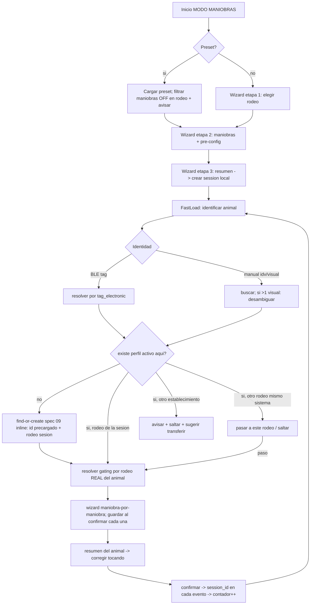
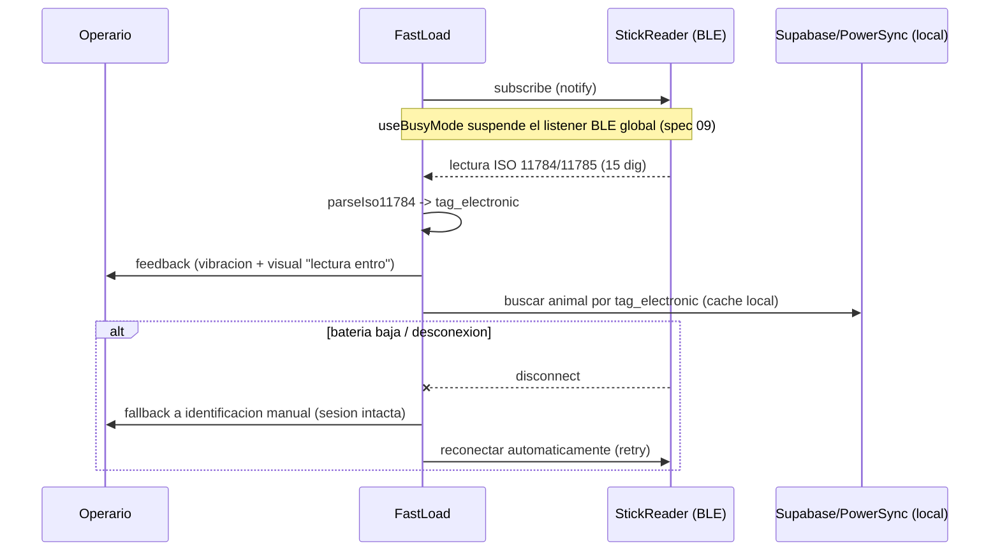
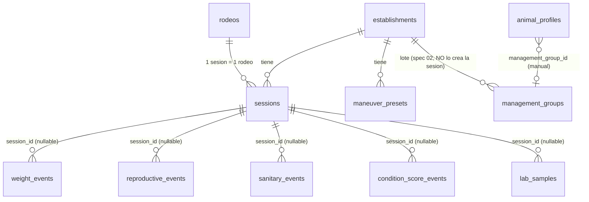

# Spec 03 — MODO MANIOBRAS — Design

**Status**: `spec_ready` — **APROBADA por Raf (Puerta 1, 2026-05-30)**. Gate 1 PASS.
**Fecha**: 2026-05-30 (sesión 18).
**Fuente de verdad**: `context.md` (Gate 0 aprobado). Sustrato: spec 02 (eventos tipados, `rodeo_data_config`, `field_definitions`, `management_groups`, triggers, `animal_timeline`, RLS, helper `establishment_of_profile`). **Nota Gate 1 (SEC-SPEC-03-02)**: las funciones `current_animal_rodeo` / `get_rodeo_data_keys` **NO existen as-built** (verificado, 0 hits en migrations 0001-0049) — spec 03 NO depende de ellas; el rodeo del animal se resuelve **inline** vía `animal_profiles.rodeo_id` del perfil activo (ver §4).

> **Numeración de migrations**: la decomposición sugería "0052", pero el as-built verificado del árbol local llega hasta **`0049_birth_calves_service_role_grant.sql`** (Tier 1 de spec 02 ocupó 0043-0049, no 0043-0051). **El próximo número libre real es `0050`.** Spec 03 arranca en **`0050`**. El implementer confirma contra el as-built antes de crear archivos y ajusta contiguo dentro del rango 0050+ sin reabrir spec, respetando dependencias. **Coordinación (terminal paralela)**: hay otra terminal trabajando en el repo; el bloque 0050+ debe coordinarse antes de crear archivos para evitar colisión de números entre migraciones concurrentes. El implementer reserva el rango contra el as-built **y** contra lo que la otra terminal tenga en vuelo, no solo contra el árbol.

> **HALLAZGO clave del as-built (corrige C2)**: las 5 tablas de evento de spec 02 **ya tienen la columna `session_id uuid`** (migrations 0025-0029), pero **SIN FK**, con el comentario "session_id se vincula al MODO MANIOBRAS (feature 03), sin FK por ahora (la tabla sessions no existe aún)". O sea, spec 02 dejó el hueco preparado. Spec 03 **no crea la columna** — solo **agrega la FK + el trigger tenant-check** (§2.3).

---

## 1. Arquitectura

### 1.1 Componentes nuevos (cliente)

```
React Native (Expo) + TypeScript
└─ features/maneuvers/
   ├─ contexts/
   │   └─ ManeuverSessionContext.tsx   — estado de la sesión activa (1 por dispositivo, persistida local)
   ├─ screens/
   │   ├─ ManeuverStartScreen.tsx      — inicio: presets al tope + "nueva jornada"
   │   ├─ SessionWizardScreen.tsx      — wizard 3 etapas (rodeo / maniobras+preconfig / resumen)
   │   ├─ FastLoadScreen.tsx           — PANTALLA CRÍTICA: carga rápida animal-por-animal
   │   ├─ ManeuverStepScreen.tsx       — una maniobra por pantalla (botones 60-80px)
   │   └─ AnimalSummaryScreen.tsx      — resumen por animal (corregir tocando una maniobra)
   ├─ ble/
   │   ├─ StickReader.ts               — interfaz abstracta agnóstica al modelo (CONTEXT/05)
   │   ├─ parseIso11784.ts             — parseo caravana electrónica → tag_electronic
   │   └─ stickReaders/<modelo>.ts     — implementaciones por modelo (cuando se confirme)
   ├─ gating/
   │   └─ maneuverGating.ts            — mapeo maniobra→data_keys + resolución por rodeo real
   ├─ hooks/
   │   ├─ useManeuverSession.ts
   │   ├─ useStickReader.ts
   │   └─ useManeuverGating.ts
   └─ services/
       ├─ sessions.ts                  — CRUD de sessions (offline-first, IDs cliente)
       ├─ maneuverPresets.ts           — CRUD de presets
       └─ maneuverEvents.ts            — orquesta los services de eventos de spec 02 con session_id
```

Reusa de **spec 02**: `services/events.ts` (createWeightEvent, createReproductiveEvent, …), `services/animals.ts` (createAnimal, searchByTag/Idv/VisualAlt, updateAnimalCategory, markCut, assignManagementGroup), `services/category/transitions.ts` (preview offline), `services/rodeo-config.ts` (`isManeuverAvailable`, gating). Reusa de **spec 09**: motor find-or-create + `useBusyMode` (suspende listener BLE global). Reusa de **spec 05**: balanza BLE (pesaje), sin la ventana de correlación porque el animal ya está identificado.

### 1.2 Componentes nuevos (backend / Supabase)

- Tabla `sessions` (NUEVA) — jornada de maniobra.
- Tabla `maneuver_presets` (NUEVA) — presets por establishment.
- `ALTER` de las 5 tablas de evento de spec 02: agregar `session_id` (FK nullable a `sessions`) — ver C2 / D1. (Conflicto: spec 02 *requirements* lo listan pero las migraciones del árbol local no lo crearon.)
- Extensión del enum reproductivo de spec 02 para `tacto_vaquillona` + campo de resultado — ver R5.13 / D-enum.
- Triggers `BEFORE INSERT` de gating DB (capa 2) en cada tabla de evento gateada — ver §4.
- Trigger `BEFORE UPDATE` de gating DB sobre `animal_profiles` para el destino dientes/CUT (`teeth_state`/`is_cut`) — ver §4 (SEC-SPEC-03-01).
- RLS en `sessions` y `maneuver_presets` (patrón canónico tenant).

### 1.3 Diagrama de flujo — carga rápida



### 1.4 Diagrama de secuencia — BLE manual-first



### 1.5 ER — sessions / eventos / lote



Nota: el lote (`management_groups`) **NO** está vinculado a `sessions` por FK. La sesión solo agrupa eventos vía `session_id`. (Ver C1.)

---

## 2. Modelo de datos (SQL nuevo)

> Patrón de la casa: `enable RLS` + `GRANT` explícito a `authenticated` + policies por establishment con helpers `has_role_in` / `is_owner_of` de spec 01. IDs `uuid` con default cliente (PowerSync). `created_by` forzado server-side donde es load-bearing (ADR-019, patrón `tg_force_created_by_auth_uid` de spec 02 `0043`). Los bloques SQL son **especificación de diseño**; el implementer escribe los `.sql` y los tests.

### 2.1 `sessions` (migration `0050_sessions.sql`)

```sql
-- 0050_sessions.sql — jornada de maniobra (NO es "lote"; ver ADR-020 / management_groups)
create type public.session_status as enum ('active', 'closed');

create table public.sessions (
  id                uuid primary key default gen_random_uuid(),
  establishment_id  uuid not null references public.establishments(id) on delete cascade,
  rodeo_id          uuid not null references public.rodeos(id),
  -- snapshot de la config de la jornada: maniobras elegidas + parametros fijos de tanda + preset_id origen
  config            jsonb not null default '{}'::jsonb,
  status            public.session_status not null default 'active',
  -- lote de trabajo informativo, NO-autoritativo (R9.4): texto libre, nunca FK asignadora a management_groups
  work_lot_label    text,
  animal_count      int not null default 0,   -- mantenido por la app al confirmar cada animal (ver nota)
  event_count       int not null default 0,   -- mantenido por la app al persistir cada evento
  notes             text,
  created_by        uuid references public.users(id),  -- forzado server-side a auth.uid()
  started_at        timestamptz not null default now(),
  ended_at          timestamptz,
  created_at        timestamptz not null default now(),
  updated_at        timestamptz not null default now(),
  deleted_at        timestamptz,
  -- SEC-SPEC-03-06: limite de tamano del jsonb libre del cliente (snapshot de config de jornada).
  -- No hay injection (no se hace EXECUTE/format dinamico sobre config), pero un CHECK acota el riesgo
  -- de encolar payloads arbitrarios via sync. 16 KiB sobra para maniobras + pre-config de una tanda.
  constraint sessions_config_size check (octet_length(config::text) < 16384)
);

create index sessions_by_est    on public.sessions (establishment_id) where deleted_at is null;
create index sessions_by_rodeo  on public.sessions (rodeo_id)         where deleted_at is null;
create index sessions_active    on public.sessions (establishment_id, status) where deleted_at is null;

-- created_by es auditoria de jornada: se FUERZA server-side (no spoofeable), reusa helper de spec 02 (0043)
create trigger sessions_force_created_by
  before insert on public.sessions
  for each row execute function public.tg_force_created_by_auth_uid();

create trigger sessions_set_updated_at
  before update on public.sessions
  for each row execute function public.tg_set_updated_at_generic();

-- rodeo debe ser del mismo establishment, activo (reusa patron de spec 02 R4.5)
create or replace function public.tg_sessions_rodeo_check ()
returns trigger language plpgsql as $$
begin
  if not exists (
    select 1 from public.rodeos r
    where r.id = new.rodeo_id and r.establishment_id = new.establishment_id
      and r.active = true and r.deleted_at is null
  ) then
    raise exception 'session rodeo does not belong to establishment or is inactive'
      using errcode = '23514';
  end if;
  return new;
end; $$;

create trigger sessions_rodeo_check
  before insert or update on public.sessions
  for each row execute function public.tg_sessions_rodeo_check();

alter table public.sessions enable row level security;

create policy sessions_select on public.sessions
  for select using (has_role_in(establishment_id) and deleted_at is null);
create policy sessions_insert on public.sessions
  for insert with check (has_role_in(establishment_id));
create policy sessions_update on public.sessions
  for update using (has_role_in(establishment_id))
  with check (has_role_in(establishment_id));
-- sin DELETE de cliente: cerrar = status='closed'; borrado = soft-delete (deleted_at) via update.

grant select, insert, update on public.sessions to authenticated;
```

**Nota sobre `animal_count` / `event_count`** (ADR-020 delegaba esto a esta spec): se mantienen **desde la app** (incremento al confirmar cada animal / persistir cada evento), NO por trigger. Razón: (a) la sesión es offline-first y los eventos se encolan localmente, así que un trigger server-side contaría desfasado respecto al estado local; (b) son contadores de conveniencia para el resumen (spec 07), no constraints de integridad. El conteo autoritativo siempre se recomputa con `count(*) … where session_id = ?`. **Default propuesto, requiere confirmación (D5).**

### 2.2 `maneuver_presets` (migration `0051_maneuver_presets.sql`)

```sql
-- 0051_maneuver_presets.sql — presets de maniobra (scope establishment, R2.4)
create table public.maneuver_presets (
  id                uuid primary key default gen_random_uuid(),
  establishment_id  uuid not null references public.establishments(id) on delete cascade,
  name              text not null,
  config            jsonb not null default '{}'::jsonb,   -- maniobras + pre-config (mismo shape que sessions.config)
  created_by        uuid references public.users(id),
  created_at        timestamptz not null default now(),
  updated_at        timestamptz not null default now(),
  deleted_at        timestamptz,
  constraint maneuver_presets_name_not_empty check (length(trim(name)) > 0),
  -- SEC-SPEC-03-06: mismo limite de tamano que sessions.config (jsonb libre del cliente).
  constraint maneuver_presets_config_size check (octet_length(config::text) < 16384)
);

create index maneuver_presets_by_est on public.maneuver_presets (establishment_id) where deleted_at is null;

create trigger maneuver_presets_force_created_by
  before insert on public.maneuver_presets
  for each row execute function public.tg_force_created_by_auth_uid();
create trigger maneuver_presets_set_updated_at
  before update on public.maneuver_presets
  for each row execute function public.tg_set_updated_at_generic();

alter table public.maneuver_presets enable row level security;

-- scope por establishment: cualquier rol operativo activo lee/crea/edita presets del establecimiento.
create policy maneuver_presets_select on public.maneuver_presets
  for select using (has_role_in(establishment_id) and deleted_at is null);
create policy maneuver_presets_insert on public.maneuver_presets
  for insert with check (has_role_in(establishment_id));
create policy maneuver_presets_update on public.maneuver_presets
  for update using (has_role_in(establishment_id))
  with check (has_role_in(establishment_id));

grant select, insert, update on public.maneuver_presets to authenticated;
```

### 2.3 FK de `session_id` en las 5 tablas de evento (migration `0052_event_session_fk.sql`) — ver C2/D1

```sql
-- 0052_event_session_fk.sql — vincular eventos a la sesion (R5.11).
-- C2 (corregido contra as-built): la columna session_id YA EXISTE en las 5 tablas (0025-0029) como uuid SIN FK,
-- con el comentario "session_id se vincula al MODO MANIOBRAS (feature 03), sin FK por ahora (sessions no existe aun)".
-- Spec 03 NO crea la columna: agrega la FK + el trigger tenant-check.
-- ON DELETE SET NULL: borrar/archivar una sesion no borra sus eventos (append-only, ADR-017).
-- Eventos cargados desde la ficha (spec 09) quedan con session_id NULL (legitimo).

alter table public.weight_events          add constraint weight_events_session_fk          foreign key (session_id) references public.sessions(id) on delete set null;
alter table public.reproductive_events    add constraint reproductive_events_session_fk    foreign key (session_id) references public.sessions(id) on delete set null;
alter table public.sanitary_events        add constraint sanitary_events_session_fk        foreign key (session_id) references public.sessions(id) on delete set null;
alter table public.condition_score_events add constraint condition_score_events_session_fk foreign key (session_id) references public.sessions(id) on delete set null;
alter table public.lab_samples            add constraint lab_samples_session_fk            foreign key (session_id) references public.sessions(id) on delete set null;

create index weight_events_by_session          on public.weight_events (session_id)          where session_id is not null;
create index reproductive_events_by_session    on public.reproductive_events (session_id)    where session_id is not null;
create index sanitary_events_by_session        on public.sanitary_events (session_id)        where session_id is not null;
create index condition_score_events_by_session on public.condition_score_events (session_id) where session_id is not null;
create index lab_samples_by_session            on public.lab_samples (session_id)            where session_id is not null;

-- Integridad tenant: el session_id de un evento debe pertenecer al mismo establishment que el animal_profile.
-- Defensa en profundidad sobre RLS; evita que un cliente pegue un session_id ajeno via PostgREST/sync.
-- SEC-SPEC-03-04: ademas del cross-tenant (ya validado), se valida INTRA-tenant:
--   (a) la sesion debe estar status='active' al momento del insert (no colgar eventos de una sesion cerrada);
--   (b) el rodeo del animal del evento debe coincidir con sessions.rodeo_id (R1.1 "una sesion = un rodeo").
-- Ambas blindan el eje de auditoria de jornada (R5.11/R11.2) contra manipulacion intra-tenant via PostgREST/sync.
create or replace function public.tg_event_session_tenant_check ()
returns trigger language plpgsql security definer set search_path = public as $$
declare
  v_event_est    uuid;
  v_session_est  uuid;
  v_session_st   public.session_status;
  v_session_rod  uuid;
  v_event_rod    uuid;
begin
  if new.session_id is null then return new; end if;
  select public.establishment_of_profile(new.animal_profile_id) into v_event_est;  -- helper de spec 02 (0022)
  -- rodeo REAL del animal del evento, resuelto inline desde el perfil activo (mismo criterio que el gating, §4).
  select rodeo_id into v_event_rod
    from public.animal_profiles
    where id = new.animal_profile_id and deleted_at is null;
  select establishment_id, status, rodeo_id
    into v_session_est, v_session_st, v_session_rod
    from public.sessions
    where id = new.session_id and deleted_at is null;
  if v_session_est is null then
    raise exception 'session % not found or deleted', new.session_id using errcode = '23503';
  end if;
  -- (cross-tenant)
  if v_session_est <> v_event_est then
    raise exception 'event session belongs to a different establishment than the animal' using errcode = '23514';
  end if;
  -- (a) intra-tenant: la sesion debe estar activa (SEC-SPEC-03-04)
  if v_session_st <> 'active' then
    raise exception 'cannot attach event to session % with status % (must be active)', new.session_id, v_session_st
      using errcode = '23514';
  end if;
  -- (b) intra-tenant: el rodeo del animal debe ser el de la sesion (R1.1; SEC-SPEC-03-04).
  -- Nota: el flujo de manga "pasar a este rodeo" (R4.4) hace el UPDATE de rodeo_id ANTES de cargar eventos,
  -- por lo que en el camino feliz v_event_rod = v_session_rod. Un evento sobre un animal aun en otro rodeo
  -- se rechaza (es exactamente el caso que R4.4 prohibe hasta mover el animal).
  if v_event_rod is distinct from v_session_rod then
    raise exception 'event animal rodeo % does not match session rodeo % (one session = one rodeo)', v_event_rod, v_session_rod
      using errcode = '23514';
  end if;
  return new;
end; $$;
-- helper interno del trigger: revocar EXECUTE de public/authenticated (leccion SEC-HIGH-01 de spec 02).
revoke execute on function public.tg_event_session_tenant_check () from public, authenticated, anon;

-- aplicar a las 5 tablas (before insert or update of session_id). Ejemplo:
create trigger weight_events_session_tenant_check
  before insert or update of session_id on public.weight_events
  for each row execute function public.tg_event_session_tenant_check();
-- ... idem para reproductive_events, sanitary_events, condition_score_events, lab_samples.
```

**Hardening R4.7 (prevención de corrupción de rodeo)**: el check intra-tenant (b) (`v_event_rod = v_session_rod`) fuerza que todo animal de la sesión esté en `session.rodeo_id`. Eso vuelve riesgoso elegir mal el rodeo de la jornada: el operario vería cada animal como "de otro rodeo" y podría mover en masa decenas al rodeo equivocado vía [pasar a este rodeo] (R4.4) sin que el gating capa 2 lo detecte. Mitigación de cliente: detecta el patrón "casi todos los primeros animales son de otro rodeo" y sugiere corregir el **rodeo de la sesión** (R4.7), en vez de empujar al operario a mover en masa. La confirmación de [pasar a este rodeo] (R4.4) muestra el **rodeo de origen** del animal.

Recomendación a futuro (backlog, no bloqueante):
- **Auditoría de movimientos de rodeo**: registrar el `rodeo_id` anterior en cada movimiento de manga haría recuperable un error puntual; toca modelado de spec 02 → fuera de alcance de esta pasada (backlog).

### 2.4 Extensión enum reproductivo para `tacto_vaquillona` (migration `0053_tacto_vaquillona.sql`) — R5.13

```sql
-- 0053_tacto_vaquillona.sql — tacto de aptitud de vaquillona (apta/no_apta/diferida).
-- Spec 02 repro_event_type no tiene 'tacto_vaquillona'; lo agregamos sin reabrir spec 02.
alter type public.repro_event_type add value if not exists 'tacto_vaquillona';

create type public.heifer_fitness_result as enum ('apta', 'no_apta', 'diferida');

alter table public.reproductive_events
  add column heifer_fitness public.heifer_fitness_result;  -- solo aplica cuando event_type='tacto_vaquillona'
-- (opcional) CHECK de coherencia: heifer_fitness no nulo SSI event_type='tacto_vaquillona'. El implementer decide.
```

> Nota: `ALTER TYPE … ADD VALUE` no corre dentro de un bloque transaccional con otro DDL en algunos contextos de Postgres; el implementer lo aísla en su propia migración si hace falta.

---

## 3. Gating capa 1 (cliente) — resolución por rodeo real

Reusa `services/rodeo-config.ts` de spec 02 (`isManeuverAvailable`, lee `rodeo_data_config` cacheado). El mapeo maniobra→`data_keys` (R5.4) vive hardcodeado en `gating/maneuverGating.ts`:

```ts
// gating/maneuverGating.ts (cliente) — mapeo ADR-021 (R5.4). Claves estables = data_key de field_definitions.
export const MANEUVER_DATA_KEYS: Record<ManeuverKind, string[]> = {
  tacto_vaca:         ['prenez', 'tamano_prenez'],
  tacto_vaquillona:   ['tacto_vaquillona'],
  sangrado:           ['brucelosis'],
  vacunacion:         ['vacunacion'],
  inseminacion:       ['inseminacion'],
  condicion_corporal: ['condicion_corporal'],
  dientes:            ['dientes'],
  pesaje:             ['peso'],
  raspado_toros:      ['raspado_toros'],
  pesaje_ternero:     ['peso'],
};
```

Resolución por animal (R5.3): `rodeo_real` = el `rodeo_id` del `animal_profile` activo del animal (leído del cache local de `animal_profiles`; el cliente NO depende de ninguna función `current_animal_rodeo` — ver corrección SEC-SPEC-03-02 en §4) → para cada maniobra de la sesión, `enabled = isManeuverAvailable(rodeo_real, MANEUVER_DATA_KEYS[maniobra])`. Si todas las `data_keys` están `enabled` → la maniobra aplica; si alguna falta → se omite para ese animal (R5.5). Para required vs opcional: el cliente lee el `rodeo_data_config` cacheado del `rodeo_real` (mismo dato que la capa 2 valida en DB) — si el rodeo no tiene filas de config habilitadas para los `data_key(s)` del evento, todos los campos son opcionales; si las tiene, respeta el flag `required` de cada `data_key` (R5.6). No se usa `get_rodeo_data_keys`, que no existe as-built.

---

## 4. Gating capa 2 (DB, trigger BEFORE INSERT) — corazón de seguridad de este spec

ADR-021 manda un trigger `BEFORE INSERT` en cada tabla de evento gateada que valide el `rodeo_data_config` del rodeo **del animal del evento** y rechace si el `data_key` requerido no está `enabled`. Defensa en profundidad sobre la UI (R7.1–R7.4).

> **Corrección Gate 1 (SEC-SPEC-03-02, HIGH).** La versión previa de este spec resolvía el rodeo del animal con `public.current_animal_rodeo(uuid)` y leía las data_keys con `public.get_rodeo_data_keys(...)`, **dándolas por existentes as-built de spec 02**. Verificado contra el árbol (migrations 0001-0049): **ninguna de las dos funciones existe** (0 hits). Premisa load-bearing rota. **Decisión firme (esta pasada): resolver el rodeo INLINE** dentro de `assert_data_keys_enabled`, leyendo directamente `animal_profiles.rodeo_id` del perfil **activo** (`deleted_at IS NULL`). Es la menor superficie de seguridad posible (una sola función SECURITY DEFINER, sin helper intermedio que blindar). `animal_profiles.rodeo_id` ES el rodeo actual del animal (spec 02 as-built, `0020` l.16, NOT NULL para un perfil vivo). NO se crean `current_animal_rodeo` / `get_rodeo_data_keys`; cualquier mención de ellas en spec 03 queda obsoleta y reemplazada por la resolución inline de abajo. (El cliente, capa 1, resuelve el rodeo real del animal del mismo modo: ver §3.)

```sql
-- 0054_gating_db_layer.sql — gating capa 2 (ADR-021).
-- Funcion generica: recibe el animal_profile_id del evento + los data_key requeridos; valida enabled.
-- SEC-SPEC-03-02: resuelve el rodeo del animal INLINE (animal_profiles.rodeo_id del perfil activo),
--   NO via current_animal_rodeo() (que NO existe as-built). Menor superficie.
-- SEC-SPEC-03-03: FAIL-CLOSED explicito. Si el rodeo no se resuelve (perfil inexistente / soft-deleted
--   => v_rodeo IS NULL) la funcion LEVANTA EXCEPCION y NO permite el insert. PROHIBIDO un early-return
--   "de cortesia" (if v_rodeo is null then return;) — eso seria fail-OPEN = bypass total del gating.
create or replace function public.assert_data_keys_enabled (p_animal_profile_id uuid, p_data_keys text[])
returns void language plpgsql security definer set search_path = public as $$
declare v_rodeo uuid; v_have int; v_need int;
begin
  v_need := array_length(p_data_keys, 1);
  if v_need is null then return; end if;   -- maniobra sin data_keys gateadas: nada que validar

  -- Rodeo REAL del animal, resuelto inline desde el perfil ACTIVO (spec 02 as-built 0020).
  select rodeo_id into v_rodeo
  from public.animal_profiles
  where id = p_animal_profile_id and deleted_at is null;

  -- FAIL-CLOSED (SEC-SPEC-03-03): rodeo no resoluble => rechazo duro, NUNCA pasar.
  if v_rodeo is null then
    raise exception 'maneuver gated: cannot resolve rodeo for gated event on profile % (profile missing or soft-deleted)', p_animal_profile_id
      using errcode = '23514';
  end if;

  select count(distinct fd.data_key) into v_have
  from public.rodeo_data_config rdc
  join public.field_definitions fd on fd.id = rdc.field_definition_id
  where rdc.rodeo_id = v_rodeo
    and rdc.enabled = true
    and fd.data_key = any (p_data_keys);

  -- FAIL-CLOSED: falta CUALQUIERA de los data_keys requeridos enabled => rechazo.
  if v_have < v_need then
    raise exception 'maneuver gated: rodeo % is missing enabled data_keys %', v_rodeo, p_data_keys
      using errcode = '23514';
  end if;
end; $$;
revoke execute on function public.assert_data_keys_enabled (uuid, text[]) from public, authenticated, anon;
-- ^ helper interno de triggers; NO RPC publico (SEC-HIGH-01 de spec 02). Los triggers SECURITY DEFINER lo invocan.

-- Trigger por tabla. Ejemplo condition_score_events (data_key: condicion_corporal):
create or replace function public.tg_condition_score_gating ()
returns trigger language plpgsql security definer set search_path = public as $$
begin
  perform public.assert_data_keys_enabled(new.animal_profile_id, array['condicion_corporal']);
  return new;
end; $$;
create trigger condition_score_gating
  before insert on public.condition_score_events
  for each row execute function public.tg_condition_score_gating();

-- weight_events (data_key: peso)            -> array['peso']
-- lab_samples (sample_type ramifica):
--   sample_type='blood'                              -> array['brucelosis']
--   sample_type in ('scrape_tricho','scrape_campylo') -> array['raspado_toros']
-- sanitary_events (event_type ramifica):
--   event_type='vaccination'                         -> array['vacunacion']
-- reproductive_events (event_type ramifica):
--   event_type='tacto'                               -> array['prenez','tamano_prenez']
--   event_type='tacto_vaquillona'                    -> array['tacto_vaquillona']
--   event_type='service' AND service_type es IA      -> array['inseminacion']
-- (parto/aborto/destete NO son maniobras de manga -> NO se gatean por este spec; ver US-8 nota)

-- ─────────────────────────────────────────────────────────────────────────────
-- SEC-SPEC-03-01 (HIGH): gating capa 2 del destino UPDATE (dientes / CUT).
-- La maniobra "dientes" (R6.7) NO es un INSERT a una tabla de evento: es un UPDATE de
-- animal_profiles.teeth_state, y CUT (R6.8) es UPDATE is_cut/category_id. Los triggers
-- BEFORE INSERT de arriba NO los cubren. Verificado contra as-built: la policy
-- animal_profiles_update (0022) solo exige has_role_in(); con grant UPDATE a authenticated
-- (0020), un UPDATE de teeth_state/is_cut por PostgREST/sync sobre un rodeo con dientes=false
-- pasaria SIN enforcement -> R7.3 (defensa en profundidad) seria falso para esa maniobra,
-- y CUT toca analytics (transicion de categoria).
-- RESUELTO (Raf, D8): ENFORCE AFINADO — gatea solo cambios aditivos; permite los sustractivos (limpieza).
-- Esto modifica una tabla de spec 02 (como la FK de §2.3 y el delta 0047) -> migration nueva.
-- Decision de producto asociada: ver D8 en §9.
create or replace function public.tg_animal_profiles_teeth_gating ()
returns trigger language plpgsql security definer set search_path = public as $$
begin
  -- ENFORCE AFINADO (D8, decisión de Raf): solo se gatean los cambios ADITIVOS
  -- (que ESCRIBEN dato de dientes/CUT). Los SUSTRACTIVOS (limpiar teeth_state -> NULL,
  -- desmarcar is_cut true->false) se PERMITEN: nunca pueden meter dato prohibido en un
  -- rodeo sin 'dientes' (solo lo quitan), así que no debilitan ADR-021 y no traban la
  -- limpieza de datos heredados (perfil que llegó de otro rodeo con teeth_state viejo).
  if (new.teeth_state is distinct from old.teeth_state and new.teeth_state is not null)
     or (new.is_cut is distinct from old.is_cut and new.is_cut = true) then
    -- Reusa assert_data_keys_enabled(NEW.id): lee animal_profiles.rodeo_id del perfil activo,
    -- fail-closed heredado (perfil soft-deleted / rodeo no resoluble -> rechaza, SEC-SPEC-03-03).
    perform public.assert_data_keys_enabled(new.id, array['dientes']);
  end if;
  return new;
end; $$;
revoke execute on function public.tg_animal_profiles_teeth_gating () from public, authenticated, anon;

-- Solo dispara cuando teeth_state o is_cut REALMENTE cambian (IS DISTINCT FROM, NULL-safe).
-- La guarda WHEN evita gatear los UPDATE de lote (R9.2: management_group_id) y de rodeo (R4.4: rodeo_id),
-- que no tocan dientes/CUT. category_id se lista en el OF porque CUT lo cambia junto con is_cut.
create trigger animal_profiles_teeth_gating
  before update of teeth_state, is_cut, category_id on public.animal_profiles
  for each row
  when (new.teeth_state is distinct from old.teeth_state
        or new.is_cut is distinct from old.is_cut)
  execute function public.tg_animal_profiles_teeth_gating();
```

> **Dientes sin historial.** Trade-off conocido y **lockeado por Gate 0**: dientes es propiedad que sobrescribe `teeth_state`, sin historial (R6.7). Se acepta la pérdida de la progresión de boca como serie temporal; revisitar post-MVP si el benchmarking lo requiere.

**Riesgo de binding `data_key`↔destino (ADR-021, R7.2)**: cada trigger ramifica por `event_type`/`sample_type` y mapea a un `data_key` literal (incluido el literal `'dientes'` del trigger `BEFORE UPDATE` de SEC-SPEC-03-01). Si un `data_key` se renombra en `field_definitions` sin actualizar el literal del trigger, el gating se rompe silenciosamente (cuenta 0 → rechaza todo, o no aplica). **Mitigación**: tests de Fase 2 que insertan un evento de cada tipo en un rodeo con/sin el `data_key` habilitado y verifican accept/reject, + el caso UPDATE dientes/CUT, + un test que verifica que cada `data_key` literal del trigger (`condicion_corporal`, `peso`, `brucelosis`, `raspado_toros`, `vacunacion`, `prenez`, `tamano_prenez`, `tacto_vaquillona`, `inseminacion`, **`dientes`**) **existe** en `field_definitions` (catálogo). Ver tasks T2.4/T2.5.

**Nota de coordinación**: agregar un `BEFORE INSERT` de gating a tablas de spec 02 es una **modificación a tablas de otra spec**. Va en migración nueva 0054, documentada como "extiende eventos de spec 02 per ADR-021 (enforcement que la nota de spec 02 tras R6.14 dejó explícitamente para spec 03)". Spec 02 R2.7 + esa nota ya declararon que este enforcement es scope de spec 03 — no hay conflicto, es el plan.

---

## 5. Offline-first (PowerSync)

- **Buckets de sync**: agregar `sessions` y `maneuver_presets` a las sync rules de PowerSync, scoping por `establishment_id` del usuario (mismo patrón que las tablas de spec 02). Las 5 tablas de evento ya están en sync (spec 02); el nuevo `session_id` viaja con ellas.
- **IDs cliente**: `sessions.id`, `maneuver_presets.id` y los eventos se generan con UUID en el cliente (R1.11, R2.5, R10.2) → sin round-trip para crear/operar offline.
- **Estrategia de conflictos**: append-only (ADR-017). Los eventos son inserts independientes; no hay edición concurrente del mismo evento en la sesión (un dispositivo = una sesión, R10.6). La sesión se edita solo desde su dispositivo dueño hasta cerrarla. `last-write-wins` de PowerSync alcanza para `sessions.status`/`ended_at`/contadores (campos no concurrentes en la práctica).
- **Cache de gating**: `rodeo_data_config` + `field_definitions` ya sincronizan (spec 02); el gating capa 1 los lee de SQLite local (R10.3). La capa 2 (DB) corre al sincronizar — si al sincronizar un evento gateado choca con un `rodeo_data_config` que cambió mientras el dispositivo estaba offline, el trigger lo rechaza; **ese rechazo NO debe ser un dead-letter silencioso** — se hace visible al operario para re-resolver (R10.8). El gating capa 1 (UI, config cacheada al configurar la jornada) y la capa 2 (DB, config al sincronizar) pueden divergir a través de una ventana offline; R10.8 cubre esa divergencia.
- **Orden de cierre offline (interacción con SEC-SPEC-03-04 check (a) "sesión active")**: el check (a) asume que los eventos se insertan mientras la sesión está `active`. Offline esto depende de que PowerSync re-aplique las mutaciones del cliente **en orden** (los eventos creados antes del cierre se suben antes que la mutación `status='closed'`). Se debe verificar/garantizar ese orden; una corrección tardía de un evento ya cerrado usa el edit per-evento de spec 02 (que NO re-apunta `session_id`, así que NO dispara el trigger). Test en Fase 2 (ver T2.6).
- **Reanudación (R10.5)**: la sesión activa vive en SQLite local con `status='active'`; al abrir la app, `ManeuverSessionContext` busca una sesión `active` del dispositivo y ofrece retomar. El "último animal/maniobra" se infiere del último evento con ese `session_id` + estado local del wizard (persistido en el context / secure-store).
- **BLE offline (R10.4)**: el `StickReader` usa BLE directo (no red); funciona sin señal.

---

## 6. BLE — `StickReader` agnóstico (CONTEXT/05, spec 04)

```ts
// ble/StickReader.ts — interfaz abstracta (R3.8). Implementaciones por modelo cuando se confirme.
export interface StickReader {
  connect(): Promise<void>;
  disconnect(): Promise<void>;
  subscribe(onRead: (raw: string) => void): () => void;   // notify; retorna unsubscribe
  onConnectionChange(cb: (s: 'connected' | 'disconnected') => void): () => void;
}
```

- **Parseo** (`parseIso11784.ts`): caravana electrónica ISO 11784/11785, 15 dígitos, prefijo país (032 Argentina) → `tag_electronic` normalizado (R3.3). Validación de longitud/prefijo; lecturas inválidas se descartan con feedback de error.
- **Feedback** (R3.4): al entrar una lectura válida → vibración (expo-haptics) + flash visual + sonido corto. "La lectura entró" debe ser inequívoco sin mirar fijo la pantalla.
- **Reconexión automática** (R3.7): `onConnectionChange('disconnected')` dispara retry con backoff; la sesión no se interrumpe.
- **Fallback manual** (R3.6): en cualquier estado de conexión, la búsqueda manual está disponible; perder el bastón nunca bloquea la manga.
- **Balanza integrada**: algunos bastones emiten peso por el mismo canal BLE. **No se asume** en MVP (CONTEXT/05). La interfaz `StickReader` se deja extensible (un `WeightCapableStickReader extends StickReader` futuro) pero spec 03 trata peso por balanza vía spec 05 o manual. El peso se toma con una **acción explícita "pesar"** del operario sobre el animal en cepo (R6.9), no pasivamente del stream BLE — evita adjudicar una lectura tardía al siguiente animal. Ver D6.
- **`useBusyMode`** (spec 09): al entrar a MODO MANIOBRAS se activa `useBusyMode`, que **suspende el listener BLE global**; el escaneo lo maneja `useStickReader` del modo (R3.2). Al salir, se restaura el listener global.

> Coordinación con spec 04 (bastón, `context_ready`): spec 04 ya contractualizó `useBleStickListener` / `BleStickListenerProvider` / `useBusyMode` / mock (ver feature_list nota de 04). `StickReader` de spec 03 debe **alinearse a esa interfaz** cuando spec 04 se implemente; el implementer reconcilia. Hardware (UUIDs/parsing del Allflex RS420) es bloqueante de spec 04, no de esta spec — acá se trabaja contra el mock.

---

## 7. Seguridad (ADR-019) — explícito para Gate 1

| Vector | Mitigación |
|---|---|
| Tenant isolation `sessions` / `maneuver_presets` | RLS `has_role_in(establishment_id)` en SELECT/INSERT/UPDATE; sin DELETE de cliente. (R11.1, R11.3) |
| `created_by` spoofing | `tg_force_created_by_auth_uid` (reusa helper de spec 02 `0043`): ignora el valor del cliente, fuerza `auth.uid()`. (R11.2) |
| `session_id` cross-tenant en un evento | `tg_event_session_tenant_check` (SECURITY DEFINER, EXECUTE revocado de public): la sesión del evento debe ser del mismo establishment que el animal. (§2.3, R7.4) |
| Gating bypass (escribir evento gateado por PostgREST/sync) | Trigger capa 2 `BEFORE INSERT` por tabla + `assert_data_keys_enabled` (SECURITY DEFINER, EXECUTE revocado, **fail-closed** ante rodeo NULL — SEC-SPEC-03-03). (§4, R7.1, R7.3, R7.6) |
| Gating bypass del destino **UPDATE** (dientes/CUT) | Trigger `BEFORE UPDATE OF teeth_state, is_cut, category_id` sobre `animal_profiles` con guarda `IS DISTINCT FROM` → `assert_data_keys_enabled(NEW.id, ['dientes'])`. Cierra el hueco verificado de la policy `animal_profiles_update`. (§4, SEC-SPEC-03-01, R7.5; ver D8) |
| Helper interno expuesto como RPC | `revoke execute … from public, authenticated, anon` en `assert_data_keys_enabled` y `tg_event_session_tenant_check` (lección SEC-HIGH-01 de spec 02). (R11.4) |
| find-or-create cross-tenant | El alta respeta `establishment_id` activo + UNIQUE de identificador (spec 02 R3.2/R4.3); `created_by` forzado. **SEC-SPEC-03-05**: el *enforcement* del alta vive en spec 09 (no implementada aún) → spec 03 no puede certificarlo acá; el contrato de seguridad del alta inline se **re-verifica en Gate 2 (code)** cuando spec 09 esté integrada (ver D9 / task de verificación cross-spec). (R4.6) |
| Append-only / corrección | Eventos solo INSERT; corrección por edición/soft-delete per-evento de spec 02 (owner o `created_by`). Sin escritura cross-tenant. (R11.5, ADR-017) |
| Edge Function / SECURITY DEFINER | **Ninguna Edge Function nueva** en este spec. Toda función `SECURITY DEFINER` (`assert_data_keys_enabled`, `tg_event_session_tenant_check`, `tg_animal_profiles_teeth_gating`) deriva el tenant/rodeo de la fila real (`establishment_of_profile` + lectura inline de `animal_profiles.rodeo_id`, NO de `current_animal_rodeo` que no existe) y tiene EXECUTE revocado de public/authenticated/anon. (R11.4) |

**Multi-tenancy**: este spec toca multi-tenancy en todas las tablas nuevas y en el gating → RLS canónico en todas (mandato CLAUDE.md). **Offline-first en campo**: este spec carga datos en campo → offline-first total (§5, mandato CLAUDE.md). Ambos cubiertos explícitamente.

---

## 8. Alternativas descartadas

**A1 — Tabla `batches` con reversión por eventos compensatorios (el modelo de la decomposición original).**
Descartada porque contradice el context.md aprobado (Gate 0) y la spec 02 as-built: ADR-020 se materializó como `management_groups` (lote per-animal, manual, **no** auto-asignado por la jornada). El context (decisión de Raf) es explícito en que una jornada puede tocar 2 lotes, así que auto-asignar un "batch de sesión" pisaría el `management_group_id`. Modelar `batches` además duplicaría el rol de `sessions` (agrupar eventos de una jornada). Se eligió `sessions` (agrupa eventos vía `session_id`) + `management_groups` (lote ortogonal). La reversión de jornada queda como decisión abierta D2, no como tabla. **Trade-off**: se pierde la reversión "deshacer todo el lote" de fábrica; se gana a futuro (si Raf la pide) como operación a nivel `session_id`, sin un modelo redundante.

**A2 — Gating solo en UI (capa 1), sin trigger DB.**
Descartada por ADR-019 (defensa en profundidad) y porque PowerSync sincroniza inserts directos que nunca pasaron por la UI. Un cliente comprometido o un bug de sync podría escribir un evento gateado. El trigger capa 2 es el único punto donde el enforcement es real. **Trade-off**: costo de un `count` por insert de evento — mitigado por el index parcial `rodeo_data_config (field_definition_id) where enabled` (O(log n), spec 02 design).

**A3 — `session_id` también en `animal_events` (observaciones) además de las 5 tipadas.**
Descartada: las maniobras escriben en las 5 tablas tipadas (analytics, spec 02). `animal_events` es para observaciones libres y no es parte del wizard. Agregar `session_id` ahí sería scope creep sin caso de uso. (Si una observación libre se carga durante la sesión, puede llevar `session_id` en una iteración futura; no en MVP.)

---

## 9. Decisiones abiertas / coordinación (para Raf — NO resueltas por el spec_author)

> Cada una con un default razonable y la marca **requiere confirmación de Raf**. Varias tocan tablas de otra spec → coordinación con la terminal de backend.

**D1 — Agregar la FK de `session_id` a las 5 tablas de evento de spec 02 (migración 0052).** Necesario para R5.11. La **columna ya existe** (spec 02 la dejó como `uuid` sin FK, anticipando feature 03 — ver C2). Spec 03 solo **agrega la FK** (`ON DELETE SET NULL`) + index parcial + trigger tenant-check. Modifica constraints de tablas de spec 02 → coordinación liviana con backend. **RESUELTO (Raf)**: spec 03 cierra la FK `session_id` (migración 0052), con coordinación liviana de migraciones con la terminal de backend.

**D2 — Profundidad de la reversión en MVP (ADR-020 lo delegaba a esta spec).** Dado C1 (el lote no se auto-asigna desde la sesión, así que no hay "lote de maniobra" que revertir), el default es: **NO hay reversión a nivel sesión en MVP**; la corrección de un dato cargado mal se hace per-evento por edición/soft-delete de spec 02 (R6.8.1, sin ventana de tiempo para los 5 tipados). **RESUELTO (Raf)**: NO hay reversión a nivel sesión en MVP; la corrección es per-evento (spec 02). Se reevaluará si aparece el caso real.

**D3 — `sessions.work_lot_label` (lote de trabajo informativo).** El context dice que la sesión "puede registrar un lote de trabajo como metadata informativa no-autoritativa, o se omite (detalle menor para spec_author)". Default: incluir `work_lot_label text` (texto libre, NUNCA FK asignadora a `management_groups`) por si el operario quiere anotar el lote de la jornada; la asignación real de lote sigue siendo el UPDATE per-animal de R9.2. **Confirmar**: ¿se incluye `work_lot_label` o se omite?

**D4 — `corrects_event_id` / `correction_reason` en `animal_events` (ADR-017).** ADR-017 contempla correcciones; spec 02 modeló `animal_events` con edit-window + soft-delete (sin esas columnas). Dado C1+D2 (no hay reversión de lote en este spec) y que la corrección de los 5 tipados ya es por edición/soft-delete sin ventana, **default: NO agregar esas columnas en spec 03** (no hay caso de uso en este alcance). **Confirmar**: ¿se difiere el modelo de compensación explícito de ADR-017 a la feature de reversión/timeline avanzado, o Raf lo quiere ya? (Si lo quiere para los tipados, es otra modificación a tablas de spec 02.)

**D5 — Mantenimiento de `animal_count` / `event_count` (ADR-020 lo dejó "trigger o app").** Default: **mantenerlos desde la app** (offline-first; un trigger contaría desfasado). El conteo autoritativo se recomputa con `count(*)`. **Confirmar**: ¿OK app-maintained, o se prefiere trigger asumiendo el desfase offline?

**D6 — Bastón con balanza integrada (CONTEXT/05, pendiente de confirmar).** Default: `StickReader` agnóstico, peso por balanza vía spec 05 o manual; se deja extensible (`WeightCapableStickReader` futuro) pero **no se asume** en MVP. **Confirmar** cuando se defina el modelo de bastón. (No bloquea el spec.)

**D7 — Scope del preset (R2.4): por establishment vs por usuario.** El context dejó "default sugerido por establishment (lo confirma spec_author)". **Confirmado por defecto: por establishment** (RLS `has_role_in`). Si Raf prefiere por-usuario, se agrega un filtro por `created_by` en la policy SELECT. **Confirmar.**

**D8 — Gating capa 2 del path dientes/CUT (`UPDATE animal_profiles`) — SEC-SPEC-03-01.** La maniobra "dientes" (R6.7) y el prompt CUT (R6.8) NO son INSERT a tablas de evento: son `UPDATE` de `animal_profiles` (`teeth_state` / `is_cut` / `category_id`). Los triggers `BEFORE INSERT` del gating capa 2 NO los cubren, y la policy `animal_profiles_update` (as-built `0022`) solo exige `has_role_in` → sin enforcement, un UPDATE de `teeth_state`/`is_cut` por PostgREST/sync sobre un rodeo con `dientes=false` pasaría (R7.3 falso para esa maniobra; CUT contamina analytics). **RESUELTO (Raf)**: ENFORCE AFINADO. El trigger gatea solo los cambios que ESCRIBEN dato de dientes/CUT (teeth_state -> valor no-NULL; is_cut false->true); PERMITE los que limpian (teeth_state -> NULL; is_cut true->false), que no pueden ensuciar analytics. Mismo blindaje que el enforce bruto, sin trabar la limpieza de datos heredados. Nota: la consistencia de `category_id` al desmarcar is_cut es responsabilidad de la app (fuera del alcance del gate, que solo previene contaminación).

**D9 — Verificación cross-spec del find-or-create inline en Gate 2 — SEC-SPEC-03-05.** El contrato de seguridad del alta inline en la manga (R4.1/R4.6: respeta `establishment_id` activo, UNIQUE `tag_electronic` global y `(establishment_id, idv)`, `created_by` forzado server-side) **depende del motor find-or-create de spec 09**, que aún no está implementada. Spec 03 no puede certificar lo que no controla. **No es fixeable en esta spec**: se deja como dependencia de orden. El UNIQUE existe as-built (`0020` l.51-53). **RESUELTO (Raf)**: se mantiene como dependencia de orden — el contrato del find-or-create inline se re-verifica en el Gate 2 (code) cuando spec 09 esté integrada (ver T2.12). El Gate 2 (`code`) de spec 03 — cuando spec 09 esté integrada — debe re-verificar que el alta inline fuerza el `establishment_id` activo (no el del payload) y respeta los UNIQUE; y el Gate 1/2 de spec 09 debe certificar el alta cross-tenant-safe. (Ver task T2.12 de verificación cross-spec en `tasks.md`.)

> Si aparece otro edge case real no cubierto por el context.md durante la implementación, NO se resuelve solo: se agrega acá como pregunta para Raf (no se cierra por cuenta del implementer — eso es trabajo del Gate 0).

---

## 10. Cobertura design → requirements

| Sección design | Requirements |
|---|---|
| §1 Arquitectura cliente (wizard, fastload, ble, gating) | R1.2, R5.1, R5.2, R3.x |
| §2.1 `sessions` | R1.1, R1.9, R1.10, R1.11, R10.6, R10.7, R11.1, R11.2 |
| §2.2 `maneuver_presets` | R2.1–R2.5, R11.1 |
| §2.3 FK `session_id` en eventos + tenant-check (cross + intra-tenant, SEC-SPEC-03-04) | R5.11, R7.4, R1.1, R10.7 |
| §2.3 Hardening prevención corrupción de rodeo (rodeo de origen + detección jornada mal elegida) | R4.4, R4.7 |
| §2.4 enum `tacto_vaquillona` | R5.13, R6.3 |
| §3 Gating capa 1 (cliente) | R1.4, R1.5, R5.3, R5.4, R5.5, R5.6, R5.7, R10.3 |
| §4 Gating capa 2 (DB) — INSERT (eventos) + UPDATE (dientes/CUT, SEC-SPEC-03-01) + fail-closed (SEC-SPEC-03-03) | R7.1, R7.2, R7.3, R7.4, R7.5, R7.6 |
| §5 Offline-first | R10.1–R10.5, R8.4 |
| §5 Surfacing de rechazos de sync + orden de cierre offline | R10.8 |
| §6 BLE | R3.1–R3.8, R10.4, R12.3 |
| §7 Seguridad | R11.1–R11.6, R4.6 |
| §8 Alternativas | C1, A2, A3 |
| §9 Decisiones abiertas | C1, C2, C3, D1–D9 |
